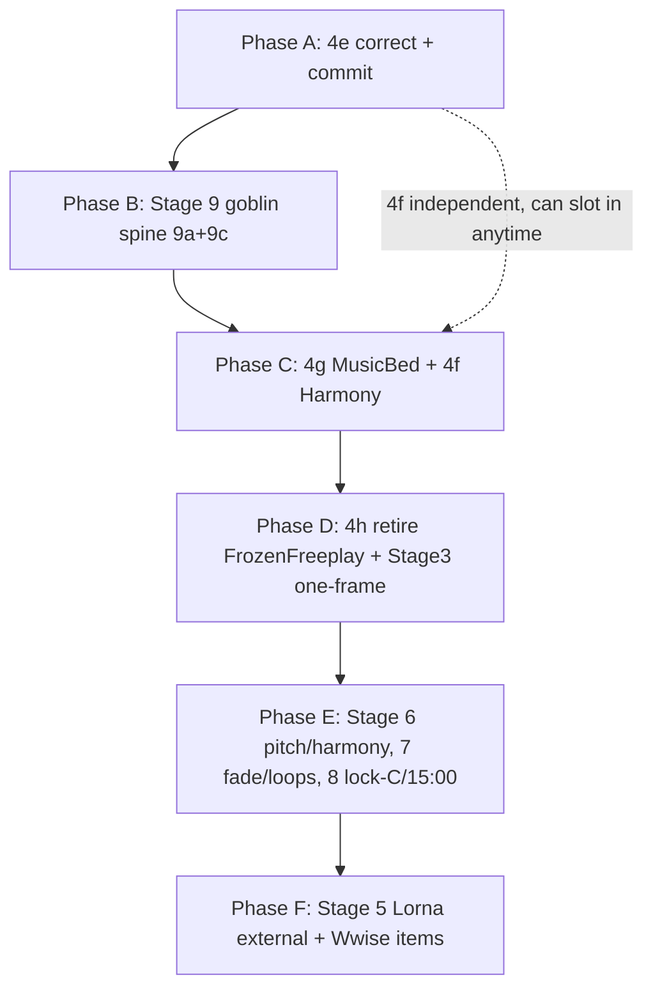

# Blocks 4 / 5 / 7 (+8) — Build Checklist

**This is the *do-the-work* checklist.** The authoritative design + history is [`BLOCKS_4_5_7_PLAN.md`](BLOCKS_4_5_7_PLAN.md); each item below links to the plan appendix that explains it in full. If the two ever disagree on *what's left*, this checklist wins for sequencing and the plan wins for detail. Workflow rules: [`soundself-director-mode.mdc`](../.cursor/rules/soundself-director-mode.mdc).

Legend: `[x]` done · `[~]` in working tree, not committed · `[ ]` to do · ⭐ recommended-next.

---

## Part 1 — How the fundamental system is supposed to work (and why)

Read this once; every checklist item below assumes this model.

### 1.1 One master, one active source

There is a single **master fundamental** (`fundamentalNoteName`). Exactly **one active source** owns it at any moment. The sources ([Appendix D §"The model"](BLOCKS_4_5_7_PLAN.md)):

| Source | Owns the master when… | Preferred = |
|---|---|---|
| **InputDriven** | the player's sung pitch should drive the key (SoundWorld interactions, Freeplay) | the last note the voice ladder committed |
| **MusicBed** | a music loop bed owns the key (MusicLoop interactions) | the loop's start note, then `Cue_Key_*` cues (4g) |
| **Sequence** | a stage/sequencer pins the note (Tutorial, Frozen, Savasana pin **C**; startup) | the pinned note |

**Why this exists:** it replaces the old priority **lock stack** (`Debug > Content > Mode`), where ownership was implicit, set/cleared in scattered places, and `ResolveFundamentalOnUnlock` had to guess who should win on release. Now ownership is **explicit, single-writer, last-writer-wins on entry** — a stage that must hold C just calls `SetFundamentalSource(Sequence, C)` after any soundscape set in the same entry.

> **No debug-force mechanism.** The old debug/content/mode lock setters and the debug override (a dev "force a note" path that sat above the active source) were **deleted in 4e** — they were pure bloat once production moved onto the source API. There is intentionally no way to force the master outside the three sources.

### 1.2 The two InputDriven gates ([Appendix D §"InputDriven vs DynamicMusicSystem gating"](BLOCKS_4_5_7_PLAN.md))

InputDriven is special because it *tracks continuously*:

- **Tracking gate** = `DynamicMusicSystem()` is running (mode ∈ {`InteractiveTutorial`, `Freeplay`}). The voice ladder (`FundamentalUpdate`) accumulates per-note **charge** here **even when InputDriven is not the active source** — it is a **shadow tracker**.
- **Write gate** = `active source == InputDriven` (`FundamentalSourcePolicy.CanInputDrivenWriteMaster`). Only then may the ladder move the master.

**Why:** so a sung build that happens *behind the curtain* (e.g. while a loop bed owns the key) is not lost — when InputDriven becomes active again it's a **warm handoff**, not a cold reset.

### 1.3 Commit forms + warm handoff (the piece that's currently broken)

A **commit** records `preferred[InputDriven] = note` **and** resets the charge memory. Two forms:

- **Audible commit** (InputDriven active): master + Wwise switch + binaural retune + reset charge + `preferred[InputDriven]=note`.
- **Silent commit** (InputDriven behind the curtain, long test passes): `preferred[InputDriven]=note` + reset charge **only** — no master / Wwise / Director.

**Warm handoff on re-enter InputDriven:** `None` ⇒ **honor** (adopt `preferred`, **do not** reset charge — an in-progress build keeps going); a **real note** ⇒ **clean slate** (set `preferred`, reset charge).

> ⚠️ **Current gap (known interim, fixed in Phase B / 9c).** The ladder gate in `TryApplyFundamentalChangeTriggers` short-circuits the *whole* ladder when InputDriven isn't the active writer, so **`preferred[InputDriven]` is never written** — there is no silent commit, and audible commits don't sync it either. Charge still accumulates, but the preferred stays stale (seeded once at `Start`). Result: adopt-preferred re-entries (world↔loop shuffle, tutorial→freeplay) can snap the master to a **stale** note and (on a real-note seed) wipe charge instead of continuing the sung pitch. **This is intentionally *not* fixed in isolation** (a standalone attempt produced confusing half-machinery) — it is **Layer 1 of the goblin's commit semantics** and lands as part of **9c** (§1.4 / Phase B), where the slot + silent/audible commit + honor-not-wipe are built together once. Interim is bounded: `preferred[InputDriven]` stays unset in normal flows, so InputDriven entry just continues from the current master; 9c is the next thing built. Design spec: [`HANDOFF_InputDriven_preferred_shadow_tracker.md`](HANDOFF_InputDriven_preferred_shadow_tracker.md) (now consumed by 9c, not parallel work).

### 1.4 The Director ↔ fundamental relationship — the "goblin" ([Appendix G](BLOCKS_4_5_7_PLAN.md))

The Director does two jobs for the fundamental:
1. **Timing** — it binds a change to *player behavior* (behavior detection / tone onset), so a queued change fires at a musical moment, not the instant the logic decided.
2. **Synchresis** — every activation pairs the *heard* change with a *seen* one (audio-only ⇒ add a visual flourish; visual-only ⇒ add an audio flourish).

**The core problem:** a fundamental change is only **audible** when it actually moves the master. A change "behind the curtain" or one that drifted back to the current master must **not** retune and must **not** pull a flourish — otherwise the lights shift with nothing heard ("phantom flourish").

**The settled design — the `targetNextFundamental` slot:** a single nullable field "the master's next commit target." The Director consults it at the top of `ActivateQueue`: if `slot != master`, apply it + count one audio event; else nothing fires ⇒ no flourish. Realized-effect becomes **structural** (no per-item bookkeeping). Apply primitives split into **`ApplyMasterFundamentalRaw`** (retune only) vs an **announce** path (enqueue late-bound + activate). A source switch = **flush + adopt + commit**, with a **disabled-bypass** (Director off ⇒ apply raw, so Savasana's C-pin under a disabled Director still works).

**Why this is the architectural spine (Robin's ordering point):** the slot + apply-primitives + commit-semantics are what every other source change rides on. The shadow-tracker fix (§1.3) *is* the InputDriven half of these commit semantics; MusicBed (4g) competing for the master is the first real consumer of the announce/slot path; Stage 8's lock-C/15:00 queueing wants a clean fundamental-queue contract. Building the goblin **early** means the rest of the refactor sits on a finished foundation instead of being retrofitted.

---

## Part 2 — Build order (adopted 2026-06-05)

The plan doc numbers stages linearly (4e → 4f → 4g → 4h → 5 → 6 → 7 → 8, with Stage 9 "riding with 4g"). **Adopted execution order (re-confirmed 2026-06-05 after a standalone shadow-tracker attempt failed) reorders these so the Director/fundamental architecture lands as the spine right after 4e:**

0. **Step 0 — retire the legacy lock stack + debug override** (done in the working tree). Pure deletion: the debug override, the three lock setters (`SetFundamentalDebugLock`/`ContentLock`/`ModeLock`), `GetLockedFundamental`, `IsFundamentalLocked`, `ResolveFundamentalOnUnlock`, and every dev force-note surface are gone; the two `FundamentalSourcePolicy` predicates lose `hasDebugOverride`. No production behavior change (all were debug-only after the migration). Bundled into the single 4e commit.
1. **Phase A — commit 4e (migration + Step 0).** The call-site migration + the lock-stack deletion are both in the tree and coherent; review → Test Runner → Opus → one commit. The shadow-tracker `preferred`-sync is **deliberately deferred to 9c** (not a standalone fix — see §1.3); 4e ships with the bounded, documented interim.
2. **Phase B — Director ↔ fundamental architecture (Stage 9: 9a then 9c).** ⭐ The spine. `ApplyMasterFundamentalRaw`, the `targetNextFundamental` slot, announce-vs-raw, disabled-bypass, realized-effect, flush-on-switch, 5s flourish, **the shadow-tracker `preferred`-sync + honor-not-wipe (Layer 1 of commit semantics)**, the pure trigger/Director policies. This is Robin's "do the goblin next."
3. **Phase C — sources + harmony on top of the spine.** 4g (MusicBed cue listener — the first announce-path consumer), 4f (HarmonyRunPolicy — independent, small).
4. **Phase D — cleanups.** 4h (retire `FrozenFreeplay`, gated on a `gameOn` audit), Stage 3 one-frame switch ordering.
5. **Phase E — musical polish.** Stage 6 (pitch/5ths/harmony), Stage 7 (fade / silent loops / `Stop_Toning`), Stage 8 (lock C before savasana + 15:00) — Stage 8 deliberately after the slot so it queues fundamental changes through the finished contract.
6. **Phase F — external (Lorna / Wwise).** Stage 5 cue embedding + e2e, plus the tracked Wwise items.

**Why not strictly linear:** 4f and 4g were "behind" Stage 9 in numbering, but 4g *depends on* the announce/slot path and 9c was already flagged "rides with 4g." Pulling Stage 9 forward removes the only real ordering knot. 4f is independent and can be done whenever a small win is wanted.

---

## Part 3 — Checklists

### Phase 0 — Already done (committed) ✅

- [x] **Stage 0 — Debug/test harness** (`c40e044b`) — `Playground_Debug` + keyboard music controls.
- [x] **Stage 1 — Director queue + shuffle + sound-worlds** (`ab63eb4f`, `816218e3`) — self-removal fix; transition audit; SoundWorld-switch-audible fix.
- [x] **Stage 2 — Binaural stage gating** (`da074617`).
- [x] **Stage 2b — Binaural single authority** (`dd1b7c0a`) — stage owns base volume, mode attenuates 30%.
- [x] **Stage 3 — first fix** (`dd1b7c0a`, `816218e3`) — MusicLoops→Silence before interactive; `SetSoundWorld` posts the switch. *(One-frame ordering still open — see Phase D.)*
- [x] **Stage 3b — Block 8 mic envelope** (`3dc74f22`) — per-soundscape MicMixer dB + stacked ADSR; playtest signed off.
- [x] **Stage 4a — dead-field cleanup** (`18651457`).
- [x] **Stage 4b — NoteTracker split** (`d18b002e`) → `voiceActivity` + `fundamentalChargeByNote`.
- [x] **Stage 4c — partial-class split** (`0fced712`).
- [x] **Stage 4d — active-source authority** (`e80da993`) — `FundamentalSource` + `FundamentalSourcePolicy`; lock setters as shims.

### Phase A — Finish Stage 4e (active-source migration + lock-stack removal) ▶

**Done in the working tree (uncommitted):** ([Appendix D §"4e IN-PROGRESS STATUS"](BLOCKS_4_5_7_PLAN.md))

- [~] **Zone 1 — startup = Sequence.** `FundamentalSourcePolicy.StartupSource`; `Start` declares `SetFundamentalSource(StartupSource, fundamentalNoteName)`. EditMode pin `StartupSource_IsSequence`.
- [~] **Zone 2 — soundscape.** `SetSoundWorld`→`InputDriven`; `SetMusicLoop`→`MusicBed(startNote)`; content-lock calls removed; `GetMusicLoopFundamental` reframed as the bed **start note**.
- [~] **Zone 3 — mode.** `SetMusicModeTo` Tutorial/Frozen→`Sequence(C)`; Freeplay→`SourceForInteractionType(...)` (MusicLoop→MusicBed, else InputDriven).
- [~] **Preparatory soundscape.** `SetSoundscapeWithoutChangingFundamentalSource` + `changeFundamentalSource` param; `OpeningStageHandler`'s 3 pre-stage calls use it (pre-stage while Silent without seizing the fundamental).
- [~] **Gate flip (Step 1).** Both InputDriven gates → `CanInputDrivenWriteMaster`; `ChangeFundamental` else-branch warning reframed.
- [~] **Zone 4 — `Tutorial.cs` (Step 2).** Correction pin → `SetFundamentalSource(Sequence, C)` guarded to `SoundWorld`; releases → `ResumeFundamentalAfterCorrectionPin()`.
- [~] **Zone 5 — `WwiseVOManager` (Step 3).** Dead `VoTryFundamentalModeUnlock` deleted.
- [~] **Zone 6 — `SavasanaStageHandler` (Step 4).** `SetFundamentalContentLock(C)` → `SetFundamentalSource(Sequence, C)`.
- [~] **Step 5 — removals.** `ResolveFundamentalOnUnlock` + `IsFundamentalLocked` deleted; production CLEAR sites rewired onto the source API.
- [~] **Step 0 — retire the legacy lock stack + debug override** (done this session): deleted `debugFundamentalOverride` + `SetDebugFundamentalOverride`; the three lock fields + `SetFundamentalDebugLock`/`ContentLock`/`ModeLock` + `GetLockedFundamental`; the dev force-note surfaces (`OnPermanentlySetFundamentalChanged`, the commented `InputReferences` I/O/K/L/N/M keys, the `MusicDebugHarness` lock actions + L/U keys). `FundamentalSourcePolicy.ShouldWriteMaster`/`CanInputDrivenWriteMaster` lost the `hasDebugOverride` param; the two gate call sites updated. Block7 + harness EditMode tests updated.
- [~] **Step 6 — test + doc.** `SourceForInteractionType` EditMode test added; plan + checklist status updated.

**One bundled 4e commit (migration + Step 0):**

- [ ] **Run Test Runner (EditMode)** — all green (Block7 + harness key-policy + Block3, etc.).
- [ ] **Opus regression pass** over the full 4e diff (migration + lock-stack deletion).
- [ ] **Robin's explicit go** → **commit 4e** → record hash in [Appendix A](BLOCKS_4_5_7_PLAN.md).

> **Shadow-tracker `preferred`-sync is NOT here.** It folds into **Phase B / 9c** (§1.3) as Layer 1 of the goblin's commit semantics. 4e ships with the bounded interim: `preferred[InputDriven]` is unmaintained, so InputDriven entry continues from the current master; no standalone half-fix.

> **Must not break:** Tutorial pin must not seize the key under a MusicLoop bed; preparatory Opening stays Silent + source-stable; the `MusicKeyCuePolicy`/`SetFundamentalDirect` path still compiles (used by 4g); no `MainGame.unity` touch.

### Phase B — Stage 9: Director ↔ fundamental architecture (the goblin spine) ⭐ ([Appendix G](BLOCKS_4_5_7_PLAN.md))

**9a — long-test bug + flourish anti-clutter (small, low-risk, InputDriven-only seed):**

- [ ] Fix the **long-test bug**: long/longish currently apply *outside* the queue (`ChangeFundamental` self-clears + retunes), so `ActivateQueue` doesn't count the audio change → no visual pairing / no-op on empty queue. Route it through an **enqueue-then-activate** path so it's counted and pairs a visual.
- [ ] **Disabled-bypass (required by 9a):** when `director.disable`, apply **raw** (today's direct behavior — InputDriven runs in Freeplay even while Playground toggles the Director off); only enqueue-then-activate when enabled.
- [ ] Introduce the seed helper `AnnounceFundamental(target, immediate)` (raw-when-disabled; else enqueue counted `fundamentalChange`, `ActivateQueue` iff immediate); route long/longish (immediate) + short (deferred) through it.
- [ ] Add dedicated **`timeSinceLastFlourish`** + `FundamentalDirectorPolicy.ShouldAddFlourish(t, ~5s)`; gate **both** the audio- and visual-flourish *add* blocks so rapid changes still propagate but flourishes don't spam. (Keep the existing `PlayTransitionSound` 5s cooldown.)
- [ ] EditMode: `FundamentalDirectorPolicy.ShouldAddFlourish` constant pinned; flourish-decision `0/0→None`.

**9c — the `targetNextFundamental` slot (the full spine; rides with/before 4g):**

- [ ] Add `private NoteName? targetNextFundamental` to `MusicSystem1` ("master's next commit target"; durable per-source memory stays in `preferredFundamentalBySource`).
- [ ] **Director consults the slot** at the top of `ActivateQueue`: if `slot.HasValue && slot != master` ⇒ apply raw + side-effects, `countAudioEvents++`, then `slot=null` (apply *first*, matching fundamentalChange-to-front).
- [ ] Make the **empty-queue early-return slot-aware** (proceed if the slot is pending even when `queue.Count==0`).
- [ ] **Realized-effect is structural** (supersedes the `Func<bool>` idea): a counted audio event exists only when the slot moved the master ⇒ drifted-back change ⇒ `0/0` ⇒ no flourish.
- [ ] **Two trigger paths:** Immediate (long/longish) = set slot + (disabled→raw / else `ActivateQueue`); Deferred (short) = set slot, don't activate (next external beat picks it up). No "BlankAction" needed.
- [ ] **Source switch = flush + adopt + commit (uniform, no Sequence carve-out):** ① `ClearQueueOfType("fundamentalChange")` + `slot=null`; ② set active source, adopt `firstFundamental` (real) or `preferred[new]`, clean-slate reset only for InputDriven+real note; ③ set slot=intent then disabled-bypass (raw if `director.disable` else `ActivateQueue`). Benign switches (`intent==master`) self-protect.
- [ ] **Retire `directorStoredFundamental`** (the slot subsumes the short-test dedupe): `directorMatchTest` ⇒ `changeTarget != slot && changeTarget != master`. *(So plan's 9b relocate/rename is **dropped**.)*
- [ ] Add **`ApplyMasterFundamentalRaw(note)`** = today's `ApplyMasterFundamental` **without** the `ClearQueueOfType("fundamentalChange")` self-clear.
- [ ] **Shadow-tracker `preferred`-sync (Layer 1, the deferred 4e fix — §1.3):** split the ladder gate so charge/decision run whenever the **tracking gate** is open (not only when InputDriven is the active writer); audible commit sets `preferred[InputDriven]=committedNote`; behind-the-curtain long/longish does a **silent commit** (`preferred`+reset charge, no master/Director).
- [ ] **Warm-handoff honor-not-wipe** on InputDriven re-entry: `SetFundamentalSource(InputDriven, None)` adopts `preferred` **without** `ResetFundamentalTimers()`; clean-slate (reset) only on the real-note path. (`FUND-HANDOFF` log; EditMode `ShouldCleanSlate(InputDriven,None)==false`, `(InputDriven,realNote)==true`.)
- [ ] **Behind-the-curtain warning** (soft): `FundamentalSourcePolicy.ShouldWarnBehindCurtainUpdate(source, active)` wired in `SetFundamentalForSource` (warn-and-honor for non-active MusicBed/Sequence; InputDriven never warns).
- [ ] **Pure policies + EditMode** (the regression backbone — [Appendix G §"Test Runner tests"](BLOCKS_4_5_7_PLAN.md)):
  - [ ] `FundamentalTriggerPolicy.WhichTest(...)` → `{None|Short|Longish|Long}` — written FIRST as a characterization of the current ladder (parity anchor), then production routed through it.
  - [ ] `FundamentalTriggerPolicy.RouteTrigger(which, isActiveWriter, slotEqualsTarget, targetEqualsMaster)` → `{None|SilentCommit|ImmediateAudible|DeferredAudible}`.
  - [ ] `FundamentalTriggerPolicy.Effects(disposition)` → `(writesPreferred, resetsCharge, writesMaster, setsSlot, touchesDirector)`.
  - [ ] `FundamentalDirectorPolicy.FlourishDecision` + `ShouldAddFlourish`; `ShouldWarnBehindCurtainUpdate`; `ShouldCleanSlate`.
  - [ ] Behind-the-curtain A/B/C case matrix (Short inert; Longish/Long silent-commit; reactivation honor) as unit + log assertions.
- [ ] **Verification logs (B457)** — `FUND-COMMIT`, `FUND-SLOT`, `FUND-SHADOW`, `FUND-HANDOFF`, `FUND-CURTAIN` (so single-source parity + director-off parity + shadow/handoff are log-assertable).
- [ ] **Playtest (headphones + lights):** behind-curtain change is silent+unlit; audible change pairs one flourish; rapid changes don't spam (5s); Savasana C-pin works with Director disabled; switch away/back to InputDriven resumes with no stale flourish.
- [ ] Commit(s) per [Appendix G §"Commit(s)"](BLOCKS_4_5_7_PLAN.md).

> **Scope (decided 2026-06-05):** land **9a minimal first** (disabled-bypass + 5s flourish + the `AnnounceFundamental` seed) as its own reviewable commit, **then 9c** (the full `targetNextFundamental` slot) on top. 9b is dropped (the slot retires `directorStoredFundamental`).

### Phase C — Sources + harmony on the spine

**4g — MusicBed `Cue_Key_*` listener** (first consumer of the announce/slot path) ([Appendix E Stage 5 + Appendix D](BLOCKS_4_5_7_PLAN.md)):

- [ ] Shared `TryHandleMusicKeyCue(cue)` called from the `Play_MusicLoops` callback in `MusicSystem1` **and** at the top of `VOCallbackFunction` / `ClosingCallBackFunction`.
- [ ] Post `Play_MusicLoops` **with** the `AK_MusicSyncUserCue` callback flag (currently posted without it → cues don't reach Unity).
- [ ] Cue→`NoteName` map (single dictionary): `Cue_Key_C..B`→naturals; `Gsharp`→Gs; `Bflat`→As; `Aflat`→Gs; `Eflat`→Ds. Unknown → warn, no change.
- [ ] Route to MusicBed via `SetFundamentalForSource(MusicBed, note)`; **binaural follows** the master automatically; fix binaural retune coalescing / handle no-op for rapid cues.
- [ ] EditMode `Block7MusicKeyCueEditModeTests` — every Lorna string → expected note; unknown → warn + no change.
- [ ] Playtest: simulate each cue; state line shows fundamental + binaural Hz matching; optional headphone in-key check. *(Round 2 subjective.)*

**4f — `HarmonyRunPolicy` (independent; can also be pulled earlier as a quick win)** ([Appendix D §"HarmonyUpdate run-gate"](BLOCKS_4_5_7_PLAN.md)):

- [ ] `HarmonyRunPolicy.ShouldRun(MusicMode, gameOn)` gating `HarmonyUpdate`: `InteractiveTutorial`→true, `Freeplay`→true, `MusicLoopSilent`→`gameOn` (Savasana toning tail; Linear off via `gameOn=false`), else false. (Still also honor `enableHarmonyTracking`.)
- [ ] EditMode: the truth table incl. the documented `MusicLoopSilent && gameOn ⇒ savasana` assumption and `FrozenFreeplay`→false.
- [ ] Playtest: confirm harmony now plays during the Savasana toning tail; not during Linear. *(Round 1 subjective.)*

### Phase D — Cleanups

**4h — retire `FrozenFreeplay` (optional; gated on a `gameOn` audit)** ([Appendix D §"4h"](BLOCKS_4_5_7_PLAN.md)):

- [ ] **`gameOn` audit (gates everything else):** confirm the `Freeplay` entry path never re-asserts `gameOn=true` after a caller sets it false (audit `StartInteractiveMusic`, `RecoverInteractiveMusicModeFromInteractionType`, `ApplyGameOnPolicy`).
- [ ] Convert the 4 call sites (`PlaygroundStageHandler` ×2, `SavasanaStageHandler`, `WwiseVOManager` fallback) to `Freeplay` + `SetGameOn(false)` + `SetFundamentalSource(Sequence, C)`.
- [ ] `HarmonyRunPolicy`: key the Freeplay case on `gameOn` for honesty.
- [ ] Delete enum value, `Update()`/`SetMusicModeTo` branches, `modeFrozenFreeplayFlag`, the `GameOnPolicy` case, and `Block3PolicyEditModeTests.FrozenFreeplayMode_AssignsGameOnFalse`.
- [ ] Accept the release-tail difference; confirm `CueStopInteractive` needs no instant freeze. *(Round 3 short subjective.)*

**Stage 3 — remaining switch hygiene** ([Appendix C Stage 3](BLOCKS_4_5_7_PLAN.md)):

- [ ] Sound-world switch posted **one frame before** the mode switch (same-frame / back-to-back robustness).
- [ ] Duplicate-switch-post-in-one-frame guard.
- [ ] EditMode `Block4SwitchOrderEditModeTests` extended; console clean of switch warnings opening→first toning.

### Phase E — Musical polish

**Stage 6 — pitch / 5ths / harmony audit** ([Appendix E Stage 6](BLOCKS_4_5_7_PLAN.md)):

- [ ] Harmonious pitches around 5ths (Fundamental + Harmony); `changeHarmony` `NoteName.None` guard solid.
- [ ] Decide whether `HarmonyUpdate` should additionally gate on `gameOn` (deferred from Stage 4); if a harmony retrigger floor is wanted, wire it here (the dead threshold was deleted in 4a).
- [ ] EditMode: interval-selection guards + `None` guard. Playtest: subjective consonance (headphones).

**Stage 7 — interactive fade / silent loops / `Stop_Toning`** ([Appendix E Stage 7](BLOCKS_4_5_7_PLAN.md)):

- [ ] Interactive fade-in not abrupt/too loud (`SILENT_Volume` + Stage 3 switch order).
- [ ] Silent loops persist when toning stops (stop events target toning v3 layers, not `Stop_MusicLoops`).
- [ ] `Stop_Toning` Wwise-paced, not an instant Unity cut (coordinate fades with Lorna).
- [ ] EditMode: silent-loop persistence invariant. Playtest: fade feel + bed persists (headphones).

**Stage 8 — lock C before savasana + 15:00 transition** *(after the slot, so it queues through the finished contract)* ([Appendix E Stage 8](BLOCKS_4_5_7_PLAN.md)):

- [ ] Fundamental locks to **C** ~60s before savasana (via `SetFundamentalSource(Sequence, C)`).
- [ ] **15:00** milestone crossfade smooth with pitches locked before the transition.
- [ ] EditMode: lock-C-before-savasana timing constant; pitch-lock-before-15:00 gate. Playtest: jump to 15:00 + savasana sims (headphones).

### Phase F — External (Lorna / Wwise) ([Appendix E Stage 5 + Appendix F](BLOCKS_4_5_7_PLAN.md))

- [ ] **Stage 5 — Lorna embeds `Cue_Key_*`** in Wwise per her timelines (opening / closing / loops); we verify the Unity side end-to-end (the 4g handler is the contract).
- [ ] If bed key cues fire on `Play_MusicPlaylist`, add the music-sync callback flag to that post.
- [ ] Celestial Dreamscape → stop when Chakapa begins.
- [ ] Wwise-authored `Stop_Toning` fades (coordinate after Stage 3 / Stage 7).

---

## Part 4 — Cross-cutting "must not break" (watch every Opus regression pass) ([Appendix F](BLOCKS_4_5_7_PLAN.md))

- [ ] No `MainGame.unity` edits (another dev owns it).
- [ ] Director self-removal bug not reintroduced when touching shuffle / fundamental queueing.
- [ ] Savasana's C-pin works under a **disabled** Director (raw-bypass).
- [ ] `SetMusicLoop` / `SetSoundWorld` vs `MusicLoopSilent` incompatibility honored.
- [ ] 4s binaural stop / retune under rapid cue changes stays sane.
- [ ] The "weak changes don't churn the queue" dedupe behavior preserved.
- [ ] Single Console filter tag **`B457`** for all series playtests; quiet incidental tagged logs.
