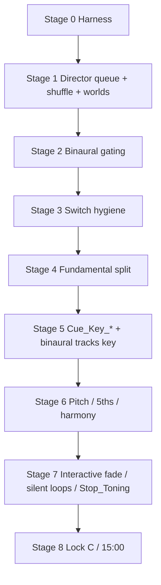

# Blocks 4 / 5 / 7 — Music System Hardening Plan

**Scope:** [Block 4 (Wwise switch hygiene)](PLAYTEST_NOTES_ORGANIZED.md#block-4--wwise-switch-hygiene-safety-fixes), [Block 5 (binaural + stage gating)](PLAYTEST_NOTES_ORGANIZED.md#block-5--binaural--stage-gating-medium-scoped), and [Block 7 (music system: fundamental, pitch, silent loops)](PLAYTEST_NOTES_ORGANIZED.md#block-7--music-system-fundamental-pitch-silent-loops-large), worked as **one** staged plan.

**Companion doc:** [`PLAYTEST_NOTES_ORGANIZED.md`](PLAYTEST_NOTES_ORGANIZED.md). **Workflow:** [`soundself-director-mode.mdc`](../.cursor/rules/soundself-director-mode.mdc).

---

## Standing rules (apply to every stage)

1. **No code is written until Robin confirms** the plan, and confirms each stage as we reach it.
2. **Each stage header names the implementation AI** — **Composer 2.5 fast** or **Opus 4.8**.
3. **Every stage ends with a required Opus 4.8 regression pass** — a read-only review of the diff for regressions across music / voice / sequencing before commit. This happens even when implementation was done by Composer.
4. **Each stage ends with a commit** — agent proposes message + files; Robin approves per the git rule.
5. **Tests favor minimal listening + minimal moving around.** Drive everything from the keyboard in a `Playground_Debug` harness; paste one-line state logs into chat.
6. **Block order inside each stage:** Test Runner tests (EditMode) first, then Playtests.
7. **Do NOT touch `Assets/Scenes/MainGame.unity`.** Another developer is actively working on it in git; editing or committing it risks merge conflicts. Do not edit, stage, or commit this scene as part of any stage. If a change *seems* to require it, stop and flag it to Robin instead.
8. **Add Test Runner (EditMode) tests as we move through the system — for regression coverage, not just the current task.** Whenever we touch a behavior with a stable rule (thresholds, switch order/values, stage→flag maps, queue mechanics, cue→note maps), add or extend an EditMode test that pins it, so future changes that break it fail a test rather than a playtest. Prefer a small pure **policy** class wired through production so the rule is unit-testable. Goal: a growing regression net that runs without Robin's ears.
9. **Record commit hashes in this plan (and the relevant doc) for each committed change.** Add the short hash next to the stage/fix it implements in the **Commit log** below. Per the repo rule, **never make a commit whose only purpose is writing a hash into a markdown file** — embed the hash in the same commit as the work it describes, or add it in the *next* commit that carries real work (or when Robin pastes it).

**Ordering rationale:** Director / shuffle queue mechanics are foundational and come first (after the harness). Then easy knock-outs (binaural gating), then switch hygiene, then the careful fundamental-system split, then the musically sensitive items in order of how fundamental they are to the music sounding good.

---

## Commit log

Short hashes for each committed stage/fix (standing rule 9). Newest at the bottom. `origin/WorkingWwise`.

| Commit | Stage / change |
|--------|----------------|
| `c40e044b` | Stage 0 — Add `Playground_Debug` harness + keyboard music controls (editor/dev only) |
| `ab63eb4f` | Stage 1 — Director queue self-removal fix; shuffle + sound-world transition audit |
| `da074617` | Stage 2 — Block 5: gate binaural off on MusicPlaylist/LinearAudio stages |
| `dd1b7c0a` | Stage 2b + Stage 3 first fix — single-authority binaural + Block 4 first switch fix (marked UNTESTED) |
| `daca6470` | Investigation start — `SOUNDWORLD_SWITCH_NOT_AUDIBLE.md` + guided playtest / binaural WIP checkpoint |
| _(pending — this commit)_ | **SOUNDWORLD_SWITCH_NOT_AUDIBLE resolved** — `SetSoundWorld` now posts `SoundWorldMode_Switch` (was gated out by the `!ToningV3WasAlreadyRestored` guard); via `InteractiveMusicSwitchPolicy.SetSoundWorldPosts` + EditMode test; plan standing rules 8/9 + commit log added |

---

## How director mode helps these blocks (and where it doesn't)

Director mode's core move: **extract the rule-based part into a policy + EditMode test so it never needs Robin's ears, and isolate the irreducibly perceptual part into the smallest possible listening checklist.** Most of Blocks 4/5/7 is rule-based (cue→note maps, lock precedence, stage→binaural gating, switch ordering, queue mechanics, timing constants), so ~70–80% becomes "read a log line and move on." The harness *is* director mode applied: park in `Playground_Debug`, press a key, paste one state line.

**What it does NOT do:** it cannot tell us the music sounds good. Green tests ≠ harmonious. The dissonance / clash / fade-feel complaints are perceptual — no EditMode test substitutes for toning in headphones. Beware false confidence: a correct cue map doesn't mean the chosen pitches are musical, only that the plumbing is right.

Each stage below states a **Listening load** so the ear-requirement is explicit up front:

- **Logs only** — sign off from the state line / console; no listening.
- **Logs + optional ear** — objective via logs, with a quick perceptual sanity check.
- **Real ear check** — irreducibly subjective; headphones required.

---

## The test harness (built first, used by every later stage)

Editor/dev-only; **no production behavior change**, so it can land first and de-risk all later subjective testing.

- New **`StageVariant.Playground_Debug`** (next free int id, e.g. `36` — append, do not renumber existing ids).
- [`PlaygroundStageHandler`](../Assets/Scripts/Sequencing/Handlers/PlaygroundStageHandler.cs) handles `Playground_Debug` like Freeplay (director + `gameOn` on) but **does not start the timeline coroutine** — it parks in a controllable state.
- A dev component (extend [`InputReferences`](../Assets/Scripts/Utilities/InputReferences.cs) or new `MusicDebugHarness`) with keys to:
  - **Simulate `Cue_Key_*`** by calling the shared cue handler directly (test the whole Unity key path without waiting on Lorna's Wwise build). Includes stepping through Lorna's example timeline.
  - Cycle **sound worlds** (SonoFlore / Shadow / Gentle / Shruti) and **music loops** (ShiftingEarth / SitarAmbience / PinkNoiseAtmosphere / Silence).
  - **Lock / unlock fundamental**, force **lock C** (savasana sim), jump to **15:00** / **savasana** milestone states.
  - **Director repro:** queue a single `ActivateEntireQueueOnNextTone` item, force-expire its timer, then start a tone — to reproduce the self-removal bug deterministically.
  - Toggle **binaural** play / volume.
  - Print **one consolidated state line** on demand: `mode | fundamental | harmony | soundworld | binaural center Hz | gameOn`.
- [`DebugSequence.asset`](../Assets/Definitions/Sequences/DebugSequence.asset)'s Playground stage repointed to `Playground_Debug` (`.asset` edit — prompt Robin to save Unity first). `MainGame.unity` already wires `definitionOverride → DebugSequence`.

> Only non-`.cs` touches: the `StageVariant` enum value and `DebugSequence.asset`. No `.unity` / `.prefab` edits planned.

---

## Stage 0 — Debug / test harness

- **Implement with: Composer 2.5 fast** · **Regression pass: Opus 4.8 (required)**
- **Listening load:** Logs only — confirm the state line and that nothing auto-advances.

**Goal / acceptance:** From `DebugSequence` + `Playground_Debug`, drive cues / worlds / loops / locks / binaural / director-repro from the keyboard and get a one-line state dump. Zero change to production sequence behavior.

**Test Runner tests (EditMode):** harness key→action map is a thin switch; assert `Playground_Debug` routes to the parked handler (no timeline coroutine).

**Playtests:** enter debug playground; press state-dump key; confirm log line; confirm no auto-advance.

**Must not break:** existing `StageVariant` int ids; normal `DebugSequence` flow when `Playground_Debug` unused.

**Commit:** `Add Playground_Debug harness + keyboard music controls (editor/dev only).`

### Stage 0 — Playtests (when implemented)

| Inspector | Value |
|-----------|--------|
| `CSVLoader` → Definition Override | `DebugSequence` (MainGame default) |
| Enter Play Mode | Advance/skip to **Playground** (variant `Playground_Debug`) |

| Step | Pass criteria |
|------|----------------|
| Parked playground | Console: `Playground_Debug — parked`; stage does not auto-complete |
| **P** | One-line `[MusicDebugHarness] STATE mode=… \| fundamental=… \| …` |
| **;** | Steps Lorna `Cue_Key_*` timeline; fundamental updates in state line |
| **R** | Director repro queued; after tone, either repro action log **or** (pre–Stage 1) empty-queue bug log |

**Harness keys:** P=state · **E=end stage** · **G=guided Stage 1+2 subjective playtest** · [=world · ]=loop · ;=key cue · … (Shift+E in InputReferences; avoid Shift+Q — Unity steals Q in Scene view)

### Guided subjective playtest (Stage 1 + 2) — **G** key

Editor-only coroutine [`MusicDebugGuidedPlaytest`](../Assets/Scripts/Debug/MusicDebugGuidedPlaytest.cs). **G** starts; **G** again aborts.

**Session entry:** Play Mode → `DebugSequence` → land on **Playground_Debug** (first stage if DebugSequence starts there). **Headphones required.**

| Step | What happens |
|------|----------------|
| **G** | Coroutine starts; ALL CAPS `>>> … <<<` logs in Console tell you what to listen for / when to tone |
| Auto | Stage 2 baseline: ~30s binaural fade-in on Playground; periodic **P** state dumps |
| Auto + **tone** | Stage 1: Director repro → Shadow soundscape → transition sound → shuffle (each waits for timer, then **NOW TONE**) |
| Optional **]** / **[** | Stage 2 attenuation dip (~49) then recovery on Playground |
| **E** (when prompted) | Leave Playground → `Linear_Nature`; listen for binaural fade-out (~30s) |
| End | Paste Console (filter `MusicDebugHarness \| Director Queue \| Binaural`) + subjective notes |

**Pass (Stage 1):** repro action executes; no *"queue is empty"* on whole-queue activation; soundscape/shuffle/transition fire on tone.

**Pass (Stage 2):** Playground `binauralOut≈70`; after **E** to Linear `binauralOut≈0`; optional `]` dip to `≈49` with `binauralAtt=on`.

---

## Stage 1 — Director queue + shuffle + sound-world transitions

- **Implement with: Opus 4.8** · **Regression pass: Opus 4.8 (required)**
- **Listening load:** Logs only — queue mechanics are pure logic; optional quick ear check that a shuffle/transition feels intentional.

**Goal / acceptance:**
- **Director self-removal bug fixed.** When an item expires with `ActivateEntireQueueOnNextTone`, it must remain a member of the queue it activates (so it fires) rather than being removed before activation. Subsumes the existing Block 7 *"Shuffle expired + empty queue"* item.
- Only one dominant sound world at a time; Shadow / Shruti transitions feel intentional; shuffle exclusion windows (≤300s / ≤180s) correct.

**Root cause (already located):** [`Director.QueueUpdate`](../Assets/Scripts/Sequencing/Director.cs) unconditionally adds every expired key to `keysToRemove`, including the `ActivateEntireQueueOnNextTone` case. The coroutine `ActivateQueueOnTone` doesn't capture the triggering action — it activates whatever's left in the queue on the next tone — so the trigger has already removed itself (and if it was the only item, the queue is empty → *"Queue activation requested but queue is empty (may have been cleared)"*). `ActivateThisActionOnNextTone` is safe (action captured); `ExpireWithoutExecuting` genuinely just expires.

**Fix shape (design carefully in-stage):**
- Don't add `ActivateEntireQueueOnNextTone` items to `keysToRemove`; mark them "pending activation" (tuple flag or side set) so `QueueUpdate` doesn't re-trigger a new coroutine every frame while `timeLeft ≤ 0`; let `ActivateQueue()`'s final `queue.Clear()` remove them when they fire.
- Handle multiple same-frame `ActivateEntireQueueOnNextTone` expiries (none lost).
- Decide behavior if the tone never arrives before the stage ends (currently they'd linger).

**Files:** [`Director.cs`](../Assets/Scripts/Sequencing/Director.cs), [`WorldShuffler.cs`](../Assets/Scripts/MusicAndLight/WorldShuffler.cs), [`PlaygroundStageHandler.cs`](../Assets/Scripts/Sequencing/Handlers/PlaygroundStageHandler.cs).

**Test Runner tests (EditMode):** `Block7DirectorQueueEditModeTests` — expire an `ActivateEntireQueueOnNextTone` item → its action still executes on activation; multiple same-frame expiries all fire; `ActivateThisActionOnNextTone` and `ExpireWithoutExecuting` unchanged; shuffle-expired-with-nonempty-queue still activates; exclusion windows.

**Playtests:** harness director-repro key → confirm log shows the item firing (not "queue is empty"); cycle worlds, watch shuffle logs.

**Must not break:** `ActivateThisActionOnNextTone` capture behavior; `fundamentalChange` short-path (`ExpireWithoutExecuting`); `activateQueueOnToneRunning` guard against duplicate coroutines.

**Note (cross-stage):** sound-world transitions touch fundamental content locks (`SetSoundWorld` clears content lock; `SetMusicLoop` sets it). Keep the transition audit light here; deep content-lock interaction is revisited in Stage 4.

**Open investigation (spun out) — RESOLVED 2026-06-04:** During the Stage 1+2 guided playtest the **sound-world change was not audible**. Root cause was Unity-side (not Wwise): [`MusicSystem1.SetSoundWorld`](../Assets/Scripts/MusicAndLight/MusicSystem1.cs) gated the `SoundWorldMode_Switch` post behind `!ToningV3WasAlreadyRestored`, which was true in the audible path, so the world switch never reached Wwise. Fixed by extracting [`InteractiveMusicSwitchPolicy.SetSoundWorldPosts`](../Assets/Scripts/MusicAndLight/InteractiveMusicSwitchPolicy.cs) (world→Silence→InteractiveMusicSystem, one toning restore) + EditMode test; verified audible + Wwise-confirmed. Details: [`SOUNDWORLD_SWITCH_NOT_AUDIBLE.md`](SOUNDWORLD_SWITCH_NOT_AUDIBLE.md).

**Commit:** `Block 7: fix Director queue self-removal on whole-queue activation; shuffle + sound-world transition audit.`

---

## Stage 2 — Block 5: binaural stage gating (easy knock-out)

- **Implement with: Composer 2.5 fast** · **Regression pass: Opus 4.8 (required)**
- **Listening load:** Logs only — state line shows binaural muted/audible per stage.

**Goal / acceptance:** Binaural silent on `MusicPlaylist` + `LinearAudio` stage types; present in `Tutorial` + `Playground`.

**Approach (Robin: stage `Enter()`, not `SetMusicModeFlags`):**

- Small **`BinauralStagePolicy`** — pure rule: which `StageType`s should have audible binaural (e.g. target volume **70** vs **0**). Handlers and tests call the policy; **do not** add stage-type branching inside [`MusicSystem1.SetMusicModeFlags`](../Assets/Scripts/MusicAndLight/MusicSystem1.cs) (that method stays mode-driven only: tutorial/freeplay/frozen/environment/MusicLoopSilent).
- Apply in **`Enter()`** on the relevant handlers via a shared helper (e.g. `BinauralStagePolicy.ApplyBinauralVolumeForStage(StageType)` → `MusicBinauralBeats.instance.SetVolume(...)`):
  - **Mute:** [`MusicPlaylistStageHandler`](../Assets/Scripts/Sequencing/Handlers/MusicPlaylistStageHandler.cs) — today never touches binaural; playlist can inherit **70** from a prior playground.
  - **Mute:** [`LinearAudioStageHandler`](../Assets/Scripts/Sequencing/Handlers/LinearAudioStageHandler.cs) — generalize beyond `Linear_Nature` only (all linear variants).
  - **On:** [`TutorialStageHandler`](../Assets/Scripts/Sequencing/Handlers/TutorialStageHandler.cs) and [`PlaygroundStageHandler`](../Assets/Scripts/Sequencing/Handlers/PlaygroundStageHandler.cs) — explicit **Enter** apply so binaural is on even if mode flags run in a different order.
- **`Exit` / `LocalCleanup`:** only if a stage can leave binaural in a wrong state for the *next* stage without that stage’s `Enter` fixing it; default is “next stage `Enter` owns volume.”

**Test Runner tests (EditMode):** `Block5BinauralPolicyEditModeTests` — policy maps playlist/linear → off, tutorial/playground → on (no play mode / Wwise).

**Playtests:** harness **P** on debug playground → `binauralVol` trends to **70** (30s lerp on Enter). **Shift+Q** to **Linear_Nature** → after lerp completes, `binauralVol=0` (or watch Console: `Binaural Beats: New Volume is 0`). Optional: **MusicPlaylist** stage — same mute target.

**Commit:** `Block 5: gate binaural off on MusicPlaylist/LinearAudio stages.`

---

## Stage 2b — Binaural single-authority consolidation (follow-up to Stage 2 regression review)

- **Implemented with: Opus 4.8** · **Regression pass: Opus 4.8 (this stage was itself the regression pass)**
- **Listening load:** Logs only — harness state line shows `binauralBase`, `binauralAtt`, `binauralOut`.

**Why:** The Stage 2 regression review found binaural volume had **two competing default authorities** — `MusicSystem1.SetMusicModeFlags` (mode → 70/50/0) and `BinauralStagePolicy` (stage → 70/0). They disagreed for `MusicLoopSilent` (mode wanted 50) on stages we want muted, so `Linear_Nature` landed at **50 instead of 0** depending on call order. Robin's decision: **one master authority = stage-based**, with a mode-driven **attenuation** toggle layered on top.

**Design (single authority + orthogonal attenuation):**

- **Base bus volume is stage-owned.** [`BinauralStagePolicy.GetTargetVolume(StageType)`](../Assets/Scripts/Sequencing/BinauralStagePolicy.cs) (`Tutorial`/`Playground` → **70**, everything else → **0**) is applied **once**, centrally, in [`SequenceRunner.AdvanceToStage`](../Assets/Scripts/Sequencing/SequenceRunner.cs) right after the re-entrancy guard. Per-handler `Enter()` calls were **removed** (Playground, Tutorial ×3, MusicPlaylist, LinearAudio).
- **Mode only attenuates.** [`MusicSystem1.SetMusicModeFlags`](../Assets/Scripts/MusicAndLight/MusicSystem1.cs) no longer sets binaural volume; it calls `MusicBinauralBeats.SetBinauralAttenuated(modeMusicLoopSilentFlag)`. When attenuated, the bus output is reduced by **30%** (`70 × 0.7 ≈ 49`, reproducing the old "50 during MusicLoopSilent", now layered on whatever base the stage set).
- **One RTPC writer.** [`MusicBinauralBeats`](../Assets/Scripts/MusicAndLight/MusicBinauralBeats.cs) holds `_volume` (base, lerped by `lerpVolume`) and `_attenuationFactor` (lerped by `lerpAttenuation`); both funnel through a single `ApplyBusVolume()` = `BinauralAttenuationPolicy.Apply(base, factor)`. Output is always the product, so the two lerps never fight.
- **Pure math extracted** to [`BinauralAttenuationPolicy`](../Assets/Scripts/MusicAndLight/BinauralAttenuationPolicy.cs) for EditMode testing.

**Decisions (Robin):** Savasana = **0**, Linear (all variants) = **0**, every non-Tutorial/Playground stage = **0**. Mid-stage mode flips no longer touch the base (they only attenuate).

**Intentional behavioral deltas to verify in playtest (all consistent with "binaural only audible in Tutorial/Playground"):**
- *Savasana → FrozenFreeplay* (CueStopInteractive) used to raise binaural to 70; now stays **0** (per decision).
- *Playground end `FadeOut()` → Environment* used to snap binaural to 0; now binaural lerps **70 → 0** gracefully as Savasana enters (base 0, 30s).
- *WwiseVO `Cue_Stop_Interactive` fallback → FrozenFreeplay* no longer nudges binaural; base stays where the stage set it.

**Test Runner tests (EditMode):** `BinauralAttenuationPolicyEditModeTests` — `GetFactor(true)=0.7`, `GetFactor(false)=1.0`, `Apply(70,true)=49`, `Apply(0,*)=0`, clamps to 0–100. `Block5BinauralPolicyEditModeTests` unchanged (still valid).

**Playtests:** harness **P** → debug playground: `binauralBase=70 binauralAtt=off binauralOut=70`. **Shift+E** to `Linear_Nature`: after lerp, `binauralBase=0 binauralAtt=on binauralOut=0`. To exercise attenuation visibly, enter a state where base is 70 and mode is `MusicLoopSilent` → `binauralOut≈49`.

**Commit:** `Block 5 follow-up: single-authority binaural (stage owns base volume, mode only attenuates 30%).`

---

## Stage 3 — Block 4: Wwise switch hygiene (safety fixes)

- **Implement with: Opus 4.8** · **Regression pass: Opus 4.8 (required)**
- **Listening load:** Logs only — pass criterion is a switch-warning-free console (objective). Fade *feel* is deferred to Stage 7.

**Goal / acceptance:** No `SoundWorldMode_Switch` / `MusicLoops_Switch` warnings on first interactive entry; one sound world; `MusicLoops → Silence` set before interactive entry; sound-world switch posted one frame before the mode switch (robust to same-frame / back-to-back triggers).

**Files:** [`MusicSystem1`](../Assets/Scripts/MusicAndLight/MusicSystem1.cs) — `SetMusicModeTo`, `StartInteractiveMusic`, `SetSoundWorld`, `SetMusicLoop`; [`WwiseVOManager.SetToEsketamineAscending`](../Assets/Scripts/WwiseManagers/WwiseVOManager.cs) path.

**Test Runner tests (EditMode):** `Block4SwitchOrderEditModeTests` — world-switch precedes mode-switch; `MusicLoops → Silence` before interactive; no duplicate switch posts in one frame (via a thin testable switch-order policy / log buffer).

**Playtests (Activation + Adjunctive):** console clean of switch warnings through opening → first toning. (Fade-feel / `Stop_Toning` subjective items handled in Stage 7.)

**Commit:** `Block 4: order sound-world/mode switches; MusicLoops→Silence before interactive.`

### Stage 3 — first fix (done): `MusicLoops → Silence` before `InteractiveMusicSystem`

- **Implemented with: Opus 4.8** · **Regression pass: Opus 4.8 (required)**

**Fix:** Lorna's top Block 4 item — *"when switching to InteractiveMusicSystem (not MusicLoops), set Music Loop switch to Silence first."* When entering interactive music for a **SoundWorld** interaction, the music-loop bed (`Play_MusicLoops` from `StartInteractiveMusic`) could bleed through because nothing forced `MusicLoops_Switch → Silence`. Now it's silenced **before** the `InteractiveMusicMode_Switch → InteractiveMusicSystem` post.

**Seam (regression-safe):** the `SoundWorld` branch of [`RecoverInteractiveMusicModeFromInteractionType`](../Assets/Scripts/MusicAndLight/MusicSystem1.cs) (called from Tutorial / Freeplay / FrozenFreeplay entry). The **`MusicLoop`** interaction path is deliberately **unchanged** (its loop is chosen by `SetMusicLoop`, so we must not force Silence there). `MusicLoopSilent` mode already sets Silence itself and does not call this method.

**Design:** switch order extracted to a pure, testable policy — [`InteractiveMusicSwitchPolicy.RecoverInteractiveModeSteps(InteractionType)`](../Assets/Scripts/MusicAndLight/InteractiveMusicSwitchPolicy.cs) returns the ordered `InteractiveMusicSwitchOp` list; `MusicSystem1` executes each op (preserving the `RunWithToningRestoredAfterInteractiveSwitch` wrapper + logs).

**Test Runner tests (EditMode):** `Block4SwitchOrderEditModeTests` — SoundWorld silences MusicLoops *before* InteractiveMusicSystem; SoundWorld never routes to MusicLoops; MusicLoop routes to MusicLoops and does **not** force Silence.

**Still open in Stage 3 (next candidates):** sound-world switch one frame before mode switch (same-frame robustness); apply the same policy/Silence at the other InteractiveMusicSystem entry ([`SetSoundWorld`](../Assets/Scripts/MusicAndLight/MusicSystem1.cs)); duplicate-post-in-one-frame guard.

**Commit:** `Block 4 (first fix): MusicLoops→Silence before InteractiveMusicSystem via switch-order policy + EditMode tests.`

---

## Stage 4 — Block 7 core: break apart the fundamental system (discuss first)

- **Implement with: Opus 4.8** · **Regression pass: Opus 4.8 (required)**
- **This stage starts with a design discussion, not code.** Agree the split before editing.
- **Listening load:** Logs only — lock precedence / mode gates verified from the state line.

**Goal / acceptance:** A clean, documented separation:
- **Master fundamental** = authority (cues / content / director / debug).
- **Input-driven** = `FundamentalUpdate` + Director queue; feeds master only when allowed by mode / lock.
- A single entry point for cue-driven sets that respects lock precedence (`Debug > Content > Mode`).

**Current state (from investigation):** `fundamentalNoteName` is already the single live authority; there is no master/input enum. Locks just freeze it. `FundamentalUpdate` runs only in `Freeplay` / `InteractiveTutorial`. `SetFundamentalDirect` is the only path that retunes binaural and resets timers.

**Open design questions to resolve in-stage:**
- Does a `Cue_Key_*` override a content lock (MusicLoops key) or defer to it?
- How does the 4s binaural stop/wait/retune interact with rapid cue changes?
- Do we add a `master`-level lock distinct from content?

**Test Runner tests (EditMode):** `Block7FundamentalPolicyEditModeTests` — lock precedence; mode gates (no input-driven change in FrozenFreeplay / MusicLoopSilent / Environment); `NoteName.None` rejection; dead-field cleanup (`fundamentalNoteCompare`, unused harmony retrigger threshold).

**Playtests:** harness lock / unlock + input-driven sim; state line confirms who won.

**Commit:** `Block 7: separate master vs input-driven fundamental authority (+ policy tests).`

---

## Stage 5 — Block 7: `Cue_Key_*` handler + binaural tracks key

- **Implement with: Opus 4.8** · **Regression pass: Opus 4.8 (required)**
- **Listening load:** Logs + optional ear — state line confirms binaural Hz matches the cued note (objective); optional headphone check that bed/binaural sit in key.

**Goal / acceptance:** Shared `TryHandleMusicKeyCue(cue)` called at the top of **both** [`VOCallbackFunction`](../Assets/Scripts/WwiseManagers/WwiseVOManager.cs) and `ClosingCallBackFunction`; cue→`NoteName` map per Lorna's spellings; applies to master fundamental; **binaural center frequency follows**; unknown `Cue_Key_*` logged at warning. This is the fix for "binaural tracking the wrong sound" — in MusicLoops the fundamental is content-locked and never tracks the bed's key changes today.

**Cue → `NoteName` map:** `Cue_Key_C..B` → naturals; `Cue_Key_Gsharp` → Gs; `Cue_Key_Bflat` → As; `Cue_Key_Aflat` → Gs; `Cue_Key_Eflat` → Ds. Single dictionary keyed by full cue name; no duplicated switch cases across the two callbacks.

**Test Runner tests (EditMode):** `Block7MusicKeyCueEditModeTests` — every Lorna string → expected `NoteName`; unknown → warn + no change.

**Playtests (keyboard, minimal listening):** simulate each `Cue_Key_*`; state line shows fundamental + binaural Hz matching; optional headphone check that bed / binaural sit in key.

**External dependency:** Lorna embeds the cues in Wwise ([Appendix A](PLAYTEST_NOTES_ORGANIZED.md#appendix-a--externallorna--non-unity-batch-together)). The harness verifies the Unity side now. Note: `Play_MusicPlaylist` is posted **without** the music-sync callback flag — if bed key cues fire there, that post needs the flag added.

**Commit:** `Block 7: shared Cue_Key_* handler; binaural follows master fundamental.`

---

## Stage 6 — Block 7: pitch / 5ths / harmony audit

- **Implement with: Opus 4.8** · **Regression pass: Opus 4.8 (required)**
- **Listening load:** Real ear check — interval math is tested, but consonance ("does it sound harmonious") requires headphones.

**Goal / acceptance:** Harmonious pitches around 5ths (Fundamental + Harmony); `changeHarmony` `NoteName.None` guard solid; remove or wire the dead harmony-retrigger threshold.

**Test Runner tests (EditMode):** harmony interval selection guards; `NoteName.None` guard.

**Playtests:** harness: set fundamental, trigger harmony, confirm intervals; subjective consonance check.

**Commit:** `Block 7: pitch/5ths + harmony guards audit.`

---

## Stage 7 — Block 7 + Block 4: interactive fade, silent loops, Stop_Toning

- **Implement with: Opus 4.8** · **Regression pass: Opus 4.8 (required)**
- **Listening load:** Real ear check — silent-loop persistence is tested objectively, but fade-in feel and `Stop_Toning` pacing require headphones.

**Goal / acceptance:** Interactive fade-in not abrupt / too loud (`SILENT_Volume` + switch order from Stage 3); silent loops persist when toning stops; `Stop_Toning` Wwise-paced, not an instant Unity cut.

**Files:** [`MusicSystem1`](../Assets/Scripts/MusicAndLight/MusicSystem1.cs) — `BasicToningUpdate`, `StopWwiseToning`, silent-layer RTPCs; coordinate Wwise fades with Lorna ([Appendix A](PLAYTEST_NOTES_ORGANIZED.md#appendix-a--externallorna--non-unity-batch-together)).

**Test Runner tests (EditMode):** silent-loop persistence invariant (stop events target toning v3 layers, not `Stop_MusicLoops`).

**Playtests:** harness: start toning, stop, confirm bed remains; subjective fade-in / out feel (headphones).

**Commit:** `Block 4/7: interactive fade, silent-loop persistence, Stop_Toning pacing.`

---

## Stage 8 — Block 7: lock C before savasana + 15:00 transition

- **Implement with: Opus 4.8** · **Regression pass: Opus 4.8 (required)**
- **Listening load:** Real ear check — lock timing / gate are tested, but crossfade smoothness at 15:00 and into savasana requires headphones.

**Goal / acceptance:** Fundamental locks to **C** ~60s before savasana; **15:00** milestone crossfade smooth with pitches locked before the transition.

**Files:** [`PlaygroundStageHandler.ProtocolStacksPlaygroundCoroutine`](../Assets/Scripts/Sequencing/Handlers/PlaygroundStageHandler.cs) (milestones ~16×60 / 15:00), [`Director.cs`](../Assets/Scripts/Sequencing/Director.cs), [`SavasanaStageHandler.cs`](../Assets/Scripts/Sequencing/Handlers/SavasanaStageHandler.cs).

**Test Runner tests (EditMode):** lock-C-before-savasana timing constant; pitch-lock-before-15:00 gate.

**Playtests:** harness: jump to 15:00 sim and savasana sim; confirm lock + smooth handoff.

**Commit:** `Block 7: lock C before savasana; smooth 15:00 transition.`

---

## External (Lorna / Wwise) — tracked, not stages

See [Appendix A](PLAYTEST_NOTES_ORGANIZED.md#appendix-a--externallorna--non-unity-batch-together):

- Embed `Cue_Key_*` in Wwise per her timelines (opening / closing / loops).
- Celestial Dreamscape → stop when Chakapa begins.
- Wwise-authored `Stop_Toning` fades (coordinate after Stage 3 / Stage 7).

The harness lets us finish and verify the Unity side independently of Lorna's build.

---

## Cross-cutting regression risks (watch each Opus pass)

- The 4s binaural stop / retune under rapid cue changes.
- `SetMusicLoop` / `SetSoundWorld` vs `MusicLoopSilent` incompatibility (explicit comments in `MusicSystem1`).
- Lock precedence interactions when cues, content locks, and director all want the fundamental.
- `Play_MusicPlaylist` posts **without** the music-sync callback flag — bed key cues there won't reach Unity unless the flag is added.
- Director queue: don't reintroduce the self-removal bug when touching shuffle / fundamental queueing in later stages.

---

## Stage map

*Plan created for Blocks 4 / 5 / 7. No code until confirmed; each stage: Composer or Opus implement → required Opus regression pass → commit.*
