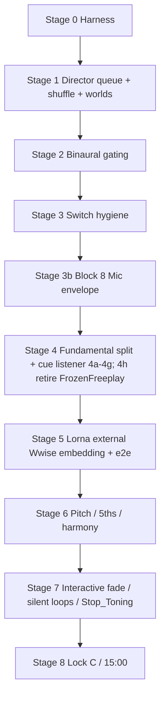

# Blocks 4 / 5 / 7 (+ 8) — Music & Voice Hardening Plan

**Scope:** [Block 4 (Wwise switch hygiene)](PLAYTEST_NOTES_ORGANIZED.md#block-4--wwise-switch-hygiene-safety-fixes), [Block 5 (binaural + stage gating)](PLAYTEST_NOTES_ORGANIZED.md#block-5--binaural--stage-gating-medium-scoped), [Block 7 (music system: fundamental, pitch, silent loops)](PLAYTEST_NOTES_ORGANIZED.md#block-7--music-system-fundamental-pitch-silent-loops-large), and [Block 8 (microphone volume envelope)](PLAYTEST_NOTES_ORGANIZED.md#block-8--microphone-volume-envelope-large-unity-side) — worked as **one** staged plan below. *(Playtest “Block 8” = mic envelope; plan “Stage 8” later = Block 7 lock-C / 15:00 — different numbering.)*

**Companion doc:** [`PLAYTEST_NOTES_ORGANIZED.md`](PLAYTEST_NOTES_ORGANIZED.md). **Workflow:** [`soundself-director-mode.mdc`](../.cursor/rules/soundself-director-mode.mdc).

---

## Standing rules (apply to every stage)

1. **No code is written until Robin confirms** the plan, and confirms each stage as we reach it.
2. **Each stage header names the implementation AI** — **Composer 2.5 fast** or **Opus 4.8**.
3. **Every stage ends with a required Opus 4.8 regression pass** — a read-only review of the diff for regressions across music / voice / sequencing before commit. This happens even when implementation was done by Composer.
4. **Each stage ends with a commit** — agent proposes message + files; Robin approves per the git rule.
5. **Tests favor minimal listening + minimal moving around.** Drive everything from the keyboard in a `Playground_Debug` harness; paste one-line state logs into chat.
6. **Block order inside each stage:** Test Runner tests (EditMode) first, then Playtests.
7. **Do NOT touch `Assets/Scenes/MainGame.unity`.** Another developer is actively working on it in git; editing or committing it risks merge conflicts. Do not edit, stage, or commit this scene as part of any stage. If a change *seems* to require it, stop and flag it to Robin instead.
8. **Add Test Runner (EditMode) tests as we move through the system — for regression coverage, not just the current task.** Whenever we touch a behavior with a stable rule (thresholds, switch order/values, stage→flag maps, queue mechanics, cue→note maps), add or extend an EditMode test that pins it, so future changes that break it fail a test rather than a playtest. Prefer a small pure **policy** class wired through production so the rule is unit-testable. Goal: a growing regression net that runs without Robin's ears.
9. **Record commit hashes in this plan (and the relevant doc) for each committed change.** Add the short hash next to the stage/fix it implements in the **Commit log** below. Per the repo rule, **never make a commit whose only purpose is writing a hash into a markdown file** — embed the hash in the same commit as the work it describes, or add it in the *next* commit that carries real work (or when Robin pastes it).
10. **Single Console filter tag: `B457`.** During any playtest in this series, Robin filters the Unity Console by the one string **`B457`** to see only what matters and hide noise. Every log we want Robin to read during a playtest **must contain `B457`**; incidental/distracting logs **must not**. When instrumenting a block's playtest, prefix the needed logs with `B457` (the `MusicDebugHarness` state line / `GUIDED` prompts already do; tagged production signals so far: Director queue activation/empty in [`Director.cs`](../Assets/Scripts/Sequencing/Director.cs), binaural target volume in [`MusicBinauralBeats.cs`](../Assets/Scripts/MusicAndLight/MusicBinauralBeats.cs)) and leave distractions untagged. A short-lived per-investigation tag may be layered on top (e.g. `SWAUDIT`) and removed at that investigation's commit; `B457` is the durable series filter.

**Ordering rationale:** Director / shuffle queue mechanics are foundational and come first (after the harness). Then easy knock-outs (binaural gating), then switch hygiene, then **Block 8 mic monitoring** (including the guided-playtest MusicLoop headroom fix) **before** the fundamental-system split, then the musically sensitive Block 7 items in order of how fundamental they are to the music sounding good.

---

## Commit log

Short hashes for each committed stage/fix (standing rule 9). Newest at the bottom. `origin/WorkingWwise`.

| Commit | Stage / change |
|--------|----------------|
| `c40e044b` | Stage 0 — Add `Playground_Debug` harness + keyboard music controls (editor/dev only) |
| `ab63eb4f` | Stage 1 — Director queue self-removal fix; shuffle + sound-world transition audit |
| `da074617` | Stage 2 — Block 5: gate binaural off on MusicPlaylist/LinearAudio stages |
| `dd1b7c0a` | Stage 2b + Stage 3 first fix — single-authority binaural + Block 4 first switch fix (marked UNTESTED) |
| `daca6470` | Investigation start — `SOUNDWORLD_SWITCH_NOT_AUDIBLE.md` + guided playtest / binaural WIP checkpoint |
| `816218e3` | **SOUNDWORLD_SWITCH_NOT_AUDIBLE resolved** — `SetSoundWorld` now posts `SoundWorldMode_Switch` (was gated out by the `!ToningV3WasAlreadyRestored` guard); via `InteractiveMusicSwitchPolicy.SetSoundWorldPosts` + EditMode test; plan standing rules 8/9 + commit log added |
| `3dc74f22` | **Stage 3b — Block 8 mic envelope** — per-soundscape MicMixer dB (worlds 0 / loops +3); stacked monitoring ADSR; `SoundscapeMonitoringPolicy` + `MonitoringAdsrPolicy` + EditMode tests; guided playtest; inspector cleanup |
| `18651457` | **Stage 4a — dead-field cleanup** — remove write-only `fundamentalNoteCompare`, `harmonyRetriggerThreshold`, `harmonyTimeSinceLastTrigger`; Stage 4 active-source design folded into plan (incl. former Stage 5 → 4g) |
| _(pending)_ | **Stage 4b — split + rename `NoteTracker`** → `voiceActivity` (`VoiceActivity { ActiveSeconds; IsActive; JustActivated }`, activation half) + `fundamentalChargeByNote` (`Dictionary<NoteName,float>`, charge half); pure data-structure split, zero logic change; EditMode parity green |

---

## How director mode helps these blocks (and where it doesn't)

Director mode's core move: **extract the rule-based part into a policy + EditMode test so it never needs Robin's ears, and isolate the irreducibly perceptual part into the smallest possible listening checklist.** Most of Blocks 4/5/7 is rule-based (cue→note maps, lock precedence, stage→binaural gating, switch ordering, queue mechanics, timing constants), so ~70–80% becomes "read a log line and move on." The harness *is* director mode applied: park in `Playground_Debug`, press a key, paste one state line.

**What it does NOT do:** it cannot tell us the music sounds good. Green tests ≠ harmonious. The dissonance / clash / fade-feel complaints are perceptual — no EditMode test substitutes for toning in headphones. Beware false confidence: a correct cue map doesn't mean the chosen pitches are musical, only that the plumbing is right.

Each stage below states a **Listening load** so the ear-requirement is explicit up front:

- **Logs only** — sign off from the state line / console; no listening.
- **Logs + optional ear** — objective via logs, with a quick perceptual sanity check.
- **Real ear check** — irreducibly subjective; headphones required.

---

## The test harness (built first, used by every later stage)

Editor/dev-only; **no production behavior change**, so it can land first and de-risk all later subjective testing.

- New **`StageVariant.Playground_Debug`** (next free int id, e.g. `36` — append, do not renumber existing ids).
- [`PlaygroundStageHandler`](../Assets/Scripts/Sequencing/Handlers/PlaygroundStageHandler.cs) handles `Playground_Debug` like Freeplay (director + `gameOn` on) but **does not start the timeline coroutine** — it parks in a controllable state.
- A dev component (extend [`InputReferences`](../Assets/Scripts/Utilities/InputReferences.cs) or new `MusicDebugHarness`) with keys to:
  - **Simulate `Cue_Key_*`** by calling the shared cue handler directly (test the whole Unity key path without waiting on Lorna's Wwise build). Includes stepping through Lorna's example timeline.
  - Cycle **sound worlds** (SonoFlore / Shadow / Gentle / Shruti) and **music loops** (ShiftingEarth / SitarAmbience / PinkNoiseAtmosphere / Silence).
  - **Lock / unlock fundamental**, force **lock C** (savasana sim), jump to **15:00** / **savasana** milestone states.
  - **Director repro:** queue a single `ActivateEntireQueueOnNextTone` item, force-expire its timer, then start a tone — to reproduce the self-removal bug deterministically.
  - Toggle **binaural** play / volume.
  - Print **one consolidated state line** on demand: `mode | fundamental | harmony | soundworld | binaural center Hz | gameOn`.
- [`DebugSequence.asset`](../Assets/Definitions/Sequences/DebugSequence.asset)'s Playground stage repointed to `Playground_Debug` (`.asset` edit — prompt Robin to save Unity first). `MainGame.unity` already wires `definitionOverride → DebugSequence`.

> Only non-`.cs` touches: the `StageVariant` enum value and `DebugSequence.asset`. No `.unity` / `.prefab` edits planned.

---

## Stage 0 — Debug / test harness

- **Implement with: Composer 2.5 fast** · **Regression pass: Opus 4.8 (required)**
- **Listening load:** Logs only — confirm the state line and that nothing auto-advances.

**Goal / acceptance:** From `DebugSequence` + `Playground_Debug`, drive cues / worlds / loops / locks / binaural / director-repro from the keyboard and get a one-line state dump. Zero change to production sequence behavior.

**Test Runner tests (EditMode):** harness key→action map is a thin switch; assert `Playground_Debug` routes to the parked handler (no timeline coroutine).

**Playtests:** enter debug playground; press state-dump key; confirm log line; confirm no auto-advance.

**Must not break:** existing `StageVariant` int ids; normal `DebugSequence` flow when `Playground_Debug` unused.

**Commit:** `Add Playground_Debug harness + keyboard music controls (editor/dev only).`

### Stage 0 — Playtests (when implemented)

| Inspector | Value |
|-----------|--------|
| `CSVLoader` → Definition Override | `DebugSequence` (MainGame default) |
| Enter Play Mode | Advance/skip to **Playground** (variant `Playground_Debug`) |

| Step | Pass criteria |
|------|----------------|
| Parked playground | Console: `Playground_Debug — parked`; stage does not auto-complete |
| **P** | One-line `[MusicDebugHarness] STATE mode=… \| fundamental=… \| …` |
| **;** | Steps Lorna `Cue_Key_*` timeline; fundamental updates in state line |
| **R** | Director repro queued; after tone, either repro action log **or** (pre–Stage 1) empty-queue bug log |

**Harness keys:** P=state · **E=end stage** · **G=guided audio audit (worlds/loops + Stage 1+2)** · [=world · ]=loop · ;=key cue · … (Shift+E in InputReferences; avoid Shift+Q — Unity steals Q in Scene view)

### Guided subjective playtest (Parts A/B/C) — **G** key

Editor-only coroutine [`MusicDebugGuidedPlaytest`](../Assets/Scripts/Debug/MusicDebugGuidedPlaytest.cs). **G** starts; **G** again aborts. **Single Console filter: `B457`** (standing rule 10).

**Session entry:** Play Mode → `DebugSequence` → land on **Playground_Debug** (first stage if DebugSequence starts there). **Headphones required.**

| Step | What happens |
|------|----------------|
| **G** | Coroutine starts; `B457` `>>> … <<<` prompts — **you advance each step** (no auto timers) |
| **Sections** | **ENTERING PART A/B/C** banners state what we are testing + pass criteria; **MOVING ON TO PART …** between sections (Space/Return to acknowledge) |
| **Advance** | **Space** or **Return** between listening steps (toning while listening does **not** advance). Director on-tone steps: **sustained tone**, then release, then Space. Named keys (**E**, **]**, **[**) where prompted |
| Part A | Four sound worlds — distinct + clean switches (`SetSoundWorld` / Block 4) |
| Part B | Loop bed then world — loop must go **silent** under world (MusicLoops→Silence hygiene) |
| Part C | Director on tone (no empty queue) + binaural in on Playground / out on Linear |
| Attenuation (optional) | Harness sets **MusicLoopSilent** then **Freeplay** (not `]`/`[` cycle) — expect `binauralAtt=on`, `binauralOut≈70` while silent |
| **E** (when prompted) | Leave Playground → `Linear_Nature`; advance after fade-out judged |
| End | Paste Console (single filter `B457`) + subjective notes |

**Pass (Stage 1):** repro action executes; no *"queue is empty"* on whole-queue activation; soundscape/shuffle/transition fire on tone. Part C clears playground **SoundscapeShuffle** / **ColorWorldShuffle** first; repro step: **release tone** → timer auto-expires → Space → **then** tone.

**Pass (Stage 2):** Playground `binauralOut≈70–100`; after **E** binaural fades out; optional MusicLoopSilent → `binauralAtt=on`.

### Guided playtest results (2026-06-04, Robin)

| Part | Result | Notes |
|------|--------|--------|
| **A** | **PASS** | All four worlds distinct + clean (Space-paced) |
| **B** | **PASS** | Loop bed audible; no bleed under Shadow; Gentle mid-wait = playground auto-shuffle (OK) |
| **C Director** | **PASS** | Repro + Shadow + transition + shuffle; `Activating entire queue with tone`; no empty-queue |
| **C Binaural in** | **PASS (weak)** | Already at 100 on enter — target met, fade-in not observable |
| **C Binaural out** | **PASS** | Fade-out heard after **E** (double-**E** skipped ahead in sequence) |
| **C Attenuation** | **Not validated** (harness) | Prior prompt used `]` = cycle loop, not MusicLoopSilent — **fixed in harness**; re-run optional step only |

**Deferred → Stage 3b.0:** MusicLoops monitoring too quiet — fix via per-soundscape **MicMixer `SoundscapeMonitoring`** (loops seeded +8 dB, 10 s lerp; silence → 0); see [3b.0](#3b0--per-soundscape-gain-on-micmixer-bus-agreed-2026-06-04--do-first-implemented-awaiting-playtest).

**Harness follow-ups in working tree (uncommitted):** Space-only advance + section banners; repro tone-release + shuffle queue clear; MusicLoopSilent via `ApplyMusicLoopSilentMode` / `ApplyFreeplayMode`.

**Stages 0–3 product sign-off (guided + EditMode):** OK to proceed plan-wise; optional: one short re-run of Part C attenuation + repro “stop toning” prompts after harness pull.

---

## Stage 1 — Director queue + shuffle + sound-world transitions

- **Implement with: Opus 4.8** · **Regression pass: Opus 4.8 (required)**
- **Listening load:** Logs only — queue mechanics are pure logic; optional quick ear check that a shuffle/transition feels intentional.

**Goal / acceptance:**
- **Director self-removal bug fixed.** When an item expires with `ActivateEntireQueueOnNextTone`, it must remain a member of the queue it activates (so it fires) rather than being removed before activation. Subsumes the existing Block 7 *"Shuffle expired + empty queue"* item.
- Only one dominant sound world at a time; Shadow / Shruti transitions feel intentional; shuffle exclusion windows (≤300s / ≤180s) correct.

**Root cause (already located):** [`Director.QueueUpdate`](../Assets/Scripts/Sequencing/Director.cs) unconditionally adds every expired key to `keysToRemove`, including the `ActivateEntireQueueOnNextTone` case. The coroutine `ActivateQueueOnTone` doesn't capture the triggering action — it activates whatever's left in the queue on the next tone — so the trigger has already removed itself (and if it was the only item, the queue is empty → *"Queue activation requested but queue is empty (may have been cleared)"*). `ActivateThisActionOnNextTone` is safe (action captured); `ExpireWithoutExecuting` genuinely just expires.

**Fix shape (design carefully in-stage):**
- Don't add `ActivateEntireQueueOnNextTone` items to `keysToRemove`; mark them "pending activation" (tuple flag or side set) so `QueueUpdate` doesn't re-trigger a new coroutine every frame while `timeLeft ≤ 0`; let `ActivateQueue()`'s final `queue.Clear()` remove them when they fire.
- Handle multiple same-frame `ActivateEntireQueueOnNextTone` expiries (none lost).
- Decide behavior if the tone never arrives before the stage ends (currently they'd linger).

**Files:** [`Director.cs`](../Assets/Scripts/Sequencing/Director.cs), [`WorldShuffler.cs`](../Assets/Scripts/MusicAndLight/WorldShuffler.cs), [`PlaygroundStageHandler.cs`](../Assets/Scripts/Sequencing/Handlers/PlaygroundStageHandler.cs).

**Test Runner tests (EditMode):** `Block7DirectorQueueEditModeTests` — expire an `ActivateEntireQueueOnNextTone` item → its action still executes on activation; multiple same-frame expiries all fire; `ActivateThisActionOnNextTone` and `ExpireWithoutExecuting` unchanged; shuffle-expired-with-nonempty-queue still activates; exclusion windows.

**Playtests:** harness director-repro key → confirm log shows the item firing (not "queue is empty"); cycle worlds, watch shuffle logs.

**Must not break:** `ActivateThisActionOnNextTone` capture behavior; `fundamentalChange` short-path (`ExpireWithoutExecuting`); `activateQueueOnToneRunning` guard against duplicate coroutines.

**Note (cross-stage):** sound-world transitions touch fundamental content locks (`SetSoundWorld` clears content lock; `SetMusicLoop` sets it). Keep the transition audit light here; deep content-lock interaction is revisited in Stage 4.

**Open investigation (spun out) — RESOLVED 2026-06-04:** During the Stage 1+2 guided playtest the **sound-world change was not audible**. Root cause was Unity-side (not Wwise): [`MusicSystem1.SetSoundWorld`](../Assets/Scripts/MusicAndLight/MusicSystem1.cs) gated the `SoundWorldMode_Switch` post behind `!ToningV3WasAlreadyRestored`, which was true in the audible path, so the world switch never reached Wwise. Fixed by extracting [`InteractiveMusicSwitchPolicy.SetSoundWorldPosts`](../Assets/Scripts/MusicAndLight/InteractiveMusicSwitchPolicy.cs) (world→Silence→InteractiveMusicSystem, one toning restore) + EditMode test; verified audible + Wwise-confirmed. Details: [`SOUNDWORLD_SWITCH_NOT_AUDIBLE.md`](SOUNDWORLD_SWITCH_NOT_AUDIBLE.md).

**Commit:** `Block 7: fix Director queue self-removal on whole-queue activation; shuffle + sound-world transition audit.`

---

## Stage 2 — Block 5: binaural stage gating (easy knock-out)

- **Implement with: Composer 2.5 fast** · **Regression pass: Opus 4.8 (required)**
- **Listening load:** Logs only — state line shows binaural muted/audible per stage.

**Goal / acceptance:** Binaural silent on `MusicPlaylist` + `LinearAudio` stage types; present in `Tutorial` + `Playground`.

**Approach (Robin: stage `Enter()`, not `SetMusicModeFlags`):**

- Small **`BinauralStagePolicy`** — pure rule: which `StageType`s should have audible binaural (e.g. target volume **70** vs **0**). Handlers and tests call the policy; **do not** add stage-type branching inside [`MusicSystem1.SetMusicModeFlags`](../Assets/Scripts/MusicAndLight/MusicSystem1.cs) (that method stays mode-driven only: tutorial/freeplay/frozen/environment/MusicLoopSilent).
- Apply in **`Enter()`** on the relevant handlers via a shared helper (e.g. `BinauralStagePolicy.ApplyBinauralVolumeForStage(StageType)` → `MusicBinauralBeats.instance.SetVolume(...)`):
  - **Mute:** [`MusicPlaylistStageHandler`](../Assets/Scripts/Sequencing/Handlers/MusicPlaylistStageHandler.cs) — today never touches binaural; playlist can inherit **70** from a prior playground.
  - **Mute:** [`LinearAudioStageHandler`](../Assets/Scripts/Sequencing/Handlers/LinearAudioStageHandler.cs) — generalize beyond `Linear_Nature` only (all linear variants).
  - **On:** [`TutorialStageHandler`](../Assets/Scripts/Sequencing/Handlers/TutorialStageHandler.cs) and [`PlaygroundStageHandler`](../Assets/Scripts/Sequencing/Handlers/PlaygroundStageHandler.cs) — explicit **Enter** apply so binaural is on even if mode flags run in a different order.
- **`Exit` / `LocalCleanup`:** only if a stage can leave binaural in a wrong state for the *next* stage without that stage’s `Enter` fixing it; default is “next stage `Enter` owns volume.”

**Test Runner tests (EditMode):** `Block5BinauralPolicyEditModeTests` — policy maps playlist/linear → off, tutorial/playground → on (no play mode / Wwise).

**Playtests:** harness **P** on debug playground → `binauralVol` trends to **70** (30s lerp on Enter). **Shift+Q** to **Linear_Nature** → after lerp completes, `binauralVol=0` (or watch Console: `Binaural Beats: New Volume is 0`). Optional: **MusicPlaylist** stage — same mute target.

**Commit:** `Block 5: gate binaural off on MusicPlaylist/LinearAudio stages.`

---

## Stage 2b — Binaural single-authority consolidation (follow-up to Stage 2 regression review)

- **Implemented with: Opus 4.8** · **Regression pass: Opus 4.8 (this stage was itself the regression pass)**
- **Listening load:** Logs only — harness state line shows `binauralBase`, `binauralAtt`, `binauralOut`.

**Why:** The Stage 2 regression review found binaural volume had **two competing default authorities** — `MusicSystem1.SetMusicModeFlags` (mode → 70/50/0) and `BinauralStagePolicy` (stage → 70/0). They disagreed for `MusicLoopSilent` (mode wanted 50) on stages we want muted, so `Linear_Nature` landed at **50 instead of 0** depending on call order. Robin's decision: **one master authority = stage-based**, with a mode-driven **attenuation** toggle layered on top.

**Design (single authority + orthogonal attenuation):**

- **Base bus volume is stage-owned.** [`BinauralStagePolicy.GetTargetVolume(StageType)`](../Assets/Scripts/Sequencing/BinauralStagePolicy.cs) (`Tutorial`/`Playground` → **70**, everything else → **0**) is applied **once**, centrally, in [`SequenceRunner.AdvanceToStage`](../Assets/Scripts/Sequencing/SequenceRunner.cs) right after the re-entrancy guard. Per-handler `Enter()` calls were **removed** (Playground, Tutorial ×3, MusicPlaylist, LinearAudio).
- **Mode only attenuates.** [`MusicSystem1.SetMusicModeFlags`](../Assets/Scripts/MusicAndLight/MusicSystem1.cs) no longer sets binaural volume; it calls `MusicBinauralBeats.SetBinauralAttenuated(modeMusicLoopSilentFlag)`. When attenuated, the bus output is reduced by **30%** (`70 × 0.7 ≈ 49`, reproducing the old "50 during MusicLoopSilent", now layered on whatever base the stage set).
- **One RTPC writer.** [`MusicBinauralBeats`](../Assets/Scripts/MusicAndLight/MusicBinauralBeats.cs) holds `_volume` (base, lerped by `lerpVolume`) and `_attenuationFactor` (lerped by `lerpAttenuation`); both funnel through a single `ApplyBusVolume()` = `BinauralAttenuationPolicy.Apply(base, factor)`. Output is always the product, so the two lerps never fight.
- **Pure math extracted** to [`BinauralAttenuationPolicy`](../Assets/Scripts/MusicAndLight/BinauralAttenuationPolicy.cs) for EditMode testing.

**Decisions (Robin):** Savasana = **0**, Linear (all variants) = **0**, every non-Tutorial/Playground stage = **0**. Mid-stage mode flips no longer touch the base (they only attenuate).

**Intentional behavioral deltas to verify in playtest (all consistent with "binaural only audible in Tutorial/Playground"):**
- *Savasana → FrozenFreeplay* (CueStopInteractive) used to raise binaural to 70; now stays **0** (per decision).
- *Playground end `FadeOut()` → Environment* used to snap binaural to 0; now binaural lerps **70 → 0** gracefully as Savasana enters (base 0, 30s).
- *WwiseVO `Cue_Stop_Interactive` fallback → FrozenFreeplay* no longer nudges binaural; base stays where the stage set it.

**Test Runner tests (EditMode):** `BinauralAttenuationPolicyEditModeTests` — `GetFactor(true)=0.7`, `GetFactor(false)=1.0`, `Apply(70,true)=49`, `Apply(0,*)=0`, clamps to 0–100. `Block5BinauralPolicyEditModeTests` unchanged (still valid).

**Playtests:** harness **P** → debug playground: `binauralBase=70 binauralAtt=off binauralOut=70`. **Shift+E** to `Linear_Nature`: after lerp, `binauralBase=0 binauralAtt=on binauralOut=0`. To exercise attenuation visibly, enter a state where base is 70 and mode is `MusicLoopSilent` → `binauralOut≈49`.

**Commit:** `Block 5 follow-up: single-authority binaural (stage owns base volume, mode only attenuates 30%).`

---

## Stage 3 — Block 4: Wwise switch hygiene (safety fixes)

- **Implement with: Opus 4.8** · **Regression pass: Opus 4.8 (required)**
- **Listening load:** Logs only — pass criterion is a switch-warning-free console (objective). Fade *feel* is deferred to Stage 7.

**Goal / acceptance:** No `SoundWorldMode_Switch` / `MusicLoops_Switch` warnings on first interactive entry; one sound world; `MusicLoops → Silence` set before interactive entry; sound-world switch posted one frame before the mode switch (robust to same-frame / back-to-back triggers).

**Files:** [`MusicSystem1`](../Assets/Scripts/MusicAndLight/MusicSystem1.cs) — `SetMusicModeTo`, `StartInteractiveMusic`, `SetSoundWorld`, `SetMusicLoop`; [`WwiseVOManager.SetToEsketamineAscending`](../Assets/Scripts/WwiseManagers/WwiseVOManager.cs) path.

**Test Runner tests (EditMode):** `Block4SwitchOrderEditModeTests` — world-switch precedes mode-switch; `MusicLoops → Silence` before interactive; no duplicate switch posts in one frame (via a thin testable switch-order policy / log buffer).

**Playtests (Activation + Adjunctive):** console clean of switch warnings through opening → first toning. (Fade-feel / `Stop_Toning` subjective items handled in Stage 7.)

**Commit:** `Block 4: order sound-world/mode switches; MusicLoops→Silence before interactive.`

### Stage 3 — first fix (done): `MusicLoops → Silence` before `InteractiveMusicSystem`

- **Implemented with: Opus 4.8** · **Regression pass: Opus 4.8 (required)**

**Fix:** Lorna's top Block 4 item — *"when switching to InteractiveMusicSystem (not MusicLoops), set Music Loop switch to Silence first."* When entering interactive music for a **SoundWorld** interaction, the music-loop bed (`Play_MusicLoops` from `StartInteractiveMusic`) could bleed through because nothing forced `MusicLoops_Switch → Silence`. Now it's silenced **before** the `InteractiveMusicMode_Switch → InteractiveMusicSystem` post.

**Seam (regression-safe):** the `SoundWorld` branch of [`RecoverInteractiveMusicModeFromInteractionType`](../Assets/Scripts/MusicAndLight/MusicSystem1.cs) (called from Tutorial / Freeplay / FrozenFreeplay entry). The **`MusicLoop`** interaction path is deliberately **unchanged** (its loop is chosen by `SetMusicLoop`, so we must not force Silence there). `MusicLoopSilent` mode already sets Silence itself and does not call this method.

**Design:** switch order extracted to a pure, testable policy — [`InteractiveMusicSwitchPolicy.RecoverInteractiveModeSteps(InteractionType)`](../Assets/Scripts/MusicAndLight/InteractiveMusicSwitchPolicy.cs) returns the ordered `InteractiveMusicSwitchOp` list; `MusicSystem1` executes each op (preserving the `RunWithToningRestoredAfterInteractiveSwitch` wrapper + logs).

**Test Runner tests (EditMode):** `Block4SwitchOrderEditModeTests` — SoundWorld silences MusicLoops *before* InteractiveMusicSystem; SoundWorld never routes to MusicLoops; MusicLoop routes to MusicLoops and does **not** force Silence.

**Still open in Stage 3 (next candidates):** sound-world switch one frame before mode switch (same-frame robustness); ~~apply the same policy/Silence at the other InteractiveMusicSystem entry ([`SetSoundWorld`](../Assets/Scripts/MusicAndLight/MusicSystem1.cs))~~ **done in `816218e3`** — `SetSoundWorld` now routes through `InteractiveMusicSwitchPolicy.SetSoundWorldPosts`, which posts `MusicLoops_Switch → Silence` before `InteractiveMusicMode_Switch → InteractiveMusicSystem`; duplicate-post-in-one-frame guard.

**Commit:** `Block 4 (first fix): MusicLoops→Silence before InteractiveMusicSystem via switch-order policy + EditMode tests.`

**Next implementation step (Robin confirmed 2026-06-04):** ~~Stage 3b~~ **done** → **[Stage 4 — Block 7 fundamental split](#stage-4--block-7-core-break-apart-the-fundamental-system-discuss-first)** (design discussion first; enables MusicLoop `Cue_Key_*` → fundamental). Stage 3 one-frame switch ordering can run in parallel if desired.

---

## Stage 3b — Block 8: Microphone volume envelope (**done 2026-06-04 — playtest signed off**)

- **Implement with: Opus 4.8** (envelope) · **3b.0 spike may be Composer 2.5 fast** · **Regression pass: Opus 4.8 (required)**
- **Listening load:** Real ear check — headphones required for all playtests in this stage.
- **Source:** [`PLAYTEST_NOTES_ORGANIZED.md` — Block 8](PLAYTEST_NOTES_ORGANIZED.md#block-8--microphone-volume-envelope-large-unity-side). Unity-side only (no bypass of custom Unity audio this pass).

**Goal / acceptance (full Block 8):** Headphone mic monitoring loud enough to guide breath across **calibration → opening → playground → savasana** without harsh jumps or endless slow creep; ADSR-style rise/decay/release replaces sluggish simple multiply where specified in playtest notes.

### 3b.0 — Per-soundscape gain on MicMixer bus (**done 2026-06-04**)

**Problem (guided Part B):** On a **MusicLoops** bed, headphone monitoring is too quiet vs **SoundWorld** — user must push harder to hear themselves.

**Architecture (agreed):** [`DirectVoiceMonitoring`](../Assets/Scripts/Voice/DirectVoiceMonitoring.cs) **`micMixerVolumeContributionsDb`** → summed → Wwise **`MicProcessingVolume`** is the **whole voice-channel output** (direct monitoring today; **future recordings** on the same bus too). Code comments state that. Session/soundscape offsets that should affect “the voice” holistically belong here — **not** per-frame `monitoringSource` scaling alone.

**Remove dead path (done):** `AttenuateMonitoring` / `monitoringAttenuationDb` / `MusicSystem1.SetMonitoringAttenuationOnce` / `NotifyMonitoringAttenuationChangedExternally` — **deleted** (was **0 dB** no-op). Cleaned call sites: `MusicSystem1`, `TutorialStageHandler`, `CalibrationStageHandler`.

**Per-soundscape boost (replaces the interaction-type idea; Robin 2026-06-04):** Keyed on **the soundscape**, not `InteractionType`. When a soundscape is set (`SetSoundWorld` / `SetMusicLoop`), lerp the named MicMixer contribution **`SoundscapeMonitoring`** to that soundscape’s dB over **10 s** (via `LerpMicMixerVolumeContributionTo`). **`MusicLoopSilent` (Savasana / Linear) and any silence → 0** — explicit `ApplySoundscapeMonitoring(null)` so quiet stages get **no** boost. Unknown soundscape → 0. Per-soundscape dB is an **Inspector list** on `DirectVoiceMonitoring` (`soundscapeMonitoringDbs`), seeded **music loops +8, sound worlds 0** — this list is the **long-term source of truth** (Robin, 2026-06-04), tuned by ear. `ApplySoundscapeMonitoring` **warns once per soundscape** if a soundscape is set with no entry (catches new soundscapes added to `MusicSystem1` `soundWorlds`/`musicLoops` without a monitoring value; silence/null is intentional 0, no warning). Tutorial/calibration overrides still block soundscape-driven lerps while they own monitoring.

**Do not** use Wwise `TONING_Volume` for this (music bed RTPC, not voice bus).

**Guided harness — MicMixer A/B coroutine (G playtest, after the 3b.1 ADSR tune):** On `Playground_Debug`, walk **every** soundscape (4 worlds + 3 loops) in **alternating world↔loop** order so each step is an A/B transition Robin can set by ear:

1. SonoFlore (world)  
2. ShiftingEarth (loop)  
3. Shadow (world)  
4. SitarAmbience (loop)  
5. Gentle (world)  
6. PinkNoiseAtmosphere (loop)  
7. Shruti (world)  

**Linear with forward/back stepping:** `Space`/`Return`/`→` = next step, `←`/`Backspace` = previous step — so Robin walks the list in order but can step back and forth between an adjacent world↔loop pair to A/B while tuning (clamps at step 1; finishing the last step ends the part). Logs `SoundscapeMonitoringDb` + `micMixerSumDb` per step. Pass: each soundscape feels usable after tuning `soundscapeMonitoringDbs`.

**3b.0 acceptance:** Part B loop step comfortable; state line shows `SoundscapeMonitoring` ≈ each soundscape’s dB during that soundscape and **0 during MusicLoopSilent**; smooth 10 s crossfades, no clicks.

**3b.0 Test Runner (EditMode):** `SoundscapeMonitoringPolicyEditModeTests` — known soundscape → mapped dB; unknown / null / empty (silence) → 0; null map → 0; lerp duration **10 s**; contribution-name constant matches `DirectVoiceMonitoring`.

**3b.0 files:** `SoundscapeMonitoringPolicy.cs`, `DirectVoiceMonitoring.cs` (per-soundscape list + apply), `MusicSystem1.cs`, `WorldShuffler.cs` (`CurrentSoundscape` getter), `TutorialStageHandler.cs` / `CalibrationStageHandler.cs` (removed `AttenuateMonitoring`), [`MusicDebugGuidedPlaytest.cs`](../Assets/Scripts/Debug/MusicDebugGuidedPlaytest.cs) + `MusicDebugHarness.cs` (A/B cycle + state line), `SoundscapeMonitoringPolicyEditModeTests.cs`.

**3b.1 — Stacked mic monitoring ADSR (**done 2026-06-04 — playtest signed off**)**

**Implementation notes (as built):** Pure math in [`MonitoringAdsrPolicy.cs`](../Assets/Scripts/MusicAndLight/MonitoringAdsrPolicy.cs); per-instance state machine (`MonitoringAdsrVoice`) + per-frame `UpdateMonitoringAdsr()` in `DirectVoiceMonitoring`. Constants: `AttackTarget` **0.9**, `MinDecaySeconds` **3 s**, `ChargeRunwayAtFullChargeSeconds` **10 s** (decay = `max(3, charge01 × 10)` — an **approximation** of "time until charge hits 0", refine later if needed), `ReleaseSeconds` **2.5 s** ease-out (feel of slow chant-down, **not** a literal `_chantLerpSlow` follow), `BoardFaderHighDb` **0**. Inspector knobs in the single box: `monitoringAdsrSustainLevel` (0.5) + `monitoringAdsrBoardFaderLowDb` (−18); telemetry `debugMonitoringAdsrSum` / `debugMonitoringAdsrVoiceCount` (state line: `adsrSum` / `adsrVoices`). `chantPresence` fully retired on the monitoring path; calibration override forces `_adsrPresenceScale` → 1f.

**Problem:** Today `chantPresence` ≈ `BoardFader(_chantLerpSlow)` in [`ApplyMonitoringVolume`](../Assets/Scripts/Voice/DirectVoiceMonitoring.cs) — one slow lerp tracks `toneActive`, so monitoring creeps and feels sluggish.

**Replacement (agreed 2026-06-04):** **Retire `chantPresence` on the monitoring path entirely.** `ApplyMonitoringVolume` uses **only** summed ADSR (clamp → `BoardFader`) for voice presence — **no** multiply with `_chantLerpSlow` / legacy `chantPresence`. `_chantLerpFast` / `_chantLerpSlow` in [`GameValues.handlecChanting`](../Assets/Scripts/Voice/GameValues.cs) may remain for **lights / gameplay** if still referenced; they must **not** drive headphone monitoring after 3b.1.

**Imitone gates (same stream, different debounce in `ImitoneVoiceIntepreter.CheckToning`):**

| Signal | Lock on | Lock off | Role in 3b.1 |
|--------|---------|----------|----------------|
| `toneActive` | 0.05 s | 0.20 s | Legacy chant lerps; **not** ADSR attack trigger |
| `toneActiveConfident` | 0.20 s | 0.40 s | **Attack** trigger (0→1); **no new burst** until this has gone **false** again (“finger off the piano key”) |
| `toneActiveBiasTrue` | Set with `toneActive` on | Cleared with confident off (~0.4 s) | Part of **release** trigger |

**Per-instance state machine (one instance per confident onset):**

1. **Attack (A):** Spawn on rising edge of **`toneActiveConfident`** only if confident was **false** since the previous instance on this burst (blocks re-attack while still “on”).
2. **Decay (D):** After attack peak (~**0.9** target — see rise, below), lerp instance level down to **sustain** over time derived from **`chantCharge` runway** (“how much time until charge hits 0?”), with a **minimum 3 s**. Sustain level default **0.5** (the **S** of ADSR — hold at decay floor, not “infinite full level”).
3. **Sustain (S):** Hold at decay floor until release trigger.
4. **Release (R):** On the **first frame** where **`!toneActiveConfident && !toneActiveBiasTrue`** (Robin: **option C**), **immediately** leave decay/sustain and run release to **0** — do not wait for decay to finish first. Release **curve family** should match the *feel* of slow chant down in [`GameValues.handlecChanting`](../Assets/Scripts/Voice/GameValues.cs) (`_chantLerpSlow` behavior), **not** a literal sample-by-sample follow of `_chantLerpSlow`.

**Stacking (monitoring only):** All non-finished instances **sum** each frame → **clamp to 1.0** → [`AudioLevelUtilities.BoardFader`](../Assets/Scripts/Utilities/AudioLevelUtilities.cs) (high **0 dB**, low tunable) → existing `ApplyMonitoringVolume` chain (`gameOn`, `chargeDuck`, etc.). ADSRs are **additive layers over time**, not a single shared `_chantLerpSlow` multiply.

**Inspector tuning (one box — playtest together, then bake):** On [`DirectVoiceMonitoring`](../Assets/Scripts/Voice/DirectVoiceMonitoring.cs) (or a single adjacent component), one **`[Header]`** group for all Block 8 envelope knobs Robin tunes by ear:

| Field (playtest) | Starting default | When to tune | After sign-off |
|------------------|------------------|--------------|----------------|
| ADSR sustain level after decay (**S**) | **0.5** | **InteractiveSoundSystem** playtest (opening / tutorial toning) | Bake into code; **remove** Inspector field |
| `BoardFader` low (dB) | **−18** | Same session | Bake; **remove** Inspector field |
| `BoardFader` high | **0 dB** | Fixed unless playtest says otherwise | Code constant |
| **DEBUG** meditative-mode override (`meditativeModeDebugOverride`: None / ForcePlayful / ForceMeditative) — **editable in this same box on `DirectVoiceMonitoring`**; pushed each frame to `RespirationTracker.instance` | **None** | Force a mode by ear to compare snappy (playful) vs blended (meditative) ADSR rise without waiting for `_absorption` hysteresis | **Temporary** — **remove** enum + runtime field + override branch (`RespirationTracker`) + field/push (`DirectVoiceMonitoring`) at 3b.1 cleanup |

**Single tuning box (Robin's requirement):** all knobs Robin touches during the Block 8 playtest live in **one** Inspector box — the `=== BLOCK 8 PLAYTEST TUNING ===` group on [`DirectVoiceMonitoring`](../Assets/Scripts/Voice/DirectVoiceMonitoring.cs). He never switches components mid-test. The meditative override is **edited here** even though the logic lives in `RespirationTracker` (DVM pushes it to `RespirationTracker.instance` each frame). 3b.1 adds the ADSR sustain + BoardFader-low fields to this same box.

Playtest instructions must tell Robin to adjust **both** sustain level and BoardFader low in that **same** Inspector box during InteractiveSoundSystem before sign-off.

**Rise (A) shape (agreed 2026-06-04):**

- **Mode gate:** [`RespirationTracker`](../Assets/Scripts/Voice/RespirationTracker.cs) `modeMeditative` / `modePlayful` (hysteresis on `_absorption`: meditative when **> 0.25**, playful when **< 0.1**; posts Wwise `AbsorptionMode` state on the **instant** bool flip).
- **Init:** `modeMeditative` = **`false`** at startup (already true in code); **`modeMeditativeLerp`** = **0** at startup.
- **Attack driver (per instance):** Lerp from 0 → **~0.9** using a **blended chant reference** each frame:
  - **Snappy (playful):** `chantLerpFast` only.
  - **Meditative:** `0.5 * (chantLerpFast + chantLerpSlow)`.
  - **Blend weight:** **`modeMeditativeLerp`** ∈ [0, 1] — **not** the raw bool (no audible jump when mode flips).
- **`modeMeditativeLerp` (add in `RespirationTracker.cs`):** There is **no** existing smoothed value today. Add a public field in the **same file** as the bool; each frame move toward target **1** when `modeMeditative`, **0** when `modePlayful`, over **60 s** wall-clock (full 0↔1 traverse ≈ **60 s**). Monitoring ADSR and any future “meditative vs playful” Unity audio math read **`modeMeditativeLerp`**, not `modeMeditative`.
- **Implementation TODO (in the lerp update block):** *Talk to Lorna — Unity `modeMeditativeLerp` is 60 s but Wwise `AbsorptionMode` still flips on the instant bool; align or document intentional split.*
- **Attack spawn** still gated on **`toneActiveConfident`** rising edge (see state machine above); chant lerps supply the curve shape during the attack phase.

**Future recording (not 3b.1):** Pre-record voice gate is a **separate** path — likely `toneActiveConfident` + `toneActiveBiasTrue` with a **ring buffer** to catch attack; **hard on/off, no decay**. Documented in the record/replay TODO at top of [`DirectVoiceMonitoring.cs`](../Assets/Scripts/Voice/DirectVoiceMonitoring.cs).

**Primary files:** [`RespirationTracker.cs`](../Assets/Scripts/Voice/RespirationTracker.cs) (`modeMeditativeLerp`), [`GameValues.handlecChanting`](../Assets/Scripts/Voice/GameValues.cs) (chant lerps), [`DirectVoiceMonitoring.ApplyMonitoringVolume`](../Assets/Scripts/Voice/DirectVoiceMonitoring.cs), optional small `MicMonitoringAdsrPolicy.cs` for EditMode tests.

**Telemetry (when debugging):** **Voice bus:** `debugMicMixerVolumeSumDb` / MicMixer contributions (includes `SoundscapeMonitoring`). **Headphone tap:** `telemetryEffectiveMonitoringGain` ≈ `monitoringVolume` × `dynamicScale` × `monitoringSource.volume` (**ADSR sum** × `chargeDuck` × `gameOn` after 3b.1 — **not** legacy `chantPresence`) — **no** `attenuationScale` after 3b.0 removal. Not in either formula: imitone `normalizationGainDb`.

**Test Runner tests (EditMode):**

- **3b.0:** `SoundscapeMonitoringPolicyEditModeTests` — known soundscape → mapped dB; unknown / null / silence → 0; null map → 0; 10 s lerp constant.
- **3b.1:** [`MonitoringAdsrPolicyEditModeTests`](../Assets/Editor/SoundSelf/Tests/EditMode/MonitoringAdsrPolicyEditModeTests.cs) — only the **non-trivial** policy rules + constants (lean-policy rule of thumb): rise blend `Lerp(fast, mean(fast,slow), modeMeditativeLerp)` incl. clamp; decay duration `max(3s, charge01 × 10)` (floored / mid / full); constant defaults (0.9 / 0.5 / 3 / 0 / −18). The single-expression rules (release `!confident && !bias`, attack edge `armed && now && !last`, `Clamp01` sum, BoardFader presence mapping) are **inlined in `DirectVoiceMonitoring`** and covered by playtest, not EditMode. **Written 2026-06-04 — run in Test Runner before playtest.**

**Run:** Test Runner → EditMode, or `.\Tools\run-editmode-tests.ps1`.

**Playtests:**

Guided `G` order (after Parts A/B): **3b.1 ADSR first, then 3b.0 MicMixer A/B** — dial the envelope shape before tuning per-soundscape headroom on top of it.

| Step | Pass criteria |
|------|----------------|
| **3b.1 — InteractiveSoundSystem tune** | Headphones; SonoFlore. 5 guided steps (playful rise → meditative rise → decay/sustain → release → stacking). In **one Inspector box**: tune **ADSR sustain after decay** (start 0.5) and **BoardFader low** (start −18 dB) until attack/decay/release feel right; paste `B457` telemetry (`adsrSum` / `adsrVoices`) |
| **3b.1 — Meditative vs playful** | Use `meditativeModeDebugOverride` (same box) — override **snaps** `modeMeditativeLerp`: playful rise = snappy (fast-only), meditative = rounder (mean fast/slow); no click on switch. Reset override to **None** after |
| **3b.1 — Opening / playground / savasana** | After bake: attack not sluggish; decay to sustain not endless creep; release on finger-off (both gates false) not harsh |
| **3b.0 — MicMixer A/B cycle** | Guided sequence visits **all** soundscapes alternating world↔loop: SonoFlore → ShiftingEarth → Shadow → SitarAmbience → Gentle → PinkNoiseAtmosphere → Shruti. Linear with **forward/back** stepping (`→`/`Space` next, `←`/`Backspace` back) to A/B adjacent pairs. Tune **`soundscapeMonitoringDbs`** (Inspector) per soundscape until each ≈ usable; loops seeded **+8** |
| **3b.0 — MusicLoopSilent check** | Enter Savasana / Linear (MusicLoopSilent): `SoundscapeMonitoringDb` shows **0** (no boost on quiet stages) |
| **3b.0 — Part B re-check** | Guided Part B loop step: comfortable monitoring under world after bake |
| **Calibration → opening → tutorial** | Per [Block 8 playtest table](PLAYTEST_NOTES_ORGANIZED.md#block-8--microphone-volume-envelope-large-unity-side): level across stages; `debugMicMixerVolumeSumDb` + `telemetry Effective Monitoring Gain` |

**Must not break:** Calibration `SetChantBasedAttenuationOverride` (chant duck on **monitoringSource** path, separate from MicMixer); `CalibrationMicrophone` MicMixer contribution; `Cue_Microphone_ON` / `OFF` gating; Block 3 noise-floor work ([`PLAYTEST_NOTES` Block 3](PLAYTEST_NOTES_ORGANIZED.md#block-3--calibration--lights-medium)).

**Commit:** `3dc74f22` — per-soundscape MicMixer monitoring + stacked ADSR envelope; bake playtest tuning; policy tests.

---

## Stage 4 — Block 7 core: break apart the fundamental system (discuss first)

- **Implement with: Opus 4.8** · **Regression pass: Opus 4.8 (required)**
- **This stage starts with a design discussion, not code.** Agree the split before editing.
- **Listening load:** Logs only — lock precedence / mode gates verified from the state line.

**Status (2026-06-05): design agreed with Robin — replacing the priority-ranked lock stack with an explicit *active-source* model.** Implementation not started; this section is the agreed design + remaining open questions.

**Goal / acceptance:** The fundamental is driven by exactly **one active source** at a time, switched explicitly. **Debug** is the only override on top. No priority ranking (`Debug > Content > Mode` retired); `None` is not a valid source. Each source tracks its own preferred fundamental; harmony + interpreted input continue to derive from the master fundamental. **Stage 5 (`Cue_Key_*` Unity listener) is folded in here as sub-stage 4g** — the listener lives in `MusicSystem1` and feeds the MusicBed source, so it belongs to this system.

### Sub-stage ordering (each ends with a regression test)

Behavior-**preserving** refactor first (4a–4d), then behavior-**changing** wiring (4e–4g). A careful regression checkpoint follows **every** sub-stage. **4e is itself broken into reviewed sub-sub-stages** (one source-changing zone at a time).

| Sub-stage | What | Behavior change? | Regression |
|---|---|---|---|
| **4a** | Dead-field cleanup (`fundamentalNoteCompare`, `harmonyRetriggerThreshold`, `harmonyTimeSinceLastTrigger`) | none | EditMode green; compiles |
| **4b** | Split + rename `NoteTracker` → `voiceActivity` + `fundamentalChargeByNote` (still inside `MusicSystem1`) | none | EditMode parity |
| **4c** | Extract `MusicInputDrivenFundamental` + `MusicInputDrivenHarmony` MonoBehaviours; set Script Execution Order; charge dict moves into the fundamental component | none (Robin wires the 2 components + execution order in Unity) | EditMode parity; logs unchanged |
| **4d** | Active-source authority: `FundamentalSource`, `FundamentalSourcePolicy`, `SetFundamentalSource` / `SetFundamentalForSource` / `SetDebugFundamentalOverride`, private `ApplyMasterFundamental`; legacy lock setters become **thin shims** | none (shims provably identical for the real flows) | EditMode: policy + shim-equivalence |
| **4e** | **Migrate call sites to `SetFundamentalSource` — its own carefully-staged sub-stage, broken into reviewed sub-sub-stages, one source-changing *zone* at a time** (Robin reviews each). Start from a **clean commit**. Zones: (1) startup = Sequence on `Awake`; (2) `SetSoundWorld`→InputDriven / `SetMusicLoop`→MusicBed; (3) `SetMusicModeTo` Tutorial/Freeplay/Frozen; (4) `Tutorial.cs` A/C-hum correction; (5) `WwiseVOManager` unlock cue; (6) `SavasanaStageHandler`. Each zone: remove the relevant shim, add EditMode end-state test, Robin review, commit. Then remove `ResolveFundamentalOnUnlock`. No blanket Freeplay gate; last-writer-wins ordering. | **yes** (genuinely source-driven) | per-zone EditMode end-state tests + **subjective (Round 1)** |
| **4f** | `HarmonyRunPolicy.ShouldRun(mode, gameOn)` on the extracted `MusicInputDrivenHarmony`: run in `InteractiveTutorial`, `Freeplay`, and `MusicLoopSilent && gameOn` (Savasana tail; Linear stays off via `gameOn=false`). Scope = harmony only. | **yes** (small: harmony adds the savasana toning tail) | EditMode `HarmonyRunPolicy` + **subjective (Round 1)** |
| **4g** | (folds former Stage 5) Cue listener in `MusicSystem1`: post `Play_MusicLoops` with the `AK_MusicSyncUserCue` flag → `TryHandleMusicKeyCue` → MusicBed source; same shared handler at VO/closing callbacks; binaural follows master (free via `ApplyMasterFundamental`); fix the binaural retune coalescing/handle no-op for rapid cues | **yes** (new: cues drive key) | EditMode cue-map; **subjective (Round 2)** |
| **4h** | **Retire `FrozenFreeplay`** (optional follow-up): collapse its 4 call sites to `SetMusicModeTo(Freeplay)` + `SetGameOn(false)` + Sequence(C); delete the enum value, `GameOnPolicy` case, `Update()` branch, `modeFrozenFreeplayFlag`, `Block3` test. Gated on a **`gameOn` audit** (see §below). | **yes** (mode removed; behavior intended-equivalent) | EditMode (gameOn map, `HarmonyRunPolicy`) + **subjective (Round 3, short)** |

**Subjective testing — two rounds:**
- **Round 1 (after 4f):** behavior-change pass for the Unity-side refactor — dynamic source switching, who-won state line, fundamental tracking feel across the migrated zones, and harmony now playing during the Savasana toning tail. 4a–4d are behavior-preserving so they ride a quick *parity* confirmation that nothing changed; 4e–4f are the first real listening.
- **Round 2 (after 4g):** cue pass — MusicBed `Cue_Key_*` driving the fundamental + binaural following the key, rapid-cue coalescing. (Needs the harness cue simulation; full Wwise-embedded verification waits on Lorna.)

So: **two rounds**, not one — split at the cue boundary (4g), because the cue listener adds a distinct new audible behavior worth isolating.

### 4h — Retire `FrozenFreeplay` (optional follow-up after the active-source model lands)

**Why it becomes removable.** `FrozenFreeplay` today has only two jobs (its whole footprint is tiny — `modeFrozenFreeplayFlag` is effectively write-only): (1) **pin the fundamental to C** (`SetFundamentalModeLock(true, C)`), and (2) **stop the voice→music pipeline** by *not* calling `DynamicMusicSystem()` in its `Update()` branch. `gameOn` is then set false by `GameOnPolicy`. There's already a `//TODO: likely we don't need this mode anymore` at `MusicSystem1.cs:975`.

- **Job (1) dissolves into the active-source model:** "frozen fundamental" = active source **Sequence(C)**. An InputDriven source would only *track*, never *write*, so the freeze is expressed by authority, not by stopping the loop. (Already mapped: `Enter FrozenFreeplay → Sequence(C)`.)
- **Job (2) is fully downstream of `gameOn`** (verified 2026-06-05): every `DynamicMusicSystem` sub-update collapses when `imitoneVoiceInterpreter.gameOn` is false —
  - `imitoneActive = gameOn && !nearNoiseFloor` (`ImitoneVoiceIntepreter.cs:991`), forced false with no tone (`:1021`); tone flags clear in the `!imitoneActive` branch (`:1114`, `:1118-1119`); `toneActiveBiasTrueFrame` follows (`:1226`).
  - `FundamentalUpdate` gated by `if (imitoneActive)` (`MusicSystem1.cs:643`); `HarmonyUpdate` by `if (toneActiveBiasTrueFrame)` (`:742`); `InterpretImitoneUpdate` note-activation by `if (imitoneActive)` (`:2056`) (the lines above only compute local fields, no Wwise/no `NoteTracker` mutation).
  - `BasicToningUpdate` / `BassSynthUpdate` are edge-triggered on the tone flags; the **falling edge** actively calls `StopWwiseToning()` (`:1728`) / `Stop_BassSynth` (`:1809`), then no-ops. So `gameOn=false` doesn't just skip work — it *stops* the audio, arguably cleaner than today (FrozenFreeplay relies on a separate stop).

So the collapse is: **callers do `SetMusicModeTo(Freeplay)` + `SetGameOn(false)` + Sequence(C)** instead of `SetMusicModeTo(FrozenFreeplay)`.

**The one real watch-item — `gameOn` audit (gates 4h).** Collapsing into `Freeplay` means `GameOnPolicy` maps the mode → `true`, so the call sites must explicitly drive `gameOn=false`, **and nothing in the `Freeplay` entry path may re-assert `gameOn=true`.** This audit — not the music updates — is what makes or breaks 4h.

Call sites to convert (the 4 `FrozenFreeplay` callers): `PlaygroundStageHandler.cs` (×2, ~137 & ~384), `SavasanaStageHandler.cs` (~165), `WwiseVOManager.cs` fallback (~347).

**Checklist:**
- [ ] Confirm `Freeplay` entry (`SetMusicModeTo(Freeplay)` path) does not set `gameOn=true` after the caller sets it false (audit `StartInteractiveMusic`, `RecoverInteractiveMusicModeFromInteractionType`, `ApplyGameOnPolicy`).
- [ ] Convert the 4 call sites to `Freeplay` + explicit `SetGameOn(false)` + `SetFundamentalSource(Sequence, C)`.
- [ ] `HarmonyRunPolicy`: key the Freeplay case on `gameOn` for coherence (harmony already can't fire — gated on `toneActiveBiasTrueFrame` — but make the policy honest).
- [ ] Delete enum value `FrozenFreeplay`, its `Update()`/`SetMusicModeTo` branches, `modeFrozenFreeplayFlag`, the `GameOnPolicy` case, and `Block3PolicyEditModeTests.FrozenFreeplayMode_AssignsGameOnFalse`.
- [ ] Accept the **release-tail** difference (tone flags decay over the normal negative thresholds rather than hard-cutting) — equivalent to releasing a tone; confirm `CueStopInteractive` doesn't need an instant freeze.

**Caveats (intended-equivalent, not byte-identical):** `DynamicMusicSystem()` now *runs as a no-op* in Freeplay+gameOn=false (only harmless timers — `fundamentalTimeSinceLastTrigger`, `bassSynthCooldownTimer` — advance) rather than not being called; and the stop is via release tail. Both are audibly equivalent to today, but worth a short **Round 3** listening pass.

**Sequencing:** keep this **out of Stage 4 proper** — it touches `gameOn` semantics and three sequence handlers, which would muddy the behavior-preserving→behavior-adding arc. Do it after the active-source model is in and proven.

### The model: one active source + a Debug override

```
enum FundamentalSource { InputDriven, MusicBed, Sequence }   // active source (Debug is a separate override)
```

- **InputDriven** — sung-pitch tracking (the decision ladder; owns the per-note **charge memory**). Keeps tracking its `preferredFundamental` even when it is **not** the active source (so a later handoff is meaningful).
- **MusicBed** — the bed's key. Fed by `Cue_Key_*` user cues embedded in the MusicLoops (wired in Stage 5); the old static `musicLoops`→note table (`SetMusicLoop` → `SetFundamentalContentLock`) is **replaced by cues**. Holds the last cued note as its preferred.
- **Sequence** — the sequencer/stage pins the note. Replaces today's *mode lock* **and** savasana's use of the *content lock*. Tutorial / FrozenFreeplay / Savasana pin **C**; Freeplay hands off to InputDriven.
- **Debug override** — dev keys / harness. Sits above the active source; clearing it restores `activeSource.preferred`. Replaces `fundamentalDebugLock`.

### Per-source preferred + the write API

Each source carries its own `preferredFundamental`. Methods:
- `SetFundamentalSource(FundamentalSource source, NoteName firstFundamental = None)` — switch active source. `None` → adopt that source's existing preferred (no reset). A real note → set that source's preferred to it. **For `InputDriven`, a real note also wipes the per-note charge memory ("clean slate").**
- `SetFundamentalForSource(FundamentalSource source, NoteName note)` — update a source's preferred; writes master only if it's the active source and no Debug override, else staged for when it next becomes active. **If `source == InputDriven`, this also runs the clean-slate reset** (Robin, 2026-06-05).
- `SetDebugFundamentalOverride(NoteName? note)` — set/clear the override.

`SetFundamentalDirect` becomes the **private** apply mechanism (`ApplyMasterFundamental`): clear `fundamentalChange` queue → set `fundamentalNoteName` → Wwise `...FundamentalOnly` switch → binaural retune → reset activation/charge → `directorStoredFundamental`. No external bypass. `ResolveFundamentalOnUnlock` is **removed** — "unlock" becomes "switch active source," resolving to that source's preferred.

### InputDriven vs `DynamicMusicSystem` gating (Robin, 2026-06-05)

`FundamentalUpdate()` **is** the InputDriven source, and it only lives inside `DynamicMusicSystem()` (runs only in `InteractiveTutorial` + `Freeplay`). So InputDriven is only *alive* in those "tracking modes." Two distinct gates:

- **Tracking gate** = `DynamicMusicSystem` running (mode ∈ {`InteractiveTutorial`, `Freeplay`}). InputDriven keeps accumulating its per-note charge / `preferredFundamental` here **even when it is not the active source** (warm handoff).
- **Write gate** = active source == InputDriven **and** no Debug override. Only then does `FundamentalUpdate` push to the master via `ApplyMasterFundamental`.

This reframes today's behavior exactly: in Tutorial, `FundamentalUpdate` already *tracks* but the mode-lock C blocks the *write*; in the new model the write is blocked because Sequence (not InputDriven) is the active source. Same observable result.

**Switching active source → InputDriven while `DynamicMusicSystem` is not running ⇒ `Debug.LogWarning` (B457).** Nothing would be running to track/drive the master, so it almost always indicates a sequencing mistake. In normal flows InputDriven only becomes active in Freeplay/Tutorial (both tracking modes), so the warning is purely a guardrail. **Behavior: warn-and-honor** — we still set the source and apply `firstFundamental` once (the master won't *track* until a tracking mode resumes). _(Refusing could cause a worse silent failure; revisit if it bites.)_

**Sequence / MusicBed / Debug are NOT gated by `DynamicMusicSystem`** — they are direct setters and apply the master fundamental immediately in any mode.

Policy: `FundamentalSourcePolicy.IsTrackingMode(MusicMode)` (true for `InteractiveTutorial`/`Freeplay`) backs both the InputDriven write gate and the warning; covered by `Block7FundamentalPolicyEditModeTests`.

### File split (MonoBehaviours — set Script Execution Order in Unity)

- **`MusicInputDrivenFundamental.cs`** — `FundamentalUpdate` + `TryApplyFundamentalChangeTriggers`; owns the **per-note charge memory** (see NoteTracker split); produces `preferredFundamental`; calls the authority apply when active. **TODO (future):** when the WorldShuffler / Director become more dynamic, use the preferred fundamental (and notes ±5 from it) to bias preferred next-soundscapes.
- **`MusicInputDrivenHarmony.cs`** — `HarmonyUpdate` + harmony sequences; reads master fundamental.
- Trivial sources (MusicBed / Sequence) + the authority stay as a small region in `MusicSystem1`. Pure rules → `FundamentalSourcePolicy` (testable).

**Execution order (earlier → later):** `ImitoneVoiceIntepreter` → `MusicSystem1` → `MusicInputDrivenFundamental` → `MusicInputDrivenHarmony`. Imitone makes the sung note; `MusicSystem1` interprets/snaps it against master + owns activation state + the apply path; the fundamental component decides/pushes master; harmony runs last on the freshest master.

### NoteTracker split (per-note charge memory → `MusicInputDrivenFundamental`)

Today `NoteTracker` packs two unrelated jobs in one tuple `(ActivationTimer, Active, FirstFrameActive, ChangeFundamentalTimer)`:
- **Activation half** (`ActivationTimer/Active/FirstFrameActive`) — written by `InterpretImitoneUpdate`, read by **toning** (`musicNoteActivated`). Stays in `MusicSystem1`.
- **Charge half** (`ChangeFundamentalTimer`) — used **only** by the fundamental decision.

→ **Split the tuple**: keep an activation tracker in `MusicSystem1`; move a `Dictionary<NoteName,float>` **charge memory** into `MusicInputDrivenFundamental`, which reads activation state each frame via a small accessor and accumulates its own charge. Clean-slate = clear that dictionary.

**Rename both (Robin 2026-06-04 — `NoteTracker` is uselessly generic for a music system):** proposed names —
- Activation tracker (stays in `MusicSystem1`): `voiceActivity` : `Dictionary<NoteName, VoiceActivity>` where `VoiceActivity { float ActiveSeconds; bool IsActive; bool JustActivated; }` (renames `ActivationTimer→ActiveSeconds`, `Active→IsActive`, `FirstFrameActive→JustActivated`).
- Charge memory (moves to `MusicInputDrivenFundamental`): `fundamentalChargeByNote` : `Dictionary<NoteName, float>` (renames `ChangeFundamentalTimer` → the dictionary value).

Confirm names before coding.

### Sequence source (mode lock + savasana content-lock) — careful refactor

Ownership is today *implicit* (priority stack) and set/cleared in scattered places: `SetMusicModeTo` (Tutorial/Frozen pin C, Freeplay unlock), `Tutorial.cs` (A/C-hum correction pins C then releases), a VO unlock cue, and `SavasanaStageHandler` (content-lock C via `MusicLoopSilent`, not the mode lock). The refactor makes ownership **explicit single-writer**: each stage/mode declares the active source on entry. Full refactor expected (Robin 2026-06-04). The safe sequencing is to land the authority + InputDriven/Harmony split first with the lock setters kept as **thin shims** over `SetFundamentalSource` (provably identical), then delete the shims and migrate call sites. **The shim-equivalence is itself baked into EditMode tests** (Robin 2026-06-04): each old call (`SetFundamentalModeLock(true,C)`, `SetFundamentalContentLock(C)`, unlock) must produce the same active-source + master + preferred state as the direct `SetFundamentalSource` call it forwards to — so the migration provably never changes behavior.

### Active-source transitions (startup + regression-proof plan)

Startup + the explicit switch points (Robin 2026-06-04). **Default: `Sequence` on `Awake`** (preferred = the startup `fundamentalNoteName`).

| Trigger | Call site | New action |
|---|---|---|
| Scene load | `MusicSystem1.Awake` | active source = **Sequence** (preferred = startup fundamental) |
| Soundscape set to a **SoundWorld** (InteractiveMusicSystem, not a loop) | `SetSoundWorld` | → **InputDriven** |
| Soundscape set to a **MusicLoop** | `SetMusicLoop` | → **MusicBed** (interim: preferred = static loop key until Stage 5 cues feed it) |
| Enter Tutorial | `SetMusicModeTo(InteractiveTutorial)` | → **Sequence** (C) *(replaces `SetFundamentalModeLock(true,C)`)* |
| Enter Freeplay | `SetMusicModeTo(Freeplay)` | → soundscape-driven (**InputDriven** for world / **MusicBed** for loop) *(replaces `SetFundamentalModeLock(false)`)* |
| Enter FrozenFreeplay | `SetMusicModeTo(FrozenFreeplay)` | → **Sequence** (C) *(replaces `SetFundamentalModeLock(true,C)`)* |
| A/C-hum correction | `Tutorial.cs` | → **Sequence** (C), then restore prior source *(replaces lock(true,C)/false)* |
| VO unlock cue | `WwiseVOManager` | → restore soundscape-driven source *(replaces `SetFundamentalModeLock(false)`)* |
| Enter Savasana | `SavasanaStageHandler.Enter` | → **Sequence** (C) *(replaces `SetFundamentalContentLock(C)`)* |

**Ordering (regression-proof via explicit sets, NOT a mode gate) — Robin 2026-06-04:** There is **no** blanket "only in Freeplay" suppression (that earlier proposal was wrong). Source changes are legitimate in multiple modes — including **Tutorial** and the **awkward adjunctive-savasana tail**. Each switch point sets the source **explicitly** and **last-writer-wins** ordering decides the outcome (a stage that must hold C sets `Sequence(C)` after any soundscape set in the same entry). The regression-proof contract is the transition table above + EditMode tests that assert the **resulting** active-source/master/preferred state for each real flow (tutorial entry + hum correction + release; freeplay world↔loop shuffle; savasana tail), not a mode-gated guard.

### `MusicInputDrivenHarmony` run-gate — `HarmonyRunPolicy` (Robin 2026-06-04)

Harmony runs when `HarmonyRunPolicy.ShouldRun(MusicMode mode, bool gameOn)` is true (still also honoring `enableHarmonyTracking`):
- `InteractiveTutorial` → true
- `Freeplay` → true
- `MusicLoopSilent` → **`gameOn`** (the Savasana toning tail — see note)
- everything else (Silent / FrozenFreeplay / Environment) → false

**Why `MusicLoopSilent && gameOn` = the Savasana tail:** `MusicLoopSilent` is shared by **Savasana** and **Linear**, but `LinearAudioStageHandler` forces `SetGameOn(false)` while the adjunctive Savasana keeps `gameOn` true until its delayed mic-off. So `gameOn` cleanly distinguishes the savasana toning tail (harmony on) from Linear (off) — no need for `MusicSystem1` to know `StageType`. `FrozenFreeplay` (standard savasana after `CueStopInteractive`) stays **off**.

This is the **one deliberate behavior change** to harmony: vs. today it *additionally* runs during the Savasana tail while the user is still toning. Pure policy → EditMode test (incl. the documented assumption that `MusicLoopSilent && gameOn` ⇒ savasana, so a future non-savasana `MusicLoopSilent && gameOn` stage would trip the test). **Scope = harmony only** (the extracted `MusicInputDrivenHarmony` gate); the `DynamicMusicSystem` mode branch for fundamental/toning is unchanged. Decoupled from the active fundamental source (reads the master fundamental whoever set it).

> 4c extracts `MusicInputDrivenHarmony` preserving today's exact gate (`InteractiveTutorial`/`Freeplay`); **4f** then swaps that gate for `HarmonyRunPolicy` (adds the `MusicLoopSilent && gameOn` savasana case).

### MusicBed cues — Wwise wiring note (Stage 5, informs MusicBed here)

`AK_MusicSyncUserCue` callbacks are **per `PostEvent` instance**, not per-gameObject: cues arrive only if the Play event was posted with the callback flag + delegate. VO events already do (`WwiseVOManager.VOCallbackFunction`). **`Play_MusicLoops` (`MusicSystem1`) and `Play_MusicPlaylist` (`WwiseVOManager`) are posted WITHOUT the flag** → `Cue_Key_*` in the bed won't reach Unity until Stage 5 adds the flag + a handler feeding the **MusicBed** source. `MusicSystem1` posts `Play_MusicLoops` on its own gameObject, so the handler can live there.

### Dead-field cleanup (do FIRST)

- `fundamentalNoteCompare` — never read → **delete** (first commit).
- `harmonyRetriggerThreshold` / `harmonyTimeSinceLastTrigger` — seeded + incremented but **never gated** (intended 6 s min between harmony retriggers, never wired). **Delete both** (Robin 2026-06-04: cut, do not wire).

### Test Runner tests (EditMode): `Block7FundamentalPolicyEditModeTests`

- Source-write rule: Debug override beats any active source; only the active source writes; `None` rejected as a source.
- Input-driven mode gate `IsTrackingMode`/`CanInputDrivenChange` (`InteractiveTutorial`/`Freeplay` track; not Frozen / MusicLoopSilent / Environment / Silent).
- InputDriven-source-outside-tracking-mode: `SetFundamentalSource(InputDriven, …)` in a non-tracking mode warns (B457) and warn-and-honors (source set, note applied once); Sequence/MusicBed/Debug are ungated by tracking mode.
- `HarmonyRunPolicy.ShouldRun(mode, gameOn)`: true for `InteractiveTutorial`, `Freeplay`, and `MusicLoopSilent && gameOn`; false otherwise (incl. `MusicLoopSilent && !gameOn` = Linear, and `FrozenFreeplay`).
- `NoteName.None` note rejection in the apply path.
- Clean-slate reset on `SetFundamentalSource(InputDriven, note)` and `SetFundamentalForSource(InputDriven, …)`.
- Mode→source mapping regression pin (Tutorial/Frozen → Sequence C; Freeplay → soundscape-driven).
- Shim-equivalence: each legacy lock call yields the same active-source/master/preferred state as the `SetFundamentalSource` it forwards to.
- Real-flow end-state (no blanket Freeplay gate): tutorial entry/hum/release, freeplay world↔loop shuffle, savasana tail each land on the documented active-source/master/preferred.

### Playtests (one inspector block + single `b457` filter)

- **One** Inspector block (harness / `MusicSystem1`) tracking: **active source, master fundamental, each source's preferred, harmony, debug override** — Robin watches only this block.
- Harness keys to switch active source dynamically and set/clear the debug override; STATE line (`b457`) shows who won.
- **`b457` console hygiene:** audit existing `b457`-tagged logs and quiet the incidental ones (binaural volume `B457 Binaural Beats: New Volume…`, Director queue activation) so the fundamental test console shows only the harness STATE line + source switches.

### Commits (one per sub-stage, each after its regression test)

- **4a** `Block 7: remove dead fundamental/harmony fields (fundamentalNoteCompare, harmony retrigger).`
- **4b** `Block 7: split + rename NoteTracker → voiceActivity + fundamentalChargeByNote.`
- **4c** `Block 7: extract MusicInputDrivenFundamental + MusicInputDrivenHarmony (execution order).`
- **4d** `Block 7: active-source fundamental authority + FundamentalSourcePolicy (lock setters as shims) + tests.`
- **4e** (multiple commits, one per reviewed zone) `Block 7: migrate <zone> to SetFundamentalSource …` — startup, soundscape, mode, tutorial, VO, savasana.
- **4f** `Block 7: HarmonyRunPolicy — harmony runs in Tutorial/Freeplay + Savasana tail (MusicLoopSilent && gameOn).`
- **4g** `Block 7: MusicBed Cue_Key_* listener (Play_MusicLoops callback) + binaural follows key + retune coalescing.`
- **4h** (optional follow-up) `Block 7: retire FrozenFreeplay — Freeplay + gameOn=false + Sequence(C) (gameOn audit).`

---

## Stage 5 — Block 7: `Cue_Key_*` listener (Unity side folded into Stage 4g) + Lorna external embedding

> **Restructured (Robin 2026-06-04):** the Unity-side cue listener moved **into Stage 4 sub-stage 4g** (the listener lives in `MusicSystem1` and feeds the **MusicBed** source — it's part of the same system). What remains as "Stage 5" is the **external** dependency: Lorna embedding the cues in Wwise, then end-to-end verification. The cue→`NoteName` map + handler spec below are the 4g contract.

- **Implement with: Opus 4.8** · **Regression pass: Opus 4.8 (required)**
- **Listening load:** Logs + optional ear — state line confirms binaural Hz matches the cued note (objective); optional headphone check that bed/binaural sit in key.

**Goal / acceptance (4g contract):** Shared `TryHandleMusicKeyCue(cue)` called from the `Play_MusicLoops` callback in `MusicSystem1` **and** at the top of [`VOCallbackFunction`](../Assets/Scripts/WwiseManagers/WwiseVOManager.cs) / `ClosingCallBackFunction`; cue→`NoteName` map per Lorna's spellings; routes to the **MusicBed** source (`SetFundamentalForSource(MusicBed, note)`); **binaural center frequency follows** automatically via `ApplyMasterFundamental`; unknown `Cue_Key_*` logged at warning. This is the fix for "binaural tracking the wrong sound" — in MusicLoops the fundamental was content-locked and never tracked the bed's key changes.

**Cue → `NoteName` map:** `Cue_Key_C..B` → naturals; `Cue_Key_Gsharp` → Gs; `Cue_Key_Bflat` → As; `Cue_Key_Aflat` → Gs; `Cue_Key_Eflat` → Ds. Single dictionary keyed by full cue name; no duplicated switch cases across the two callbacks.

**Test Runner tests (EditMode):** `Block7MusicKeyCueEditModeTests` — every Lorna string → expected `NoteName`; unknown → warn + no change.

**Playtests (keyboard, minimal listening):** simulate each `Cue_Key_*`; state line shows fundamental + binaural Hz matching; optional headphone check that bed / binaural sit in key.

**External dependency:** Lorna embeds the cues in Wwise ([Appendix A](PLAYTEST_NOTES_ORGANIZED.md#appendix-a--externallorna--non-unity-batch-together)). The harness verifies the Unity side now. Note: `Play_MusicPlaylist` is posted **without** the music-sync callback flag — if bed key cues fire there, that post needs the flag added.

**Commit:** `Block 7: shared Cue_Key_* handler; binaural follows master fundamental.`

---

## Stage 6 — Block 7: pitch / 5ths / harmony audit

- **Implement with: Opus 4.8** · **Regression pass: Opus 4.8 (required)**
- **Listening load:** Real ear check — interval math is tested, but consonance ("does it sound harmonious") requires headphones.

**Goal / acceptance:** Harmonious pitches around 5ths (Fundamental + Harmony); `changeHarmony` `NoteName.None` guard solid. (The dead harmony-retrigger threshold was deleted in Stage 4; if a retrigger floor is wanted, decide + wire it here.) Also revisit whether `MusicInputDrivenHarmony` should additionally gate on `gameOn` (deferred from Stage 4).

**Test Runner tests (EditMode):** harmony interval selection guards; `NoteName.None` guard.

**Playtests:** harness: set fundamental, trigger harmony, confirm intervals; subjective consonance check.

**Commit:** `Block 7: pitch/5ths + harmony guards audit.`

---

## Stage 7 — Block 7 + Block 4: interactive fade, silent loops, Stop_Toning

- **Implement with: Opus 4.8** · **Regression pass: Opus 4.8 (required)**
- **Listening load:** Real ear check — silent-loop persistence is tested objectively, but fade-in feel and `Stop_Toning` pacing require headphones.

**Goal / acceptance:** Interactive fade-in not abrupt / too loud (`SILENT_Volume` + switch order from Stage 3); silent loops persist when toning stops; `Stop_Toning` Wwise-paced, not an instant Unity cut.

**Files:** [`MusicSystem1`](../Assets/Scripts/MusicAndLight/MusicSystem1.cs) — `BasicToningUpdate`, `StopWwiseToning`, silent-layer RTPCs; coordinate Wwise fades with Lorna ([Appendix A](PLAYTEST_NOTES_ORGANIZED.md#appendix-a--externallorna--non-unity-batch-together)).

**Test Runner tests (EditMode):** silent-loop persistence invariant (stop events target toning v3 layers, not `Stop_MusicLoops`).

**Playtests:** harness: start toning, stop, confirm bed remains; subjective fade-in / out feel (headphones).

**Commit:** `Block 4/7: interactive fade, silent-loop persistence, Stop_Toning pacing.`

---

## Stage 8 — Block 7: lock C before savasana + 15:00 transition *(plan stage 8 — not playtest Block 8)*

- **Implement with: Opus 4.8** · **Regression pass: Opus 4.8 (required)**
- **Listening load:** Real ear check — lock timing / gate are tested, but crossfade smoothness at 15:00 and into savasana requires headphones.

**Goal / acceptance:** Fundamental locks to **C** ~60s before savasana; **15:00** milestone crossfade smooth with pitches locked before the transition.

**Files:** [`PlaygroundStageHandler.ProtocolStacksPlaygroundCoroutine`](../Assets/Scripts/Sequencing/Handlers/PlaygroundStageHandler.cs) (milestones ~16×60 / 15:00), [`Director.cs`](../Assets/Scripts/Sequencing/Director.cs), [`SavasanaStageHandler.cs`](../Assets/Scripts/Sequencing/Handlers/SavasanaStageHandler.cs).

**Test Runner tests (EditMode):** lock-C-before-savasana timing constant; pitch-lock-before-15:00 gate.

**Playtests:** harness: jump to 15:00 sim and savasana sim; confirm lock + smooth handoff.

**Commit:** `Block 7: lock C before savasana; smooth 15:00 transition.`

---

## External (Lorna / Wwise) — tracked, not stages

See [Appendix A](PLAYTEST_NOTES_ORGANIZED.md#appendix-a--externallorna--non-unity-batch-together):

- Embed `Cue_Key_*` in Wwise per her timelines (opening / closing / loops).
- Celestial Dreamscape → stop when Chakapa begins.
- Wwise-authored `Stop_Toning` fades (coordinate after Stage 3 / Stage 7).

The harness lets us finish and verify the Unity side independently of Lorna's build.

---

## Cross-cutting regression risks (watch each Opus pass)

- The 4s binaural stop / retune under rapid cue changes.
- `SetMusicLoop` / `SetSoundWorld` vs `MusicLoopSilent` incompatibility (explicit comments in `MusicSystem1`).
- Lock precedence interactions when cues, content locks, and director all want the fundamental.
- `Play_MusicPlaylist` posts **without** the music-sync callback flag — bed key cues there won't reach Unity unless the flag is added.
- Director queue: don't reintroduce the self-removal bug when touching shuffle / fundamental queueing in later stages.

---

## Stage map



*Plan: Blocks 4 / 5 / 7 / 8. No code until confirmed; each stage: Composer or Opus implement → required Opus regression pass → commit.*
