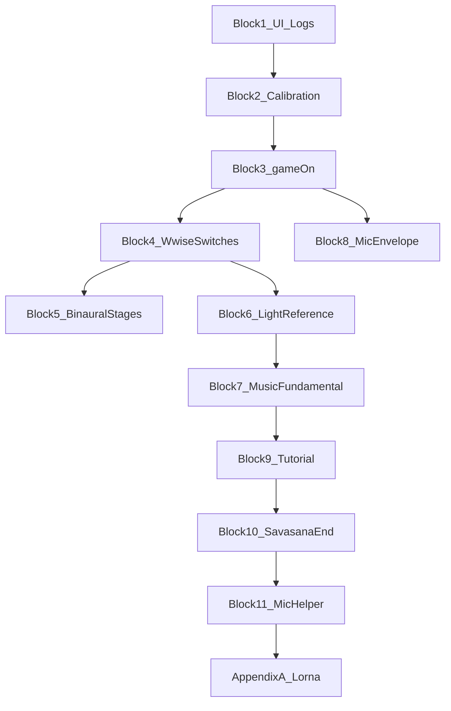
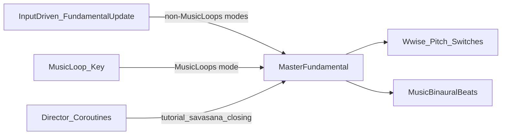

# Playtest Notes — Organized Work Blocks

**Source:** Lorna playtests + Robin reflections (Adjunctive / Dual Stage / cross-mode).  
**Purpose:** Work top-to-bottom; test after each block when possible. Check off items as fixed and verified.

**Legend**

- Original Lorna feedback is in normal text.
- Robin decisions from notes are in **bold asterisks**.
- `- [ ]` = not done / not verified · `- [x]` = done and playtest-verified

**Clock times** in Block 3 and Block 7 (e.g. 16:15, 15:37, 15:00) refer to **time remaining on the countdown** in Adjunctive Dual Stacks (`TimeTrackerScript.CountdownThisSection`), traceable against [`PlaygroundStageHandler.ProtocolStacksPlaygroundCoroutine`](../Assets/Scripts/Sequencing/Handlers/PlaygroundStageHandler.cs).

---

## Work order (summary)

1. Blocks **1–2** — quick UI, logging, calibration tweaks  
2. Blocks **3–5** — `gameOn`, Wwise switches, binaural stage gating  
3. Block **6** — light / reference signal  
4. Blocks **7–8** — music system + mic envelope (largest)  
5. Blocks **9–10** — tutorial + playground/savasana end  
6. Block **11** — microphone helper UI (if time)  
7. Block **12** — full verification pass  
8. **Appendix A** — Lorna / non-Unity batch (one outreach session)  
9. **Appendix B** — future / Notion only  

---

## Block 1 — Quick UI / copy / logging (low risk)

**Test focus:** Calibration skip label; `gameOn` transitions visible in log without health-summary spam.

| Done | Item | Action | Primary files |
|------|------|--------|---------------|
| - [ ] | Skip calibration label | Remove “(Not Recommended)” from skip button — Lorna: remove “not recommended” | [`UIManager.cs`](../Assets/Jinnbyte/SoundSelfUI/Scripts/UIManager.cs) — `SetCalibrationScreen` |
| - [ ] | Stage labels | Change “Stage One:” / “Stage Two:” to remove colons | Unity scene/prefab (not code) |
| - [ ] | End-of-session text | Make end text bigger and more legible | Unity scene/prefab (not code) |
| - [ ] | Health log noise | Hide `DirectVoiceMonitoring Health` log (Inspector `logHealthSummary` or code gate) | [`DirectVoiceMonitoring.cs`](../Assets/Scripts/Voice/DirectVoiceMonitoring.cs) |
| - [ ] | `gameOn` logging | Add dedicated allow-logs flag for `gameOn` (critical; separate from general debug) | [`ImitoneVoiceIntepreter.cs`](../Assets/Scripts/Voice/ImitoneVoiceIntepreter.cs) |
| - [ ] | Vibro troubleshooting copy | Calibration troubleshooting for vibroacoustic: include quitting and restarting the tablet | Calibration UI / [`UIManager.cs`](../Assets/Jinnbyte/SoundSelfUI/Scripts/UIManager.cs) |
| - [ ] | Launcher copy | Review launcher copy and troubleshooting section clarity | **Non-Unity** — [Appendix A](#appendix-a--externallorna--non-unity-batch-together) |

---

## Block 2 — Calibration-only audio / light tweaks

**Test focus:** Mic calibration comfortable (−6 dB only on mic step); vibro step at gameplay level; calibration white lights match playground white brightness.

| Done | Item | Action | Primary files |
|------|------|--------|---------------|
| - [ ] | Mic calibration level | **Further reduce mic level during mic calibration only by another 6 dB** — not during vibroacoustic calibration | [`CalibrationStageHandler.cs`](../Assets/Scripts/Sequencing/Handlers/CalibrationStageHandler.cs), [`DirectVoiceMonitoring.cs`](../Assets/Scripts/Voice/DirectVoiceMonitoring.cs) |
| - [ ] | Calibration lights dim | **Investigate:** calibration light level dimmer than gameplay — same color set? “White” should be equivalently bright | [`LightControl.cs`](../Assets/Scripts/MusicAndLight/LightControl.cs), [`CalibrationStageHandler.cs`](../Assets/Scripts/Sequencing/Handlers/CalibrationStageHandler.cs) (`CalibrationAvsStart` → `SetPreferredColor("White")`) |
| - [ ] | Noise floor in orientation | **Sneak noise floor sample during calibration “orientation”** (no vocalization expected) | [`ImitoneVoiceIntepreter.cs`](../Assets/Scripts/Voice/ImitoneVoiceIntepreter.cs) — `SetNoiseFloorThreshold`, `imitoneActive = gameOn && !micIsNearNoiseFloor` |
| - [ ] | HPF pre-imitone | **Increase HPF** on pre-imitone path to filter subwoofer bleed | [`ImitoneVoiceIntepreter.AudioThread.cs`](../Assets/Scripts/Voice/ImitoneVoiceIntepreter.AudioThread.cs) |

**Lorna (context):** Microphone very quiet globally — addressed primarily in [Block 8](#block-8--microphone-volume-envelope-large-unity-side); calibration mic too loud is separate (this block).

---

## Block 3 — `gameOn` fixes (mic audible / lights reactive)

**Test focus:** Adjunctive opening — mic + reactive lights; savasana guided breath; full Dual Stacks run with `gameOn` log; investigate clock anomalies.

| Done | Item | Report / action | Primary files |
|------|------|-----------------|---------------|
| - [ ] | Opening breathwork (Adjunctive) | Cannot hear mic; lights dark / non-interactive (was beautiful). **Ensure `gameOn` is on at start of opening for Adjunctive mode** | [`OpeningStageHandler.cs`](../Assets/Scripts/Sequencing/Handlers/OpeningStageHandler.cs) — `Opening_PS_Ascending`; today `SetMusicModeTo(Silent)` → `gameOn = false` via [`MusicSystem1.SetMusicModeTo`](../Assets/Scripts/MusicAndLight/MusicSystem1.cs) |
| - [ ] | Savasana breath in / sigh | Microphone not audible. **Prefer Lorna cue-driven `Cue_Microphone_ON/OFF`** — Robin contacts Lorna ([Appendix A](#appendix-a--externallorna--non-unity-batch-together)) | [`WwiseVOManager.cs`](../Assets/Scripts/WwiseManagers/WwiseVOManager.cs), [`SavasanaStageHandler.cs`](../Assets/Scripts/Sequencing/Handlers/SavasanaStageHandler.cs) |
| - [ ] | Spravato / DualStage before savasana | Mic “turned off” before savasana transition. **Investigate** — Robin didn’t reproduce; likely volume not `gameOn`. Ascending: `Cue_Stop_Interactive_3m` + 120s `DelayedMicOff` only | [`SavasanaStageHandler.cs`](../Assets/Scripts/Sequencing/Handlers/SavasanaStageHandler.cs) |
| - [ ] | **16:15** on clock | Mic went away; should stay on during this period. **Investigate** | [`PlaygroundStageHandler.cs`](../Assets/Scripts/Sequencing/Handlers/PlaygroundStageHandler.cs), `gameOn` logs |
| - [ ] | **15:37** on clock | Mic suddenly jumps in. **Investigate** | Same |
| - [ ] | See `gameOn` in logs | Critical for whole game logic — covered in Block 1 dedicated log flag | [`ImitoneVoiceIntepreter.cs`](../Assets/Scripts/Voice/ImitoneVoiceIntepreter.cs) |

---

## Block 4 — Wwise switch hygiene (safety fixes)

**Lorna:** SWITCH WARNING — select switches before initiating game calls, as early as possible (`SoundWorldMode_Switch`, `MusicLoops_Switch`). Interactive music fade-in abrupt, too loud, all sound worlds at once.

**Test focus:** First interactive entry — one sound world, smooth fade; no switch warnings in Activation playthrough (re-test at end).

| Done | Item | Action | Primary files |
|------|------|--------|---------------|
| - [ ] | MusicLoops → Silence on interactive entry | **When switching to InteractiveMusicSystem (not MusicLoops), set Music Loop switch to Silence first** — may fix many issues | [`MusicSystem1.cs`](../Assets/Scripts/MusicAndLight/MusicSystem1.cs) — `SetMusicModeTo`, `StartInteractiveMusic`, `SetSoundWorld` |
| - [ ] | Sound world before mode switch | **Set sound-world switch (e.g. Shruti) one frame before** switching Silence / MusicLoops / interactive mode. Design for same-frame / back-to-back triggers | `MusicSystem1` |
| - [ ] | Switch warnings | **Re-test in Activation** — may already be fixed; watch `SoundWorldMode_Switch` / `MusicLoops_Switch` warnings | `MusicSystem1`, [`WwiseVOManager.SetToEsketamineAscending`](../Assets/Scripts/WwiseManagers/WwiseVOManager.cs) |
| - [ ] | Cacophony on fade-in | Ensure `SoundWorldMode` selected in advance of Silence ↔ MusicLoops transitions (ties to frame-delay above) | `MusicSystem1` |
| - [ ] | `Stop_Toning` too fast | `Stop_Toning` happening too quickly; everything fades too fast. **Prefer Wwise-authored fades**; audit Unity `StopWwiseToning` / RTPC vs Wwise | [`MusicSystem1.BasicToningUpdate`](../Assets/Scripts/MusicAndLight/MusicSystem1.cs), Wwise project |

---

## Block 5 — Binaural + stage gating (medium, scoped)

**Lorna:** Binaural beats clash harmonically with music — quieter or different pitches. **Robin:** Part of music system review; beats should match fundamental key — possibly fundamental not updating in MusicLoop ([Block 7](#block-7--music-system-fundamental-pitch-silent-loops-large)).

**Test focus:** Playlist / linear stages silent binaural; tutorial + playground still have beats.

| Done | Item | Action | Primary files |
|------|------|--------|---------------|
| - [ ] | Disable on playlist / linear | **Disable binaural on MusicPlaylist and Linear Music stages**; re-enable by default in Tutorial and Playground | [`MusicPlaylistStageHandler.cs`](../Assets/Scripts/Sequencing/Handlers/MusicPlaylistStageHandler.cs), [`LinearAudioStageHandler.cs`](../Assets/Scripts/Sequencing/Handlers/LinearAudioStageHandler.cs), [`MusicSystem1.SetMusicModeFlags`](../Assets/Scripts/MusicAndLight/MusicSystem1.cs) |
| - [ ] | Binaural vs fundamental | Verify binaural follows master fundamental / loop key — full fix in Block 7 | [`MusicBinauralBeats.cs`](../Assets/Scripts/MusicAndLight/MusicBinauralBeats.cs) |

---

## Block 6 — Lights: reference signal refactor

**Robin:** Lights on when they should be dark — likely reference signal. Refactor **internal to** `LightControl`: reference **off** when color is Dark (after fade delay); **on** when light is any non-Dark color. Audit opening/tutorial init if they touch reference.

**Test focus:** Dark → no reference bleed; color change → reference on; back to Dark → reference off after fade.

| Done | Item | Action | Primary files |
|------|------|--------|---------------|
| - [ ] | Reference tied to color | Refactor reference signal to follow light color state | [`LightControl.cs`](../Assets/Scripts/MusicAndLight/LightControl.cs) — `playReference`, `GoDark`, `SetWaveColor` |
| - [ ] | Stage init audit | Opening / tutorial paths that set lights or reference must use new behavior | [`OpeningStageHandler.cs`](../Assets/Scripts/Sequencing/Handlers/OpeningStageHandler.cs), [`TutorialStageHandler.cs`](../Assets/Scripts/Sequencing/Handlers/TutorialStageHandler.cs), [`CalibrationStageHandler.cs`](../Assets/Scripts/Sequencing/Handlers/CalibrationStageHandler.cs) |

**Lorna (context):** Opening breathwork lights dark / non-interactive — also tied to `gameOn` ([Block 3](#block-3--gameon-fixes-mic-audible--lights-reactive)).

---

## Block 7 — Music system: fundamental, pitch, silent loops (large)

**Lorna:** Pitches not always harmonious (design around 5ths: Fundamental C, Harmony G). Silent loops wrong pitch. Chaos / dissonance; only one sound world at a time; transitions strange; little difference between sound worlds. Balancing: silent loops disappear — shouldn’t. **Robin:** Audit sound world transitions (shadow, shruti, etc.) — possibly broken in recent work.

### Architectural intent (fundamental split)

- **Master fundamental:** Controlled by user or music system authority.
- **Input driven:** Most current behavior in [`MusicSystem1.cs`](../Assets/Scripts/MusicAndLight/MusicSystem1.cs). Generally updates master when **not** in MusicLoops mode (Freeplay / interactive). In MusicLoops, master fed from loop key (and likely tutorial / savasana from coroutine/director — review closing/opening/tutorial).

### Wwise music-key cues (12 pitches) — Lorna + Unity

**Context:** Lorna is adding Wwise user cues wherever the **music bed changes key** — opening, closing, and transitions **out of / within MusicLoops** (playlist segments, loop crossfades, etc.). Unity should set the **master fundamental** from those cues instead of guessing from loop metadata alone.

**Listeners (both must delegate to one shared handler — no duplicated switch cases):**

| Callback | Used by |
|----------|---------|
| [`WwiseVOManager.VOCallbackFunction`](../Assets/Scripts/WwiseManagers/WwiseVOManager.cs) | Opening, tutorial VO, preparation sequences, etc. |
| [`WwiseVOManager.ClosingCallBackFunction`](../Assets/Scripts/WwiseManagers/WwiseVOManager.cs) | Thematic savasana, ascending closing |

**Implementation shape (no code yet):**

1. Add **`TryHandleMusicFundamentalCue(string cue) → bool`** on `WwiseVOManager` (or a small dedicated helper class called from it).
2. At the **top** of each callback’s `switch` (or via `default` that tries this first and returns), call the shared method; if it returns `true`, skip other handling.
3. Map cue name → `NoteName` → `MusicSystem1` master update (e.g. content lock or `SetFundamentalDirect` — align with master/input-driven split above).
4. Single dictionary or generated table for all 12 names; optional log when unknown `Cue_MusicKey_*` arrives.

**Placeholder cue names (replace when Lorna’s Wwise names are final):**

| Note | Placeholder cue |
|------|-----------------|
| C | `Cue_MusicKey_C` |
| C♯ / D♭ | `Cue_MusicKey_Cs` |
| D | `Cue_MusicKey_D` |
| D♯ / E♭ | `Cue_MusicKey_Ds` |
| E | `Cue_MusicKey_E` |
| F | `Cue_MusicKey_F` |
| F♯ / G♭ | `Cue_MusicKey_Fs` |
| G | `Cue_MusicKey_G` |
| G♯ / A♭ | `Cue_MusicKey_Gs` |
| A | `Cue_MusicKey_A` |
| A♯ / B♭ | `Cue_MusicKey_As` |
| B | `Cue_MusicKey_B` |

Suffixes should match [`NoteUtils.NoteToWwiseString`](../Assets/Scripts/Utilities/ConversionUtilities.cs) conventions where possible so renaming is a one-line table edit.

| Done | Item | Action | Primary files |
|------|------|--------|---------------|
| - [ ] | Shared cue handler | `TryHandleMusicFundamentalCue` — one implementation, called from **both** `VOCallbackFunction` and `ClosingCallBackFunction` | [`WwiseVOManager.cs`](../Assets/Scripts/WwiseManagers/WwiseVOManager.cs) |
| - [ ] | Placeholder cue table | Wire all 12 `Cue_MusicKey_*` names above; document that names are provisional | Same |
| - [ ] | Apply to master fundamental | On match: update master fundamental (and binaural follow-up per Block 7) | [`MusicSystem1.cs`](../Assets/Scripts/MusicAndLight/MusicSystem1.cs) |
| - [ ] | Lorna: embed cues in music | Cues on key change in opening / closing / music-loop segments | Wwise — [Appendix A](#appendix-a--externallorna--non-unity-batch-together) |
| - [ ] | Rename pass | When Lorna delivers final names, update table only (no listener duplication) | `WwiseVOManager` cue map |

**Test:** Opening or closing segment with known key change fires cue → log shows note → Wwise fundamental switch matches bed; same behavior whether cue arrived on VO or closing callback.

---

| Done | Item | Action | Primary files |
|------|------|--------|---------------|
| - [ ] | Master vs input-driven | Split fundamental into master + input-driven paths | [`MusicSystem1.cs`](../Assets/Scripts/MusicAndLight/MusicSystem1.cs) — `FundamentalUpdate`, locks, `SetMusicLoop` |
| - [ ] | Binaural key | Binaural plays same key as master; fix stale fundamental in MusicLoops | `MusicSystem1`, [`MusicBinauralBeats.cs`](../Assets/Scripts/MusicAndLight/MusicBinauralBeats.cs) |
| - [ ] | Pitch / 5ths audit | Audit pitch selections, `changeHarmony`, `NoteName.None` guard | `MusicSystem1` |
| - [ ] | Sound world transitions | Audit Shadow, Shruti, shuffle exclusions (≤300s / ≤180s) | [`PlaygroundStageHandler.cs`](../Assets/Scripts/Sequencing/Handlers/PlaygroundStageHandler.cs), [`WorldShuffler.cs`](../Assets/Scripts/MusicAndLight/WorldShuffler.cs) |
| - [ ] | Interactive fade | Abrupt / too loud — RTPC `SILENT_Volume` + switch order ([Block 4](#block-4--wwise-switch-hygiene-safety-fixs)) | `MusicSystem1` |
| - [ ] | Silent loops disappear | Re-verify prior fix; `StopInteractiveMusic`, `MusicLoopSilent`, harmony None | `MusicSystem1` |
| - [ ] | Lock C before savasana | **60 seconds before end of Adjunctive (before Savasana), lock fundamental to C** — director first OK | `PlaygroundStageHandler` / [`Director.cs`](../Assets/Scripts/Sequencing/Director.cs) |
| - [ ] | **15:00** transition | Transition clunky; should be smooth fade. **Lock pitches before this point** for sensible crossfade into music. **Investigate** | `PlaygroundStageHandler` — coroutine milestone ~`16×60` s remaining in code |
| - [ ] | Shuffle expired + empty queue | Log: “Soundscape Shuffle Expired Will activate entire queue on next tone” but queue empty. **Bug:** expired shuffle should still shuffle unless disabled | [`Director.cs`](../Assets/Scripts/Sequencing/Director.cs), [`WorldShuffler.cs`](../Assets/Scripts/MusicAndLight/WorldShuffler.cs) |
| - [ ] | Celestial Dreamscape → Chakapa | Does not stop when Chakapa begins — **Lorna fixes in Wwise** | No Unity change |

**Code milestone reference (Adjunctive playground coroutine):** thresholds at ~19×60−30, 16×60, 13×60, 12×60, 10×60, 4×60, 60, 0 seconds remaining — see [`PlaygroundStageHandler.ProtocolStacksPlaygroundCoroutine`](../Assets/Scripts/Sequencing/Handlers/PlaygroundStageHandler.cs).

---

## Block 8 — Microphone volume envelope (large, Unity-side)

**Lorna:** Microphone very very quiet — significantly changed since last build. **Robin:** Changes on our side only (no bypass of custom Unity audio for this pass). Possibly coming in too slow (`chantLerpSlow`); combine fast + slow; ADSR-style coroutine vs simple multiply.

**Test focus:** Opening, playground, savasana — audible mic without harsh jumps; no endless slow creep.

| Done | Item | Specification | Primary files |
|------|------|---------------|---------------|
| - [ ] | ADSR envelope | On `toneActive`: rise only, then decay; not simple tracking multiply | [`GameValues.handlecChanting`](../Assets/Scripts/Voice/GameValues.cs), [`DirectVoiceMonitoring.ApplyMonitoringVolume`](../Assets/Scripts/Voice/DirectVoiceMonitoring.cs) |
| - [ ] | Rise curve | From 0→1 as weighted avg of `chantLerpFast`/`chantLerpSlow` goes 0→0.9. **Meditative:** mean(fast, slow). **Not meditative:** `chantLerpFast` only. Factor in `toneActiveConfident` etc. | `GameValues` / `DirectVoiceMonitoring` |
| - [ ] | Decay | Slowly decay over time matching `chantCharge` down to **0.5** | Same |
| - [ ] | Release | If `toneActiveBiasTrue` false → drop to 0 with curve matching `chantLerpSlow` down behavior | Same |
| - [ ] | BoardFader | Run through `BoardFader()`: high **0 dB**, low **−18 dB** | [`AudioLevelUtilities.BoardFader`](../Assets/Scripts/Utilities/AudioLevelUtilities.cs) |

**Related (not this envelope):** `SetMusicToningLayerVolume` / Wwise `TONING_Volume` RTPC in imitone path — keep in mind when testing.

---

## Block 9 — Tutorial & correction behavior

**Test focus:** Repeat Sonoflore user gets short tutorial; correction harmony matches music; correction lags one VO behind on fail.

| Done | Item | Action | Primary files |
|------|------|--------|---------------|
| - [ ] | Short tutorial (Sonoflore) | **Not-first-time Sonoflore should use short tutorial, not long** | [`Sonoflore.asset`](../Assets/Definitions/Sequences/Sonoflore.asset) (currently `Tutorial_Long`), [`TutorialStageHandler.cs`](../Assets/Scripts/Sequencing/Handlers/TutorialStageHandler.cs), [`CSVLoader.cs`](../Assets/Scripts/CSVUtility/HummingBirdCommunications/CSVLoader.cs) |
| - [ ] | A/C hum mismatch | Tutorial correction: use tone matching **music**, not favor wrong hum VO. If no correct Ahh/Ohh asset, use **Tone (Advanced)** at correct pitch — harmony > label | [`Tutorial.cs`](../Assets/Scripts/Sequencing/Tutorial.cs), [`WwiseVOManager.cs`](../Assets/Scripts/WwiseManagers/WwiseVOManager.cs) |
| - [ ] | Correction timing | Correction for Hum/Ahh/Ohh/Tone should apply to **the instruction being tested**, not the *next* cue. Example: fail at end of last “Ahh” VO before “Ohh” cue → still give **Ahh** correction, not Ohh yet | `Tutorial.cs` — `ProvideCorrection`, `GetLongVocalizationTypeForGuidanceCount` |

---

## Block 10 — Playground / savasana end (Adjunctive + timing)

**Lorna:** End started ~7–10 s late but landing at 0 was OK.

**Test focus:** Dual Stacks countdown end timing; savasana director behavior; AVS continuous lift on 3m cue.

| Done | Item | Action | Primary files |
|------|------|--------|---------------|
| - [ ] | +7–10 s DualStage countdown | **Add same 7–10 s buffer to DualStage countdown** in sequence definition (Activation/Sonoflore sessions already adjusted) | [`Adjunctive_Dualstage_*.asset`](../Assets/Definitions/Sequences/), [`StartCountdownStageHandler.cs`](../Assets/Scripts/Sequencing/Handlers/StartCountdownStageHandler.cs) |
| - [ ] | Director at playground→savasana | **Don’t disable director entirely** at playground end / savasana start. Disable **world shuffler** + soundscape/fundamental changes only. Full director off on `Cue_Stop_Interactive_3m` | [`PlaygroundStageHandler.cs`](../Assets/Scripts/Sequencing/Handlers/PlaygroundStageHandler.cs), [`SavasanaStageHandler.cs`](../Assets/Scripts/Sequencing/Handlers/SavasanaStageHandler.cs) |
| - [ ] | AVS on `Cue_Stop_Interactive_3m` | AVS lifts from Delta to high level (continuous look), then fades; **then** director off | `SavasanaStageHandler`, [`LightControl.cs`](../Assets/Scripts/MusicAndLight/LightControl.cs) / AVS sequences |
| - [ ] | Celestial Dreamscape | Stops when Chakapa begins — **Lorna / Wwise** | No Unity change |

---

## Block 11 — New feature: Microphone helper UI

**Test focus:** Facilitator can open helper in main game; icon reflects live `toneActive`.

| Done | Item | Action |
|------|------|--------|
| - [ ] | Microphone helper | Box with text + icon on/off with `toneActive`. Two screens: “what you need to know” and “what you need to do” | New UI + [`ImitoneVoiceIntepreter`](../Assets/Scripts/Voice/ImitoneVoiceIntepreter.cs) |

---

## Block 12 — Verification pass (after Blocks 1–11)

| Done | Check |
|------|-------|
| - [ ] | Full **Adjunctive Dual Stacks** playthrough; countdown log vs coroutine milestones |
| - [ ] | **Activation** mode — switch warnings, interactive fade-in |
| - [ ] | Mic + light behavior: Calibration → Opening → Playground → Savasana |
| - [ ] | Mic volume acceptable (Block 8) across session |
| - [ ] | Single sound world / harmonious pitches (Block 7) |
| - [ ] | Silent loops persist through toning stops (Block 7) |
| - [ ] | Wwise `Cue_MusicKey_*` cues update master fundamental (opening + closing callbacks) |

---

## Appendix A — External / Lorna / non-Unity (batch together)

Use one outreach session for Lorna; separate block for Robin non-dev tasks.

### Contact Lorna (Wwise / VO / content)

| Done | Item |
|------|------|
| - [ ] | **Savasana breath in / sigh:** Use `Cue_Microphone_ON` / `Cue_Microphone_OFF` at appropriate moments (tell her which cues) |
| - [ ] | **No voiceover at end of DualStage Stage 1** (Sandeep) — different closing asset; likely **next release**, not this one |
| - [ ] | **Sonoflore savasana:** More space between VO lines — ask if she edited timing / her read on pacing |
| - [ ] | **27 minutes before end of 40-minute album** — is someone mumbling? (question only) |
| - [ ] | **Celestial Dreamscape** stop when Chakapa Song begins (she’ll fix in Wwise) |
| - [ ] | **Copy:** Update in-app and launcher text to Lorna’s preferred wording |
| - [ ] | **DualStage Stage 1 closing** variant if pursuing later release |
| - [ ] | **Stop_Toning / fade timings** in Wwise vs Unity — coordinate after Block 4 audit |
| - [ ] | **Music-key cues (12 pitches):** Add user cues on every music key change in opening, closing, and music-loop beds. Unity placeholders: `Cue_MusicKey_C` … `Cue_MusicKey_B` (Robin will rename in code when final) — see [Block 7 — Wwise music-key cues](#wwise-music-key-cues-12-pitches--lorna--unity) |

### Robin — non-Unity

| Done | Item |
|------|------|
| - [ ] | Launcher: review copy and troubleshooting section — clearer, easier to use |
| - [ ] | SoundSelf calibration troubleshooting: vibro step “quit and restart tablet” (also Block 1 if in Unity UI) |
| - [ ] | **Robot Koch** — listen to album first; outreach |
| - [ ] | **Maneesh** — outreach (album-related) |

---

## Appendix B — Future / Notion (not this build)

Add to project management / Notion; no implementation in current release.

| Item |
|------|
| **Sleep behavior:** Director switches track + fundamental; loop Lorna “Ahh” tones |
| **Album picker:** “Wheel” UI when multiple albums — mood-based selection |
| **Dual Stage Stage 2:** Occasional playback of player voice captured in Stage 1 |
| **Practitioner album prompts** when catalog grows |

---

## Raw notes index (quick lookup)

| Topic | Block |
|-------|-------|
| Mic too quiet (global) | 8 |
| Mic calibration too loud | 2 |
| Opening Adjunctive mic + lights | 3, 6 |
| Binaural clash | 5, 7 |
| Switch warnings / cacophony fade-in | 4 |
| Pitch / sound worlds / silent loops | 7 |
| Stop_Toning fast | 4, 7 |
| Clock 16:15 / 15:37 / 15:00 | 3, 7 |
| gameOn logging | 1, 3 |
| Fundamental master / input / lock C | 7, 10 |
| Wwise music-key cues (12 pitches) | 7, Appendix A |
| Tutorial short / correction / harmony | 9 |
| Director / savasana end / AVS 3m | 10 |
| Reference signal / dark lights | 6 |
| Noise floor orientation / HPF | 2 |
| Lorna / launcher / VO | Appendix A |
| Sleep / album wheel / Stage 2 voice | Appendix B |

---

*Last organized from playtest notes — work blocks for implementation and sign-off.*
