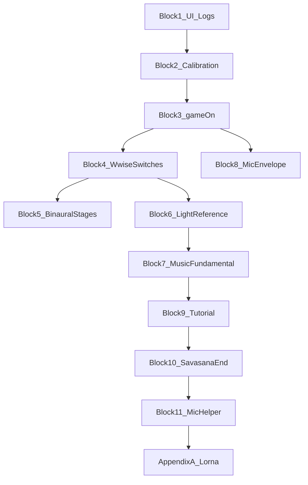
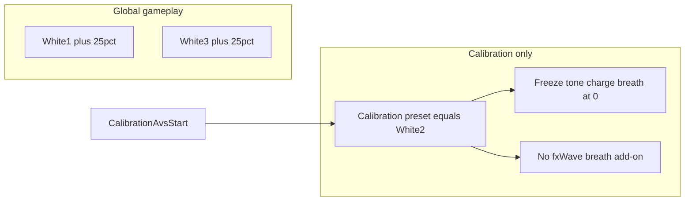
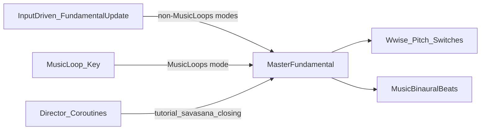

# Playtest Notes — Organized Work Blocks

**Source:** Lorna playtests + Robin reflections (Adjunctive / Dual Stage / cross-mode).  
**Purpose:** Work top-to-bottom; test after each block when possible. Check off items as fixed and verified.

**Legend**

- Original Lorna feedback is in normal text.
- Robin decisions from notes are in **bold asterisks**.
- `- [ ]` = not done / not verified · `- [x]` = done and playtest-verified

**Testing vocabulary** (see [`.cursor/rules/soundself-director-mode.mdc`](../.cursor/rules/soundself-director-mode.mdc)):

| Term | Meaning |
|------|---------|
| **Test Runner tests** / **Unity Test Runner tests** | Automated **EditMode** tests — **Window → General → Test Runner → EditMode**, or `.\Tools\run-editmode-tests.ps1` with Unity closed |
| **EditMode tests** | Same as Test Runner tests (technical name for the test platform tab) |
| **Playtests** | Play Mode verification — overrides, log flags, numbered steps, Console checks, headphones when needed |

**Director mode:** Say **director mode** + block number to work a block end-to-end. Each block lists **Test Runner tests (EditMode)** then **Playtests**, then work items (implementation reference subsections may follow, as in Block 2 and Block 7).

**Block template (in order):**

1. Test focus / goal  
2. **Test Runner tests (EditMode)**  
3. **Playtests**  
4. Work items table (`Done` / `Item` / …)

**Clock times** in Block 3 and Block 7 (e.g. 16:15, 15:37, 15:00) refer to **time remaining on the countdown** in Adjunctive Dual Stacks (`TimeTrackerScript.CountdownThisSection`), traceable against [`PlaygroundStageHandler.ProtocolStacksPlaygroundCoroutine`](../Assets/Scripts/Sequencing/Handlers/PlaygroundStageHandler.cs).

---

## Work order (summary)

1. Blocks **1–2** — quick UI, logging, calibration tweaks  
2. Blocks **3–5** — `gameOn`, Wwise switches, binaural stage gating  
3. Block **6** — light / reference signal  
4. Blocks **7–8** — music system + mic envelope (largest)  
5. Blocks **9–10** — tutorial + playground/savasana end  
6. Block **11** — microphone helper UI (if time)  
7. Block **12** — full verification pass  
8. **Appendix A** — Lorna / non-Unity batch (one outreach session)  
9. **Appendix B** — future / Notion only  



---

## Block 1 — Quick UI / copy / logging (low risk)

**Test focus:** Calibration skip label; `gameOn` transitions visible in log without health-summary spam.

### Test Runner tests (EditMode)

**None yet** (block playtest-verified before Test Runner suite). *Candidates if backfilling:* `gameOn` log gate does not spam when off; health summary respects `logHealthSummary`.

**Run (when added):** Test Runner → EditMode, or `.\Tools\run-editmode-tests.ps1`.

### Playtests

| Done | Step | Pass criteria |
|------|------|----------------|
| - [x] | **Skip calibration label** | Skip button does not show “(Not Recommended)”. |
| - [x] | **Stage / end copy** | Stage labels without colons; end-of-session text legible (scene/prefab). |
| - [x] | **Health log** | Console free of `DirectVoiceMonitoring Health` spam unless `logHealthSummary` enabled. |
| - [x] | **`gameOn` log** | With `debugAllowGameOnLogs` on: each `gameOn` transition logs once with source. |
| - [x] | **Vibro troubleshooting** | Calibration vibro copy mentions quit/restart tablet. |

| Done | Item | Action | Primary files |
|------|------|--------|---------------|
| - [x] | Skip calibration label | Remove “(Not Recommended)” from skip button — Lorna: remove “not recommended” | [`UIManager.cs`](../Assets/Jinnbyte/SoundSelfUI/Scripts/UIManager.cs) — `SetCalibrationScreen` |
| - [x] | Stage labels | Change “Stage One:” / “Stage Two:” to remove colons | Unity scene/prefab (not code) |
| - [x] | End-of-session text | Make end text bigger and more legible | Unity scene/prefab (not code) |
| - [x] | Health log noise | Hide `DirectVoiceMonitoring Health` log (Inspector `logHealthSummary` or code gate) | [`DirectVoiceMonitoring.cs`](../Assets/Scripts/Voice/DirectVoiceMonitoring.cs) |
| - [x] | `gameOn` logging | Add dedicated allow-logs flag for `gameOn` (critical; separate from general debug) | [`ImitoneVoiceIntepreter.cs`](../Assets/Scripts/Voice/ImitoneVoiceIntepreter.cs) |
| - [x] | Vibro troubleshooting copy | Calibration troubleshooting for vibroacoustic: include quitting and restarting the tablet | Calibration UI / [`UIManager.cs`](../Assets/Jinnbyte/SoundSelfUI/Scripts/UIManager.cs) |
| - [~] | Launcher copy | Review launcher copy and troubleshooting section clarity | **Non-Unity** — [Appendix A](#appendix-a--externallorna--non-unity-batch-together) |

---

## Block 2 — Calibration-only audio / light tweaks

**Block 2 status: complete** (implementation + playtest verified). Parallel **[inspector cleanup](INSPECTOR_CLEANUP_IMITONE_AND_DVR2.md)** for `ImitoneVoiceIntepreter` and `DirectVoiceMonitoring` is also **complete**.

**Test focus:** Mic calibration comfortable (−6 dB only on mic step, **1 s** fade); vibro at gameplay MicMixer level; calibration lights use dedicated **Calibration** color world (stable, not voice-pumped); playground **White1/White3** globally brighter.

**Robin's note:** Mic attenuation uses named **MicMixer** dB contributions (`LerpMicMixerVolumeContributionTo` / `SetMicMixerVolumeContributionDb` on [`DirectVoiceMonitoring`](../Assets/Scripts/Voice/DirectVoiceMonitoring.cs)), not the legacy SoundSelf Mic Processing attenuation fader alone.

### Test Runner tests (EditMode)

**None yet** (block complete). *Candidates when backfilling:* calibration step → `gameOn` map; mic-step **−6 dB** / **1 s** fade constants; orientation noise-floor pinned prune rules; `Calibration` color world misuse guard.

**Run (when added):** Test Runner → EditMode, or `.\Tools\run-editmode-tests.ps1`.

### Playtests

#### Mic MicMixer contribution

| Done | Step | Pass criteria |
|------|------|----------------|
| - [x] | **Mic step fade-in** | Enter **Microphone** calibration step: monitoring level eases to the quieter mic-test level over **~1 s** (not an instant click). |
| - [x] | **Mic step fade-out** | Advance to **Vibro** (or any non-mic step): level eases back toward normal gameplay monitoring over **~1 s**. |
| - [x] | **Vibro / other steps** | On **VibroAcoustic** and non-mic steps, no extra **−6 dB** offset (gameplay MicMixer sum only, e.g. **Initialization** +6 dB baseline). |
| - [x] | **Skip / exit calibration** | Skip or complete calibration while on mic step (or mid-fade): no stuck quiet mic in playground; `CalibrationMicrophone` contribution cleared. |
| - [x] | **Subjective level** | Mic step still readable/comfortable vs other steps; compare to pre-change if unsure. |

#### Noise floor orientation

| Done | Step | Pass criteria |
|------|------|----------------|
| - [x] | **Inspector / telemetry** | During `Start`: `expectNoiseFloor` true; orientation sample count/elapsed increases; no jump coroutine phase activity. |
| - [x] | **After Intro_End** | Threshold moves off default **−52** if room level differs; `telemetryNoiseMeasurementsCount` includes **one pinned** sample. |
| - [x] | **Mic step** | With `gameOn`, toning near floor behaves reasonably (not permanently dead from stale −52). |
| - [x] | **Through Opening** | Pinned still present in telemetry until Tutorial/Playground **Enter** (then cleared). |
| - [x] | **Skip from Start (short)** | Skip before **5 s** on Start: no pinned commit; **5 s or more** on Start: partial average committed. |

**Playtest note — intro VO in the average:** The orientation window includes time after the user presses **Next** when **Wwise intro VO** may play from the device. That audio is included in the **mean** (not excluded). If the mic step feels too insensitive afterward, consider a follow-up (e.g. measure only pre-Next silence, or percentile instead of mean) — out of scope for v1.

#### Calibration lights

| Done | Step | Pass criteria |
|------|------|----------------|
| - [x] | **Light-glasses step** | Stable white, no voice pumping; mic step readable tone UI but lights steady; leaving calibration → Dark; playground White1/3 brighter than before. |

**Session entry:** Full calibration from [`Adjunctive_Dualstage_Start`](../Assets/Definitions/Sequences/Adjunctive_Dualstage_Start.asset) or production pack sequence; no sequence override required for cal-only checks.

| Done | Item | Action | Primary files |
|------|------|--------|---------------|
| - [x] | Mic calibration level | **1 s** lerp of extra **−6 dB** MicMixer contribution on **Microphone** step only (`CalibrationMicrophone`); generalized `LerpMicMixerVolumeContributionTo` on DVR | [`CalibrationStageHandler.cs`](../Assets/Scripts/Sequencing/Handlers/CalibrationStageHandler.cs), [`DirectVoiceMonitoring.cs`](../Assets/Scripts/Voice/DirectVoiceMonitoring.cs) |
| - [x] | Calibration lights | See **[Calibration lights — implementation plan](#calibration-lights--implementation-plan)** below | [`LightControl.cs`](../Assets/Scripts/MusicAndLight/LightControl.cs), [`CalibrationStageHandler.cs`](../Assets/Scripts/Sequencing/Handlers/CalibrationStageHandler.cs), [`CalibrationMenu.cs`](../Assets/CalibrationMenu.cs) |
| - [x] | Noise floor in orientation | See **[Noise floor — orientation (implementation plan)](#noise-floor--orientation-implementation-plan)** below | [`ImitoneVoiceIntepreter.cs`](../Assets/Scripts/Voice/ImitoneVoiceIntepreter.cs), [`CalibrationStageHandler.cs`](../Assets/Scripts/Sequencing/Handlers/CalibrationStageHandler.cs), [`TutorialStageHandler.cs`](../Assets/Scripts/Sequencing/Handlers/TutorialStageHandler.cs), [`PlaygroundStageHandler.cs`](../Assets/Scripts/Sequencing/Handlers/PlaygroundStageHandler.cs) |
| - [x] | HPF pre-imitone | **Increase HPF** on pre-imitone path to filter subwoofer bleed | [`ImitoneVoiceIntepreter.AudioThread.cs`](../Assets/Scripts/Voice/ImitoneVoiceIntepreter.AudioThread.cs) |

**Lorna (context):** Microphone very quiet globally — addressed primarily in [Block 8](#block-8--microphone-volume-envelope-large-unity-side); calibration mic level is separate (this block).

---

### Calibration lights — implementation plan

**Investigation summary:** Calibration used the same `SetPreferredColor("White")` → `White1/2/3` presets as gameplay, but (1) **White** presets are numerically dimmer than Red/Blue in `colorPresets`, (2) playground often shuffles to Red/Blue, (3) calibration had **no** voice-driven strobe boosts (`Wwise_Strobe_ToneDisplay` / `ChargeDisplay`) on the light-glasses step (`gameOn` off) and limited pumping on mic step.

**Decisions (confirmed):**

| Topic | Choice |
|--------|--------|
| White1 / White3 brightness | **+25% RGB** on strobe + wave — **global** (all sessions using those presets) |
| Calibration color | New color world **`Calibration`** — single preset (copy of **White2**), only calibration may select it |
| Strobe tone / charge | **Freeze at minimum modulation** (`_input = 0`) for calmer screen — not 0.5 |
| Breath AVS | **Freeze** `Wwise_BreathDisplay` (wave 3 master at 0) while in Calibration color world |
| `_fxWave` / breath add-on | **Bypass** during Calibration color world (no `FXWave` pulsing from breath) |
| Misuse of Calibration world | **One-time `Debug.LogWarning`** if Calibration color active outside calibration stage (log only) |
| Terminology | **Color world** = `SetPreferredColor` type (`Red`, `White`, `Calibration`, …); **preset** = `colorPresets` key (`White2`, `Calibration`, …) |

**Frozen RTPC values** (from [`LightControl`](Assets/Scripts/MusicAndLight/LightControl.cs) formulas at `_input = 0`, `_gammaBurstMode = 0`):

| Method | RTPCs set |
|--------|-----------|
| `Wwise_Strobe_ToneDisplay` | Depth W1 **44**, Master W1 **45**, Master W2 **0** |
| `Wwise_Strobe_ChargeDisplay` | PWM W1/W2 **25**, Smoothing W1 **100** |
| `Wwise_BreathDisplay` | Master W3 **0** |

**Implementation checklist:**

| Done | Step | Details |
|------|------|---------|
| - [x] | **1a. White1 +25%** | Update `colorPresets` strobe/wave for `White1` (replace magic numbers; document +25% in comments) |
| - [x] | **1b. White3 +25%** | Same for `White3` |
| - [x] | **2a. `Calibration` preset** | Add `Calibration` entry to `colorPresets` — copy **current White2** strobe/wave values |
| - [x] | **2b. `Calibration` color type** | Allow `"Calibration"` in `SetPreferredColor` / `SetColorWorldByType`; `SetColorWorldByName("Calibration")`; `worldShuffler.ClearCurrentColorWorld()` — **do not** add to `WorldShuffler.availableColorWorlds` |
| - [x] | **2c. Stage uses Calibration** | `CalibrationAvsStart`: `SetPreferredColor("Calibration", 5f)` + `SetStrobeRate(10f, 0)` — [`CalibrationStageHandler`](../Assets/Scripts/Sequencing/Handlers/CalibrationStageHandler.cs) (legacy `CalibrationMenu` callback is commented out) |
| - [x] | **2d. Stage flag** | `LightControl.SetCalibrationColorWorldStageActive(true/false)` from handler on Avs start/end + `LocalCleanup` |
| - [x] | **2e. Misuse warning** | One-time warning if Calibration color selected while stage flag false |
| - [x] | **3a. Freeze tone/charge** | Early return in `Wwise_Strobe_ToneDisplay` / `Wwise_Strobe_ChargeDisplay` when `currentColorWorld == Calibration`; apply frozen RTPCs above |
| - [x] | **3b. Freeze breath** | Early return in `Wwise_BreathDisplay` when Calibration — force Master W3 **0** |
| - [x] | **3c. Bypass `_fxWave`** | `GetBreathFxWaveAddOn()` returns 0 during Calibration; `FXWave` ignored while Calibration color world active |
| - [x] | **4. Playtest** | Light-glasses step: stable white, no voice pumping; mic step: still readable tone UI but lights steady; leaving calibration → Dark; playground White1/3 brighter than before |



---

### Noise floor — orientation (implementation plan)

**Scope:** **`CalibrationUI.Start` only** — the first calibration screen (“orientation”), ~**15 s**, same step list as [`CalibrationStageHandler`](../Assets/Scripts/Sequencing/Handlers/CalibrationStageHandler.cs) (`MapStepToPortion` → `"Intro"`). **Not** Opening, not Headphone/Mic/Lights. Pinned sample **persists through Opening** until Tutorial or Playground stage **Enter**.

**Goal:** Before the user is asked to tone on the **Microphone** step, seed imitone’s adaptive threshold from a **quiet-room** estimate taken while `expectNoiseFloor` is true (no jump-triggered 1.5 s samples during that window).

**Current system (unchanged for gameplay):** Jump on raw `_dbMicrophone` → drop → **1.5 s** average → append to `noiseMeasurements` → **median** + **3 dB** → `SetThreshold()`. Ephemeral entries expire after **120 s**.

**Memory model change (Option A):** Extend history to `(timestamp, db, pinned)`. **Prune** only `!pinned && age > 120 s`. **At most one** pinned orientation sample per calibration run; **`BeginOrientationNoiseFloorSampling()`** removes any previous pinned entry. Median/threshold logic unchanged.

| Phase | Behavior |
|--------|----------|
| **Begin** | `CalibrationStageHandler` when orientation starts (`Enter` on `Start`, or re-enter `Start`): `expectNoiseFloor = true`, stop in-flight `MeasureNoiseFloorCoroutine`, clear prior **pinned**, reset sum/count. **Suppress** jump-triggered coroutines. Accumulate `_dbMicrophone` every frame. |
| **During (~15 s)** | No jump coroutines. **Do not** push partial averages to `SetThreshold()` each frame — accumulate only; apply once on **End**. |
| **End** | Leaving `Start` (primary: `Cue_Calibration_Intro_End` before advance; also any path off `Start`): mean dB over window → **one pinned** history entry → prune → median → `SetThreshold()`, `expectNoiseFloor = false`. |
| **Skip calibration** | `LocalCleanup` while still on `Start`: commit if accumulated duration **> 5 s**, else discard; always clear `expectNoiseFloor`. |
| **Clear pinned** | `TutorialStageHandler.Enter()` and `PlaygroundStageHandler.Enter()` call `ClearPinnedOrientationNoiseFloorHistory()` (recompute median/threshold without pinned). **Opening does not clear.** |

**API (on `ImitoneVoiceIntepreter`):** `BeginOrientationNoiseFloorSampling()`, `EndOrientationNoiseFloorSamplingAndCommit()`, `ClearPinnedOrientationNoiseFloorHistory()`. Refactor: `RecordNoiseFloorMeasurement(db, pinned)`, `PruneExpiredNoiseMeasurements()`, `ApplyMedianNoiseFloorThreshold()`. Remove unused **`noiseFloorFlag`**.

**Implementation checklist:**

| Done | Step | Details |
|------|------|---------|
| - [x] | **NF-1. Tuple + prune** | `noiseMeasurements`: `(time, db, pinned)`; prune respects `pinned` |
| - [x] | **NF-2. Orientation accumulate** | `expectNoiseFloor`: per-frame sum/count; suppress jumps; stop in-flight coroutine on begin |
| - [x] | **NF-3. Cal handler hooks** | Begin on `Start`; End before leave `Start` / Intro_End; skip commit if **> 5 s** |
| - [x] | **NF-4. Clear pinned** | Tutorial + Playground `Enter()` only |
| - [x] | **NF-5. Cleanup** | Delete `noiseFloorFlag`; shared commit/prune/median helpers |
| - [x] | **NF-6. Playtest** | See [Playtests](#playtests) above |

---

## Block 3 — `gameOn` fixes (mic audible / lights reactive)

**Test focus:** Adjunctive opening — mic + reactive lights; savasana guided breath; Dual Stacks `gameOn` log; clock anomalies (16:15, 15:37).

### Test Runner tests (EditMode)

Policy: [`GameOnPolicy.cs`](../Assets/Scripts/Voice/GameOnPolicy.cs), [`MicNormalizationStagePolicy.cs`](../Assets/Scripts/Voice/MicNormalizationStagePolicy.cs).  
Tests: [`Block3PolicyEditModeTests.cs`](../Assets/Editor/SoundSelf/Tests/EditMode/Block3PolicyEditModeTests.cs).

**Run:** **Window → General → Test Runner → EditMode** (Unity open), or `.\Tools\run-editmode-tests.ps1` (Unity closed).

| Covered by Test Runner / EditMode tests |
|----------------------------------------|
| Music mode → `gameOn` via `Sequencer.ApplyGameOnPolicy` (Silent / Freeplay / FrozenFreeplay) |
| Opening Enter: `gameOn` true all variants (`OpeningStageHandler`, not `MusicSystem1`) |
| Dual Stacks countdown windows (16:15, 15:37, step 1 at ≤20:00 remaining) |
| Savasana ascending: 120 s delayed mic-off constant |
| Normalization raise-freeze on stage Enter (opening/savasana vs tutorial/playground) |
| Raise-freeze blocks gain-riding raises when frozen |

### Playtests

**Session entry (Adjunctive / Dual Stage example):**

| Inspector | Value |
|-----------|--------|
| `CSVLoader` → Content Pack Override | `HB_Adjunctive_DualStage` |
| `SequenceRunner` → Definition Override | `Adjunctive_Dualstage_StageInteractive` (or debug sequence with skip playground when testing savasana only) |
| `ImitoneVoiceIntepreter` → `debugAllowGameOnLogs` | on |
| Watch | `gainRidingGateRaiseFrozen` on `ImitoneVoiceIntepreter` during opening/savasana |

**Playtest only** (not covered by Test Runner tests):

| Done | Step | Pass criteria |
|------|------|----------------|
| - [x] | **Opening mic + lights** | Console: `gameOn` OFF (Silent) then ON; **headphones:** hear monitoring, lights react to tone |
| - [x] | **Normalization freeze** | Opening/savasana: `gainRidingGateRaiseFrozen` true; `normalizationGainDb` must not creep **up** on quiet noise; may go **down** if toning loud |
| - [x] | **16:15 / 15:37** | Full or partial playground; paste `gameOn` log lines at anomalies |
| - [x] | **Savasana mic / Lorna cues** | Play savasana stage; mic + VO behavior |
| - [ ] | **Full session feel** | Optional; not required to check off individual work rows |

| Done | Item | Report / action | Primary files |
|------|------|-----------------|---------------|
| - [ ] | Opening breathwork | Mic audible + reactive lights on Enter (**all** opening variants). Refactor: [`OpeningStageHandler`](../Assets/Scripts/Sequencing/Handlers/OpeningStageHandler.cs) `SetGameOn(true)` after Silent; not via `MusicSystem1` | Same + Block 3 playtests |
| - [x] | Savasana breath in / sigh | Microphone not audible. **Prefer Lorna cue-driven `Cue_Microphone_ON/OFF`** — Robin contacts Lorna ([Appendix A](#appendix-a--externallorna--non-unity-batch-together)) | [`WwiseVOManager.cs`](../Assets/Scripts/WwiseManagers/WwiseVOManager.cs), [`SavasanaStageHandler.cs`](../Assets/Scripts/Sequencing/Handlers/SavasanaStageHandler.cs) |
| - [ ] | Spravato / DualStage before savasana | Mic “turned off” before savasana transition. **Investigate** — Robin didn’t reproduce; likely volume not `gameOn`. Ascending: `Cue_Stop_Interactive_3m` + 120s `DelayedMicOff` only | [`SavasanaStageHandler.cs`](../Assets/Scripts/Sequencing/Handlers/SavasanaStageHandler.cs) |
| - [ ] | **16:15** on clock | Mic went away; should stay on during this period. **Investigate** | [`PlaygroundStageHandler.cs`](../Assets/Scripts/Sequencing/Handlers/PlaygroundStageHandler.cs), `gameOn` logs |
| - [ ] | **15:37** on clock | Mic suddenly jumps in. **Investigate** | Same |
| - [x] | See `gameOn` in logs | Critical for whole game logic — covered in Block 1 dedicated log flag | [`ImitoneVoiceIntepreter.cs`](../Assets/Scripts/Voice/ImitoneVoiceIntepreter.cs) |

---

## Block 4 — Wwise switch hygiene (safety fixes)

**Lorna:** SWITCH WARNING — select switches before initiating game calls, as early as possible (`SoundWorldMode_Switch`, `MusicLoops_Switch`). Interactive music fade-in abrupt, too loud, all sound worlds at once.

**Test focus:** First interactive entry — one sound world, smooth fade; no switch warnings in Activation playthrough (re-test at end).

### Test Runner tests (EditMode)

**None yet.** *Candidates:* MusicLoops → Silence before interactive entry; sound-world switch ordering one frame before mode switch; no duplicate switch posts in same frame.

**Run (when added):** Test Runner → EditMode, or `.\Tools\run-editmode-tests.ps1`.

### Playtests

**Session entry:** **Activation** mode sequence + pack (or Adjunctive path that hits first interactive music). Console open for Wwise switch warnings.

| Done | Step | Pass criteria |
|------|------|----------------|
| - [ ] | **First interactive entry** | Single sound world audible; fade-in not abrupt/cacophonous; `MusicLoops` → Silence before interactive if implemented |
| - [ ] | **Switch warnings** | No `SoundWorldMode_Switch` / `MusicLoops_Switch` warnings through Activation opening → first playground toning |
| - [ ] | **Stop_Toning** | Stops feel Wwise-paced, not instant Unity cut-off (subjective + log if instrumented) |

| Done | Item | Action | Primary files |
|------|------|--------|---------------|
| - [ ] | MusicLoops → Silence on interactive entry | **When switching to InteractiveMusicSystem (not MusicLoops), set Music Loop switch to Silence first** — may fix many issues | [`MusicSystem1.cs`](../Assets/Scripts/MusicAndLight/MusicSystem1.cs) — `SetMusicModeTo`, `StartInteractiveMusic`, `SetSoundWorld` |
| - [ ] | Sound world before mode switch | **Set sound-world switch (e.g. Shruti) one frame before** switching Silence / MusicLoops / interactive mode. Design for same-frame / back-to-back triggers | `MusicSystem1` |
| - [ ] | Switch warnings | **Re-test in Activation** — may already be fixed; watch `SoundWorldMode_Switch` / `MusicLoops_Switch` warnings | `MusicSystem1`, [`WwiseVOManager.SetToEsketamineAscending`](../Assets/Scripts/WwiseManagers/WwiseVOManager.cs) |
| - [ ] | Cacophony on fade-in | Ensure `SoundWorldMode` selected in advance of Silence ↔ MusicLoops transitions (ties to frame-delay above) | `MusicSystem1` |
| - [ ] | `Stop_Toning` too fast | `Stop_Toning` happening too quickly; everything fades too fast. **Prefer Wwise-authored fades**; audit Unity `StopWwiseToning` / RTPC vs Wwise | [`MusicSystem1.BasicToningUpdate`](../Assets/Scripts/MusicAndLight/MusicSystem1.cs), Wwise project |

---

## Block 5 — Binaural + stage gating (medium, scoped)

**Lorna:** Binaural beats clash harmonically with music — quieter or different pitches. **Robin:** Part of music system review; beats should match fundamental key — possibly fundamental not updating in MusicLoop ([Block 7](#block-7--music-system-fundamental-pitch-silent-loops-large)).

**Test focus:** Playlist / linear stages silent binaural; tutorial + playground still have beats.

### Test Runner tests (EditMode)

**None yet.** *Candidates:* `SetMusicModeFlags` disables binaural for MusicPlaylist + LinearAudio stage types; enabled for Tutorial + Playground.

**Run (when added):** Test Runner → EditMode, or `.\Tools\run-editmode-tests.ps1`.

### Playtests

| Done | Step | Pass criteria |
|------|------|----------------|
| - [ ] | **Music playlist / linear** | No binaural bed (or clearly off) during those stage types |
| - [ ] | **Tutorial + playground** | Binaural present when expected; level not fighting music harshly (full key match = Block 7) |

| Done | Item | Action | Primary files |
|------|------|--------|---------------|
| - [ ] | Disable on playlist / linear | **Disable binaural on MusicPlaylist and Linear Music stages**; re-enable by default in Tutorial and Playground | [`MusicPlaylistStageHandler.cs`](../Assets/Scripts/Sequencing/Handlers/MusicPlaylistStageHandler.cs), [`LinearAudioStageHandler.cs`](../Assets/Scripts/Sequencing/Handlers/LinearAudioStageHandler.cs), [`MusicSystem1.SetMusicModeFlags`](../Assets/Scripts/MusicAndLight/MusicSystem1.cs) |
| - [ ] | Binaural vs fundamental | Verify binaural follows master fundamental / loop key — full fix in Block 7 | [`MusicBinauralBeats.cs`](../Assets/Scripts/MusicAndLight/MusicBinauralBeats.cs) |

---

## Block 6 — Lights: reference signal refactor

**Robin:** Lights on when they should be dark — likely reference signal. Refactor **internal to** `LightControl`: reference **off** when color is Dark (after fade delay); **on** when light is any non-Dark color. Audit opening/tutorial init if they touch reference.

**Test focus:** Dark → no reference bleed; color change → reference on; back to Dark → reference off after fade.

### Test Runner tests (EditMode)

**None yet.** *Candidates:* reference RTPC off when `currentColorWorld` is Dark (after fade gate); on for non-Dark worlds.

**Run (when added):** Test Runner → EditMode, or `.\Tools\run-editmode-tests.ps1`.

### Playtests

**Session entry:** Adjunctive opening ([Block 3](#block-3--gameon-fixes-mic-audible--lights-reactive) overrides) — verify lights + reference together.

| Done | Step | Pass criteria |
|------|------|----------------|
| - [ ] | **Dark state** | After `GoDark` / dark color world: no reference bleed on glasses (subjective + inspector `playReference` if exposed) |
| - [ ] | **Non-dark color** | Red/White/etc.: reference on when color active |
| - [ ] | **Opening / tutorial** | Stage init does not leave reference stuck on in dark breathwork moments |

| Done | Item | Action | Primary files |
|------|------|--------|---------------|
| - [ ] | Reference tied to color | Refactor reference signal to follow light color state | [`LightControl.cs`](../Assets/Scripts/MusicAndLight/LightControl.cs) — `playReference`, `GoDark`, `SetWaveColor` |
| - [ ] | Stage init audit | Opening / tutorial paths that set lights or reference must use new behavior | [`OpeningStageHandler.cs`](../Assets/Scripts/Sequencing/Handlers/OpeningStageHandler.cs), [`TutorialStageHandler.cs`](../Assets/Scripts/Sequencing/Handlers/TutorialStageHandler.cs), [`CalibrationStageHandler.cs`](../Assets/Scripts/Sequencing/Handlers/CalibrationStageHandler.cs) |

**Lorna (context):** Opening breathwork lights dark / non-interactive — also tied to `gameOn` ([Block 3](#block-3--gameon-fixes-mic-audible--lights-reactive)).

---

## Block 7 — Music system: fundamental, pitch, silent loops (large)

**Lorna:** Pitches not always harmonious (design around 5ths: Fundamental C, Harmony G). Silent loops wrong pitch. Chaos / dissonance; only one sound world at a time; transitions strange; little difference between sound worlds. Balancing: silent loops disappear — shouldn’t. **Robin:** Audit sound world transitions (shadow, shruti, etc.) — possibly broken in recent work.

**Test focus:** One sound world at a time; harmonious pitches / 5ths; silent loops persist; `Cue_Key_*` updates master fundamental; **15:00** playground transition smooth; lock C before savasana.

### Test Runner tests (EditMode)

**None yet.** *Candidates:* `TryHandleMusicKeyCue` maps Lorna spellings → `NoteName`; master vs input-driven mode gates; shuffle-expired still activates queue when non-empty.

**Run (when added):** Test Runner → EditMode, or `.\Tools\run-editmode-tests.ps1`. Re-run [`Block3PolicyEditModeTests`](../Assets/Editor/SoundSelf/Tests/EditMode/Block3PolicyEditModeTests.cs) when touching shared music/voice policy.

### Playtests

**Session entry:** Adjunctive Dual Stacks (`HB_Adjunctive_DualStage` + `Adjunctive_Dualstage_StageInteractive`); optional Activation for switch/fade cross-check ([Block 4](#block-4--wwise-switch-hygiene-safety-fixes)). Enable music/fundamental debug logs if available.

| Done | Step | Pass criteria |
|------|------|----------------|
| - [ ] | **`Cue_Key_*` (opening)** | Each key change logs handled note; master fundamental matches bed (VO callback) |
| - [ ] | **`Cue_Key_*` (closing)** | Same on `ClosingCallBackFunction` / savasana closing |
| - [ ] | **Sound worlds** | Only one dominant world at a time; Shadow/Shruti transitions feel intentional |
| - [ ] | **Silent loops** | Loops remain after toning stops (no “all silent bed gone” regression) |
| - [ ] | **15:00 milestone** | Countdown ~15:00 remaining: crossfade smooth; pitches locked before transition if implemented |
| - [ ] | **Lock C (~60 s before savasana)** | Fundamental held on C entering savasana segment |
| - [ ] | **Shuffle expired** | If log says shuffle expired, next tone still changes soundscape when queue non-empty |

### Architectural intent (fundamental split)



- **Master fundamental:** Controlled by user or music system authority.
- **Input driven:** Most current behavior in [`MusicSystem1.cs`](../Assets/Scripts/MusicAndLight/MusicSystem1.cs). Generally updates master when **not** in MusicLoops mode (Freeplay / interactive). In MusicLoops, master fed from loop key (and likely tutorial / savasana from coroutine/director — review closing/opening/tutorial).

### Wwise music-key cues — Lorna + Unity

**Context:** Lorna embeds user cues wherever the **music bed changes key** — opening, closing, and transitions **out of / within MusicLoops**. Unity sets the **master fundamental** from those cues (not from loop metadata alone).

**Wwise cue format (from Lorna):** `Cue_Key_{pitch}` — pitch suffix uses **naturals** (`C`, `D`, …) or **sharp/flat spellings as below** (`Gsharp`, `Bflat`, `Aflat`, `Eflat`). Replaces the old `Cue_MusicKey_*` placeholders.

**Listeners (both must delegate to one shared handler — no duplicated switch cases):**

| Callback | Used by |
|----------|---------|
| [`WwiseVOManager.VOCallbackFunction`](../Assets/Scripts/WwiseManagers/WwiseVOManager.cs) | Opening, tutorial VO, preparation sequences, etc. |
| [`WwiseVOManager.ClosingCallBackFunction`](../Assets/Scripts/WwiseManagers/WwiseVOManager.cs) | Thematic savasana, ascending closing |

**Implementation shape:**

1. Add **`TryHandleMusicKeyCue(string cue) → bool`** on `WwiseVOManager` (or a small helper called from it).
2. At the **top** of each callback (before the big `switch`, or first in `default`), call the shared method; if it returns `true`, return early.
3. Map exact cue string → [`NoteName`](../Assets/Scripts/Utilities/ConversionUtilities.cs) → `MusicSystem1` master update (`SetFundamentalDirect` / content lock — align with master vs input-driven split).
4. Single dictionary keyed by full cue name (e.g. `"Cue_Key_C"`). Log unknown `Cue_Key_*` at warning level.

**Cue → `NoteName` map (use Lorna’s strings exactly):**

| Wwise cue | `NoteName` | Notes |
|-----------|------------|--------|
| `Cue_Key_C` | C | |
| `Cue_Key_D` | D | |
| `Cue_Key_E` | E | |
| `Cue_Key_F` | F | |
| `Cue_Key_G` | G | |
| `Cue_Key_A` | A | |
| `Cue_Key_B` | B | |
| `Cue_Key_Gsharp` | Gs | G♯ |
| `Cue_Key_Bflat` | As | B♭ |
| `Cue_Key_Aflat` | Gs | A♭ ≡ G♯ in 12-TET |
| `Cue_Key_Eflat` | Ds | E♭ |

**Not in Lorna’s naming yet (optional aliases if she adds later):** `Cue_Key_Fsharp`, `Cue_Key_Csharp`, `Cue_Key_Dsharp`, etc. — only add when Wwise uses them.

Wwise **interactive** switches still use [`NoteUtils.NoteToWwiseString`](../Assets/Scripts/Utilities/ConversionUtilities.cs) (`CsharpDflat`, …); cue names are separate from switch group spellings.

**Example timeline from Lorna (one bed — reference only):**

```
Cue_Key_C → Cue_Key_B → Cue_Key_G → Cue_Key_F → Cue_Key_A → Cue_Key_E
→ Cue_Key_Gsharp → Cue_Key_Bflat → Cue_Key_C → (n/a) → Cue_Key_Aflat → Cue_Key_C
→ Cue_Key_C → Cue_Key_C → Cue_Key_D → Cue_Key_C → Cue_Key_C → Cue_Key_Eflat
→ Cue_Key_C → Cue_Key_C → Cue_Key_A
```

`(n/a)` = no cue at that moment in her sheet — not a Wwise cue name.

### Work items

| Done | Item | Action | Primary files |
|------|------|--------|---------------|
| - [ ] | Shared cue handler | `TryHandleMusicKeyCue` — one implementation, both `VOCallbackFunction` and `ClosingCallBackFunction` | [`WwiseVOManager.cs`](../Assets/Scripts/WwiseManagers/WwiseVOManager.cs) |
| - [ ] | `Cue_Key_*` table | Wire map above (Lorna’s spellings); log unknown `Cue_Key_*` | Same |
| - [ ] | Apply to master fundamental | On match: update master (+ binaural per Block 7) | [`MusicSystem1.cs`](../Assets/Scripts/MusicAndLight/MusicSystem1.cs) |
| - [ ] | Lorna: embed cues in Wwise | Key changes per her timelines in opening / closing / music-loop segments | Wwise — [Appendix A](#appendix-a--externallorna--non-unity-batch-together) |

---

| Done | Item | Action | Primary files |
|------|------|--------|---------------|
| - [ ] | Master vs input-driven | Split fundamental into master + input-driven paths | [`MusicSystem1.cs`](../Assets/Scripts/MusicAndLight/MusicSystem1.cs) — `FundamentalUpdate`, locks, `SetMusicLoop` |
| - [ ] | Binaural key | Binaural plays same key as master; fix stale fundamental in MusicLoops | `MusicSystem1`, [`MusicBinauralBeats.cs`](../Assets/Scripts/MusicAndLight/MusicBinauralBeats.cs) |
| - [ ] | Pitch / 5ths audit | Audit pitch selections, `changeHarmony`, `NoteName.None` guard | `MusicSystem1` |
| - [ ] | Sound world transitions | Audit Shadow, Shruti, shuffle exclusions (≤300s / ≤180s) | [`PlaygroundStageHandler.cs`](../Assets/Scripts/Sequencing/Handlers/PlaygroundStageHandler.cs), [`WorldShuffler.cs`](../Assets/Scripts/MusicAndLight/WorldShuffler.cs) |
| - [ ] | Interactive fade | Abrupt / too loud — RTPC `SILENT_Volume` + switch order ([Block 4](#block-4--wwise-switch-hygiene-safety-fixes)) | `MusicSystem1` |
| - [ ] | Silent loops disappear | Re-verify prior fix; `StopInteractiveMusic`, `MusicLoopSilent`, harmony None | `MusicSystem1` |
| - [ ] | Lock C before savasana | **60 seconds before end of Adjunctive (before Savasana), lock fundamental to C** — director first OK | `PlaygroundStageHandler` / [`Director.cs`](../Assets/Scripts/Sequencing/Director.cs) |
| - [ ] | **15:00** transition | Transition clunky; should be smooth fade. **Lock pitches before this point** for sensible crossfade into music. **Investigate** | `PlaygroundStageHandler` — coroutine milestone ~`16×60` s remaining in code |
| - [ ] | Shuffle expired + empty queue | Log: “Soundscape Shuffle Expired Will activate entire queue on next tone” but queue empty. **Bug:** expired shuffle should still shuffle unless disabled | [`Director.cs`](../Assets/Scripts/Sequencing/Director.cs), [`WorldShuffler.cs`](../Assets/Scripts/MusicAndLight/WorldShuffler.cs) |
| - [ ] | Celestial Dreamscape → Chakapa | Does not stop when Chakapa begins — **Lorna fixes in Wwise** | No Unity change |

**Code milestone reference (Adjunctive playground coroutine):** thresholds at ~19×60−30, 16×60, 13×60, 12×60, 10×60, 4×60, 60, 0 seconds remaining — see [`PlaygroundStageHandler.ProtocolStacksPlaygroundCoroutine`](../Assets/Scripts/Sequencing/Handlers/PlaygroundStageHandler.cs).

---

## Block 8 — Microphone volume envelope (large, Unity-side)

**Lorna:** Microphone very very quiet — significantly changed since last build. **Robin:** Changes on our side only (no bypass of custom Unity audio for this pass). Possibly coming in too slow (`chantLerpSlow`); combine fast + slow; ADSR-style coroutine vs simple multiply.

**Test focus:** Opening, playground, savasana — audible mic without harsh jumps; no endless slow creep.

### DirectVoiceMonitoring telemetry (when working this block)

On [`DirectVoiceMonitoring`](../Assets/Scripts/Voice/DirectVoiceMonitoring.cs), Play Mode field **`telemetryEffectiveMonitoringGain`** mirrors **`effectiveMonitoringGain`** from `ApplyMonitoringVolume` (what `OnAudioFilterRead` applies to headphone monitoring, before per-sample smoothing):

**`telemetryEffectiveMonitoringGain` ≈ `monitoringVolume` × `dynamicScale` × `attenuationScale` × `monitoringSource.volume` × (0 if muted)**

When **`dynamicVolumeEnabled`** is on:

- **`dynamicScale`** = **`gameOnLerp`** × **`chargeDuckScale`** × **`chantPresenceScale`**
- **`chantPresenceScale`** comes from `BoardFader(GameValues._chantLerpSlow, …)` — watch **`telemetry Chant Lerp Slow`** in the same Inspector section
- Calibration **`SetChantBasedAttenuationOverride(true)`** forces chant + charge duck to 1; **`gameOnLerp`** still applies

**Not in this formula:** MicMixer bus sum (`debugMicMixerVolumeSumDb`, calibration **−6 dB** contribution) or imitone **`normalizationGainDb`** — separate paths; see calibration → opening playtest row below.

### Test Runner tests (EditMode)

**None yet.** *Candidates:* ADSR rise/decay/release curves from mocked `toneActive` / `chantCharge`; `BoardFader` endpoints **0 dB** / **−18 dB**.

**Run (when added):** Test Runner → EditMode, or `.\Tools\run-editmode-tests.ps1`.

### Playtests

**Session entry:** Adjunctive full path or skip-to-playground debug sequence; **headphones** required. Compare to pre-change build if unsure.

| Done | Step | Pass criteria |
|------|------|----------------|
| - [ ] | **Calibration → opening → tutorial** | Play through from **calibration** (note mic monitoring on **microphone / vibro** steps) into **opening**, then **tutorial**, without skipping. Compare headphone monitoring level across the three stages: drop after cal, opening vs tutorial, and whether toning brings level back. Inspector: `ImitoneVoiceIntepreter` → `normalizationGainDb` / `gainRidingGateRaiseFrozen`; `DirectVoiceMonitoring` → `telemetry Effective Monitoring Gain`, `telemetry Chant Lerp Slow` |
| - [ ] | **Opening** | Mic monitoring loud enough to guide breath; attack not sluggish; release not harsh |
| - [ ] | **Playground** | Sustained toning holds usable level; decay to ~50% charge feels natural |
| - [ ] | **Savasana** | Guided breath mic audible; no runaway slow creep while humming quietly |
| - [ ] | **Meditative vs not** | Meditative sessions use blended fast/slow rise; non-meditative paths feel snappier (if distinguishable in pack) |

**Related (not this envelope):** `SetMusicToningLayerVolume` / Wwise `TONING_Volume` RTPC in imitone path — note in Console if music layer masks mic.

| Done | Item | Specification | Primary files |
|------|------|---------------|---------------|
| - [ ] | ADSR envelope | On `toneActive`: rise only, then decay; not simple tracking multiply | [`GameValues.handlecChanting`](../Assets/Scripts/Voice/GameValues.cs), [`DirectVoiceMonitoring.ApplyMonitoringVolume`](../Assets/Scripts/Voice/DirectVoiceMonitoring.cs) |
| - [ ] | Rise curve | From 0→1 as weighted avg of `chantLerpFast`/`chantLerpSlow` goes 0→0.9. **Meditative:** mean(fast, slow). **Not meditative:** `chantLerpFast` only. Factor in `toneActiveConfident` etc. | `GameValues` / `DirectVoiceMonitoring` |
| - [ ] | Decay | Slowly decay over time matching `chantCharge` down to **0.5** | Same |
| - [ ] | Release | If `toneActiveBiasTrue` false → drop to 0 with curve matching `chantLerpSlow` down behavior | Same |
| - [ ] | BoardFader | Run through `BoardFader()`: high **0 dB**, low **−18 dB** | [`AudioLevelUtilities.BoardFader`](../Assets/Scripts/Utilities/AudioLevelUtilities.cs) |

---

## Block 9 — Tutorial & correction behavior

**Test focus:** Repeat Sonoflore user gets short tutorial; correction harmony matches music; correction lags one VO behind on fail.

### Test Runner tests (EditMode)

**None yet.** *Candidates:* not-first-time Sonoflore → short tutorial variant; `ProvideCorrection` targets failed vocalization not next cue.

**Run (when added):** Test Runner → EditMode, or `.\Tools\run-editmode-tests.ps1`.

### Playtests

**Session entry:** Sonoflore pack + sequence with repeat-user flag (or CSV path that skips long tutorial); complete tutorial fail paths deliberately.

| Done | Step | Pass criteria |
|------|------|----------------|
| - [ ] | **Short tutorial (repeat user)** | Returning Sonoflore user gets short tutorial, not long |
| - [ ] | **A vs C hum** | Wrong hum correction uses pitch matching **music** (Tone Advanced if needed) |
| - [ ] | **Correction timing** | Fail last **Ahh** before **Ohh** cue → **Ahh** correction, not Ohh |

| Done | Item | Action | Primary files |
|------|------|--------|---------------|
| - [ ] | Short tutorial (Sonoflore) | **Not-first-time Sonoflore should use short tutorial, not long** | [`Sonoflore.asset`](../Assets/Definitions/Sequences/Sonoflore.asset) (currently `Tutorial_Long`), [`TutorialStageHandler.cs`](../Assets/Scripts/Sequencing/Handlers/TutorialStageHandler.cs), [`CSVLoader.cs`](../Assets/Scripts/CSVUtility/HummingBirdCommunications/CSVLoader.cs) |
| - [ ] | A/C hum mismatch | Tutorial correction: use tone matching **music**, not favor wrong hum VO. If no correct Ahh/Ohh asset, use **Tone (Advanced)** at correct pitch — harmony > label | [`Tutorial.cs`](../Assets/Scripts/Sequencing/Tutorial.cs), [`WwiseVOManager.cs`](../Assets/Scripts/WwiseManagers/WwiseVOManager.cs) |
| - [ ] | Correction timing | Correction for Hum/Ahh/Ohh/Tone should apply to **the instruction being tested**, not the *next* cue. Example: fail at end of last “Ahh” VO before “Ohh” cue → still give **Ahh** correction, not Ohh yet | `Tutorial.cs` — `ProvideCorrection`, `GetLongVocalizationTypeForGuidanceCount` |

---

## Block 10 — Playground / savasana end (Adjunctive + timing)

**Lorna:** End started ~7–10 s late but landing at 0 was OK.

**Test focus:** Dual Stacks countdown end timing; savasana director behavior; AVS continuous lift on 3m cue.

### Test Runner tests (EditMode)

**None yet.** *Candidates:* DualStage countdown duration includes +7–10 s buffer constant; director partial disable vs full off at `Cue_Stop_Interactive_3m`.

**Run (when added):** Test Runner → EditMode, or `.\Tools\run-editmode-tests.ps1`.

### Playtests

**Session entry:** `Adjunctive_Dualstage_StageInteractive` (or debug skip-to-playground → savasana). Watch countdown hit **0** and `Cue_Stop_Interactive_3m`.

| Done | Step | Pass criteria |
|------|------|----------------|
| - [ ] | **Countdown end** | Session end lands at **0** without feeling ~7–10 s “late” vs music (after buffer fix) |
| - [ ] | **Playground → savasana** | World shuffler / soundscape changes stop; director still runs other duties until 3m cue |
| - [ ] | **AVS on 3m cue** | AVS lifts continuous look, fades, **then** director fully off |
| - [ ] | **Celestial Dreamscape** | N/A Unity — confirm with Lorna Wwise fix when available |

| Done | Item | Action | Primary files |
|------|------|--------|---------------|
| - [ ] | +7–10 s DualStage countdown | **Add same 7–10 s buffer to DualStage countdown** in sequence definition (Activation/Sonoflore sessions already adjusted) | [`Adjunctive_Dualstage_*.asset`](../Assets/Definitions/Sequences/), [`StartCountdownStageHandler.cs`](../Assets/Scripts/Sequencing/Handlers/StartCountdownStageHandler.cs) |
| - [ ] | Director at playground→savasana | **Don’t disable director entirely** at playground end / savasana start. Disable **world shuffler** + soundscape/fundamental changes only. Full director off on `Cue_Stop_Interactive_3m` | [`PlaygroundStageHandler.cs`](../Assets/Scripts/Sequencing/Handlers/PlaygroundStageHandler.cs), [`SavasanaStageHandler.cs`](../Assets/Scripts/Sequencing/Handlers/SavasanaStageHandler.cs) |
| - [ ] | AVS on `Cue_Stop_Interactive_3m` | AVS lifts from Delta to high level (continuous look), then fades; **then** director off | `SavasanaStageHandler`, [`LightControl.cs`](../Assets/Scripts/MusicAndLight/LightControl.cs) / AVS sequences |
| - [ ] | Celestial Dreamscape | Stops when Chakapa begins — **Lorna / Wwise** | No Unity change |

---

## Block 11 — New feature: Microphone helper UI

**Test focus:** Facilitator can open helper in main game; icon reflects live `toneActive`.

### Test Runner tests (EditMode)

**None yet.** *Candidates:* UI binding reads `toneActive` without scene play (mock interpreter or test harness).

**Run (when added):** Test Runner → EditMode, or `.\Tools\run-editmode-tests.ps1`.

### Playtests

| Done | Step | Pass criteria |
|------|------|----------------|
| - [ ] | **Open helper** | Facilitator can open mic helper from main game UI |
| - [ ] | **Icon** | Icon on/off tracks live toning (`toneActive`) |
| - [ ] | **Two screens** | “What you need to know” and “What you need to do” both reachable and readable |

| Done | Item | Action |
|------|------|--------|
| - [ ] | Microphone helper | Box with text + icon on/off with `toneActive`. Two screens: “what you need to know” and “what you need to do” | New UI + [`ImitoneVoiceIntepreter`](../Assets/Scripts/Voice/ImitoneVoiceIntepreter.cs) |

---

## Block 12 — Verification pass (after Blocks 1–11)

**Test focus:** End-to-end regression across blocks; re-run all Test Runner suites before sign-off.

### Test Runner tests (EditMode)

Run **all** EditMode assemblies (Test Runner → EditMode → Run All), or `.\Tools\run-editmode-tests.ps1` with filter cleared / broadened once multiple block suites exist. Today: [`Block3PolicyEditModeTests`](../Assets/Editor/SoundSelf/Tests/EditMode/Block3PolicyEditModeTests.cs) must pass.

### Playtests

Full-session checklist (check off when verified in one or more focused playtests):

| Done | Check |
|------|-------|
| - [ ] | Full **Adjunctive Dual Stacks** playthrough; countdown log vs coroutine milestones |
| - [ ] | **Activation** mode — switch warnings, interactive fade-in |
| - [ ] | Mic + light behavior: Calibration → Opening → Playground → Savasana |
| - [ ] | Mic volume acceptable (Block 8) across session |
| - [ ] | Single sound world / harmonious pitches (Block 7) |
| - [ ] | Silent loops persist through toning stops (Block 7) |
| - [ ] | Wwise `Cue_Key_*` cues update master fundamental (opening + closing callbacks) |

---

## Appendix A — External / Lorna / non-Unity (batch together)

Use one outreach session for Lorna; separate block for Robin non-dev tasks. **No Test Runner tests** — track completion in tables below; link Unity playtests to blocks 3, 4, 7, 10 as needed.

### Contact Lorna (Wwise / VO / content)

| Done | Item |
|------|------|
| - [ ] | **Savasana breath in / sigh:** Use `Cue_Microphone_ON` / `Cue_Microphone_OFF` at appropriate moments (tell her which cues) |
| - [ ] | **No voiceover at end of DualStage Stage 1** (Sandeep) — different closing asset; likely **next release**, not this one |
| - [ ] | **Sonoflore savasana:** More space between VO lines — ask if she edited timing / her read on pacing |
| - [ ] | **27 minutes before end of 40-minute album** — is someone mumbling? (question only) |
| - [ ] | **Celestial Dreamscape** stop when Chakapa Song begins (she’ll fix in Wwise) |
| - [ ] | **Copy:** Update in-app and launcher text to Lorna’s preferred wording |
| - [ ] | **DualStage Stage 1 closing** variant if pursuing later release |
| - [ ] | **Stop_Toning / fade timings** in Wwise vs Unity — coordinate after Block 4 audit |
| - [ ] | **Music-key cues:** Format `Cue_Key_{pitch}` (`Cue_Key_C`, `Cue_Key_Gsharp`, `Cue_Key_Bflat`, …) on key changes — see [Block 7 — Wwise music-key cues](#wwise-music-key-cues--lorna--unity) |

### Robin — non-Unity

| Done | Item |
|------|------|
| - [ ] | Launcher: review copy and troubleshooting section — clearer, easier to use |
| - [ ] | SoundSelf calibration troubleshooting: vibro step “quit and restart tablet” (also Block 1 if in Unity UI) |
| - [ ] | **Robot Koch** — listen to album first; outreach |
| - [ ] | **Maneesh** — outreach (album-related) |

---

## Appendix B — Future / Notion (not this build)

Add to project management / Notion; no implementation or Test Runner / playtest sections in current release.

| Item |
|------|
| **Sleep behavior:** Director switches track + fundamental; loop Lorna “Ahh” tones |
| **Album picker:** “Wheel” UI when multiple albums — mood-based selection |
| **Dual Stage Stage 2:** Occasional playback of player voice captured in Stage 1 |
| **Practitioner album prompts** when catalog grows |

---

## Raw notes index (quick lookup)

| Topic | Block |
|-------|-------|
| Mic too quiet (global) | 8 |
| Mic calibration too loud | 2 |
| Opening Adjunctive mic + lights | 3, 6 |
| Binaural clash | 5, 7 |
| Switch warnings / cacophony fade-in | 4 |
| Pitch / sound worlds / silent loops | 7 |
| Stop_Toning fast | 4, 7 |
| Clock 16:15 / 15:37 / 15:00 | 3, 7 |
| gameOn logging | 1, 3 |
| Fundamental master / input / lock C | 7, 10 |
| Wwise music-key cues (12 pitches) | 7, Appendix A |
| Tutorial short / correction / harmony | 9 |
| Director / savasana end / AVS 3m | 10 |
| Reference signal / dark lights | 6 |
| Noise floor orientation / HPF | 2 |
| Lorna / launcher / VO | Appendix A |
| Sleep / album wheel / Stage 2 voice | Appendix B |

---

*Last organized from playtest notes — work blocks for implementation and sign-off.*
