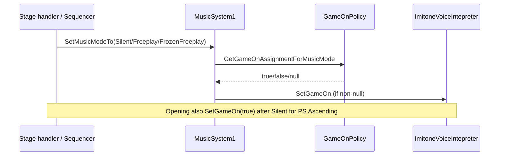
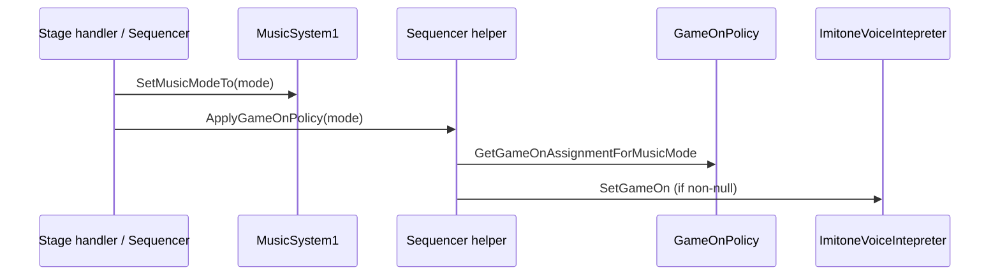

# Refactor plan: `gameOn` out of `MusicSystem1`

**Goal:** `MusicSystem1.SetMusicModeTo` changes Wwise/music state only. Any `gameOn` assignment tied to music mode moves to **sequencing** — `Sequencer`, `SequenceRunner` (if needed), or **stage handlers** — using `GameOnPolicy` as the rulebook.

**Scope (this document):**

- Remove `ApplyMusicModeGameOn` / `GameOnPolicy` usage from [`MusicSystem1.cs`](../Assets/Scripts/MusicAndLight/MusicSystem1.cs).
- Add explicit `gameOn` at sequencing call sites that today rely on the music-mode side effect.
- **Not in scope:** Full audit of every `SetGameOn` in the project (calibration, `WwiseVOManager` mic cues, `Tutorial.cs`, etc.). Those stay as-is unless a call site is listed below because it pairs with `SetMusicModeTo`.

**Related:** Block 3 — [`PLAYTEST_NOTES_ORGANIZED.md`](PLAYTEST_NOTES_ORGANIZED.md), [`GameOnPolicy.cs`](../Assets/Scripts/Voice/GameOnPolicy.cs), [`Block3PolicyEditModeTests.cs`](../Assets/Editor/SoundSelf/Tests/EditMode/Block3PolicyEditModeTests.cs).

---

## Recorded decisions (Robin)

| # | Decision |
|---|----------|
| 1 | Shared helper on [`Sequencer.cs`](../Assets/Scripts/Sequencing/Sequencer.cs). **Not** named `ApplyGameOnForMusicMode` — use **`Sequencer.ApplyGameOnPolicy(MusicSystem1.MusicMode mode)`** (policy lookup + `SetGameOn`; name reflects `GameOnPolicy`, not music ownership). |
| 2 | **`Cue_Stop_Interactive` VO fallback:** keep path **A** (fallback + explicit `gameOn`). Add **TODO:** verify whether fallback ever runs in production. |
| 3 | **Opening:** **always** `SetGameOn(true)` on Enter for **all** opening variants — not only `Opening_PS_Ascending`. See [§ Opening (decision 3)](#opening-decision-3) below. |
| 4 | Call **`ApplyGameOnPolicy`** whenever session intent requires it — **not** only when `SetMusicModeTo` changes an internal mode flag. |
| 5 | **Wwise `Cue_Microphone_ON/OFF`** — leave as explicit `SetGameOn` in `WwiseVOManager`; no change required for this refactor. |
| 6 | **Playtests:** quick smoke after Phase 1; full Block 3 playtests after Phase 2. |
| 7 | **Tutorial `gameOn = true`** — optional cleanup, not part of this refactor ([§ Tutorial note (decision 7)](#tutorial-note-decision-7)). |

### Opening (decision 3)

**Does “always true” fully answer the opening question?** Yes for implementation direction:

- On `OpeningStageHandler.Enter`, after `SetMusicModeTo(Silent)`, call **`SetGameOn(true)`** (or `_sequencer.ApplyGameOnPolicy` is **not** used for Silent here — policy would set OFF).
- **Remove** the `GameOnPolicy.RequiresGameOnAfterOpeningEnter(variant)` branch (and eventually the policy method or repurpose it to document “opening always on”).

**Behavior change to be aware of:** Today, non–PS-Ascending openings end at `Silent` → `gameOn` **false** (no override). After this, **Preparation / Sonoflore / Activation** openings will have **mic + reactive lights on** during opening unless something else turns `gameOn` off later. That matches the stated product intent; confirm in Block 3 opening playtest for **each** variant you ship.

**Policy / tests follow-up:** Update or replace `RequiresGameOnAfterOpeningEnter` and EditMode tests that expect standard variants **not** to need an override.

### Tutorial note (decision 7)

`TutorialStageHandler` sets `imitoneVoiceInterpreter.gameOn = true` with a **direct field write**, not `SetGameOn(true)`.

- **Behavior:** same while the field is public.
- **Difference:** `SetGameOn` logs transitions when `debugAllowGameOnLogs` is on; direct assign still logs via the interpreter’s “direct assignment” path in `Update`, but with a vaguer source.

No action needed for the music-system refactor unless you want consistent logging later (Phase 3 optional).

---

## 1. Assumption check: “music mode → `gameOn` is only triggered from sequence code”

### 1.1 Which modes actually change `gameOn` today?

`MusicSystem1` calls `ApplyMusicModeGameOn` only when entering these modes (and only if the mode flag was not already set):

| `MusicMode` | Policy assignment | Applied via `SetGameOn`? |
|-------------|-------------------|---------------------------|
| **Silent** | `false` | Yes |
| **Freeplay** | `true` | Yes |
| **FrozenFreeplay** | `false` | Yes |
| MusicLoopSilent | `null` (unchanged) | No |
| InteractiveTutorial | `null` | No |
| Environment | `null` | No |

### 1.2 Every `SetMusicModeTo` call site in the repo

| # | Caller | File | Mode | Indirect `gameOn` today? | Origin |
|---|--------|------|------|---------------------------|--------|
| 1 | `OpeningStageHandler.Enter` | Sequencing/handlers | Silent | **OFF** today (+ PS Ascending override ON); **target: always ON** after refactor | Sequence |
| 2 | `PlaygroundStageHandler.Enter` | Sequencing/handlers | Freeplay | **ON** | Sequence |
| 3 | `PlaygroundStageHandler.ExecuteSequenceCommand` (`CueStopInteractive`, Standard) | Sequencing/handlers | FrozenFreeplay | **OFF** | Sequence (Wwise cue → `Sequencer.HandleSequenceCommand`) |
| 4 | `PlaygroundStageHandler` coroutine Step 1 | Sequencing/handlers | Freeplay | **ON** (often no-op if already Freeplay) | Sequence |
| 5 | `PlaygroundStageHandler` Standard coroutine ~30s remaining | Sequencing/handlers | FrozenFreeplay | **OFF** | Sequence |
| 6 | `SavasanaStageHandler.Enter` | Sequencing/handlers | MusicLoopSilent | No policy apply | Sequence |
| 7 | `SavasanaStageHandler` (`CueStopInteractive`, Standard) | Sequencing/handlers | FrozenFreeplay | **OFF** | Sequence |
| 8 | `TutorialStageHandler` (mid-tutorial path) | Sequencing/handlers | InteractiveTutorial | No (handler already sets `gameOn = true` on Enter) | Sequence |
| 9 | `LinearAudioStageHandler.Enter` (`Linear_Nature`) | Sequencing/handlers | MusicLoopSilent | No (+ explicit `SetGameOn(false)` already) | Sequence |
| 10 | `Sequencer.FadeOut` | Sequencing | Environment | No | Sequence |
| 11 | `Sequencer.StartPlayground` (dev / cheat entry) | Sequencing | Freeplay | **ON** | Sequence |
| 12 | **`WwiseVOManager`** `Cue_Stop_Interactive` **fallback** | **WwiseManagers** | FrozenFreeplay | **OFF** | Wwise → VO; only if `sequencer.HandleSequenceCommand` returns false |

**`SequenceRunner`:** No `SetMusicModeTo` calls today. Refactor can still add a **shared helper** there or on `Sequencer` if that keeps handlers thin.

### 1.3 Verdict on the assumption

**Mostly true, with one gap:**

- Every mode that **currently** toggles `gameOn` via `MusicSystem1` is reached from **sequencing handlers** or **`Sequencer`**, except **#12**.
- **#12** is not under `Assets/Scripts/Sequencing/`, but it is **session/sequence behavior**: Wwise posts `Cue_Stop_Interactive`, the active handler should handle it; the VO manager only sets `FrozenFreeplay` when dispatch fails.

**Implication:** Moving `gameOn` to sequencing covers the main path. For **#12**, either:

- Ensure handlers always handle `CueStopInteractive` so the fallback never runs, **and/or**
- On fallback, call the same sequencing helper as handlers (not `MusicSystem1` policy), **or**
- Leave a one-line `SetGameOn(false)` next to the fallback `SetMusicModeTo` in `WwiseVOManager` (minimal, documented exception).

Do **not** assume `SequenceRunner` is involved until you add calls there; handlers + `Sequencer` are the real owners today.

---

## 2. Current flow (what we are undoing)



**Problems:**

- Music layer owns voice-session gating.
- Easy to miss pairing (e.g. `MusicLoopSilent` + separate `SetGameOn(false)` in `LinearAudioStageHandler`).
- Opening needs a **second** call to undo Silent’s side effect.

---

## 3. Target design

### 3.1 Principles

1. **`SetMusicModeTo` = audio only** (Wwise switches, flags, fundamentals, silent layer, etc.).
2. **`GameOnPolicy.GetGameOnAssignmentForMusicMode`** remains the single rule for “if we are changing mode for session reasons, what should `gameOn` become?” — but **sequencing applies** it, not `MusicSystem1`.
3. Prefer **one helper** on `Sequencer` (see [Recorded decisions](#recorded-decisions-robin)):

   ```csharp
   // Sequencer.cs — uses GameOnPolicy; not owned by MusicSystem1
   public void ApplyGameOnPolicy(MusicSystem1.MusicMode mode)
   {
       if (imitoneVoiceInterpreter == null) return;
       bool? assignment = GameOnPolicy.GetGameOnAssignmentForMusicMode(mode);
       if (assignment.HasValue)
           imitoneVoiceInterpreter.SetGameOn(assignment.Value);
   }
   ```

   Handlers: `_sequencer.ApplyGameOnPolicy(mode)` after `SetMusicModeTo` where policy applies. **Opening is special:** `SetGameOn(true)` always; do not apply Silent’s `false` policy on opening Enter.

4. **Opening:** always `SetGameOn(true)` after `SetMusicModeTo(Silent)` — all variants ([§ Opening (decision 3)](#opening-decision-3)).

### 3.2 Target flow



Handlers that already set `gameOn` explicitly (calibration, linear nature, opening override) should be reviewed so we do not **double-apply** or fight the helper.

---

## 4. Migration table (sequencing-only focus)

After removing `ApplyMusicModeGameOn` from `MusicSystem1`, call **`_sequencer.ApplyGameOnPolicy(mode)`** (or `SetGameOn` where noted) whenever session intent requires it — including when mode flags do not flip (decision 4).

| Call site | After `SetMusicModeTo(...)` | Notes |
|-----------|-----------------------------|--------|
| `OpeningStageHandler` ~110 | **`SetGameOn(true)` only** — all variants; **do not** apply Silent policy (`false`) on Enter | Replaces `RequiresGameOnAfterOpeningEnter` |
| `PlaygroundStageHandler.Enter` ~83 | `ApplyGameOnPolicy(Freeplay)` | |
| `PlaygroundStageHandler` Step 1 ~224 | `ApplyGameOnPolicy(Freeplay)` even if already Freeplay | Decision 4 |
| `PlaygroundStageHandler` `CueStopInteractive` ~130 | `ApplyGameOnPolicy(FrozenFreeplay)` | |
| `PlaygroundStageHandler` Standard coroutine ~375 | Same | |
| `SavasanaStageHandler` `CueStopInteractive` ~165 | Same | Enter: MusicLoopSilent — no policy; ascending `DelayedMicOff` unchanged |
| `Sequencer.StartPlayground` ~541 | `ApplyGameOnPolicy(Freeplay)` | Dev/cheat path |
| `WwiseVOManager` fallback ~339 | `SetMusicModeTo(FrozenFreeplay)` + **`ApplyGameOnPolicy` or explicit `SetGameOn(false)`** via sequencer ref | **TODO:** log if fallback runs; investigate removing later |

**No helper call needed** (policy `null`) — leave unchanged unless product wants explicit `gameOn`:

| Call site | Mode |
|-----------|------|
| `SavasanaStageHandler.Enter` | MusicLoopSilent |
| `TutorialStageHandler` ~158 | InteractiveTutorial |
| `LinearAudioStageHandler` | MusicLoopSilent (+ already `SetGameOn(false)`) |
| `Sequencer.FadeOut` | Environment |

---

## 5. Risks and edge cases

### 5.1 `SetMusicModeTo` no-op when flag already set

`MusicSystem1` only runs mode body when `!modeXxxFlag`. If playground is already **Freeplay**, a second `SetMusicModeTo(Freeplay)` may **not** re-enter the branch — today that also **skips** `ApplyMusicModeGameOn`. Sequencing must **still** set `gameOn` when the intent is “ensure mic on” regardless of music flags (e.g. Step 1, or after something else turned `gameOn` off via Wwise cue).

**Recommendation:** Helper can be called every time; `SetGameOn` already no-ops if unchanged. Do not rely on music mode transition as the only trigger.

### 5.2 Opening (all variants)

**Decision:** `SetMusicModeTo(Silent)` then **`SetGameOn(true)`** — do not run Silent’s policy OFF on opening Enter. Playtest non-Adjunctive openings if their mic/lights during opening VO were previously off.

### 5.3 Wwise `Cue_Microphone_ON/OFF`

Unchanged. Still parallel authority; logs (`debugAllowGameOnLogs`) remain important for Block 3 playtests.

### 5.4 `GameOnPolicy` methods not wired to music mode

`ExpectGameOnDuringDualStacksPlayground`, `TryParseCountdownClock`, `SavasanaAscendingDelayedMicOffSeconds` — unchanged by this refactor. Optional follow-up: use constant in `SavasanaStageHandler.DelayedMicOff(GameOnPolicy.SavasanaAscendingDelayedMicOffSeconds)`.

---

## 6. Suggested implementation phases

### Phase 0 — Baseline (before code churn)

- [x] Run EditMode: `Block3PolicyEditModeTests` (all pass).
- [ ] Note current Block 3 playtest status in `PLAYTEST_NOTES_ORGANIZED.md`.

### Phase 1 — Add sequencing helper (opening behavior change)

- [x] Add `Sequencer.ApplyGameOnPolicy(MusicMode mode)`.
- [x] Wire handlers + opening **always `SetGameOn(true)`**.
- [x] **TODO** in `WwiseVOManager` `Cue_Stop_Interactive` fallback: investigate if fallback ever runs.
- [ ] Playtest smoke: opening (all variants you care about) + playground Enter.

### Phase 2 — Remove hook from `MusicSystem1`

- [x] Delete `ApplyMusicModeGameOn` and its three call sites inside `SetMusicModeTo`.
- [x] Update `GameOnPolicy` + EditMode tests: opening always on; `OpeningEnterSetsGameOnTrue`.
- [x] Update `GameOnPolicy` XML: “sequencing calls `Sequencer.ApplyGameOnPolicy`” (not `MusicSystem1`).
- [x] Wire **WwiseVOManager** fallback (#12).
- [ ] Run EditMode tests + Block 3 playtests.

### Phase 3 — Cleanup (optional)

- [ ] Replace `TutorialStageHandler` direct `gameOn = true` with `SetGameOn(true)` for consistent logging (decision 7 — optional).
- [ ] Document in director-mode rule: **never** add `gameOn` to `MusicSystem1` again.
- [ ] Resolve Wwise `Cue_Stop_Interactive` fallback TODO if logs show it never fires.

---

## 7. Testing

| Layer | What to run |
|-------|-------------|
| **Test Runner** | `Block3PolicyEditModeTests` — policy unchanged; still valid. |
| **Playtests** | Block 3 playtest table: opening mic/lights, normalization freeze, 16:15/15:37 logs. |
| **Regression** | `Cue_Stop_Interactive` with playground/savasana active (handler path + fallback path). |
| **Dev** | `Sequencer.StartPlayground` cheat still turns mic on. |

---

## 8. Files expected to touch

| File | Change |
|------|--------|
| [`MusicSystem1.cs`](../Assets/Scripts/MusicAndLight/MusicSystem1.cs) | Remove `ApplyMusicModeGameOn` |
| [`Sequencer.cs`](../Assets/Scripts/Sequencing/Sequencer.cs) | Add helper; call from `StartPlayground` |
| [`OpeningStageHandler.cs`](../Assets/Scripts/Sequencing/Handlers/OpeningStageHandler.cs) | Apply after Silent |
| [`PlaygroundStageHandler.cs`](../Assets/Scripts/Sequencing/Handlers/PlaygroundStageHandler.cs) | Apply at Enter, Step 1, FrozenFreeplay sites |
| [`SavasanaStageHandler.cs`](../Assets/Scripts/Sequencing/Handlers/SavasanaStageHandler.cs) | Apply on `CueStopInteractive` |
| [`WwiseVOManager.cs`](../Assets/Scripts/WwiseManagers/WwiseVOManager.cs) | Fallback parity (small) |
| [`GameOnPolicy.cs`](../Assets/Scripts/Voice/GameOnPolicy.cs) | Doc comment only |
| [`PLAYTEST_NOTES_ORGANIZED.md`](PLAYTEST_NOTES_ORGANIZED.md) | One line under Block 3: refactor done / playtest again |

**Unlikely:** `SequenceRunner.cs` unless you centralize stage-agnostic helpers there.

---

## 9. Out of scope (explicit)

- Moving Wwise `Cue_Microphone_ON/OFF` into handlers.
- Rewiring all `gameOn` in calibration / tutorial scripts.
- Enforcing `ExpectGameOnDuringDualStacksPlayground` at runtime (Block 3 spec / tests only).
- Changing **when** playground chooses Freeplay vs FrozenFreeplay (behavior preserved; only **where** `gameOn` is set moves).

---

*Draft for careful refactor — implement Phase 0→2 before treating Block 3 playtests as signed off post-refactor.*
